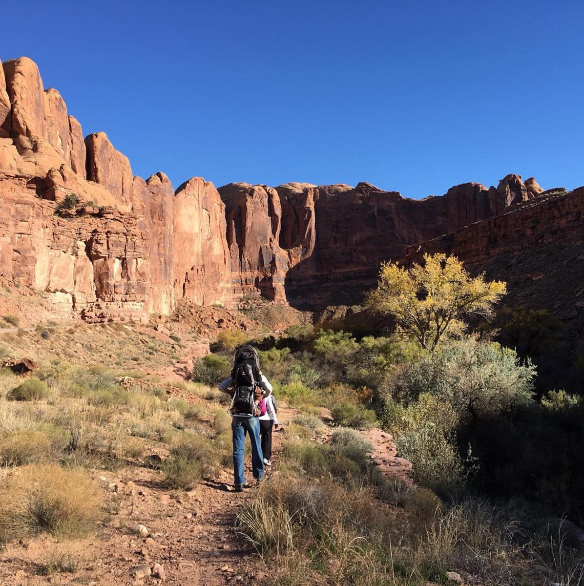
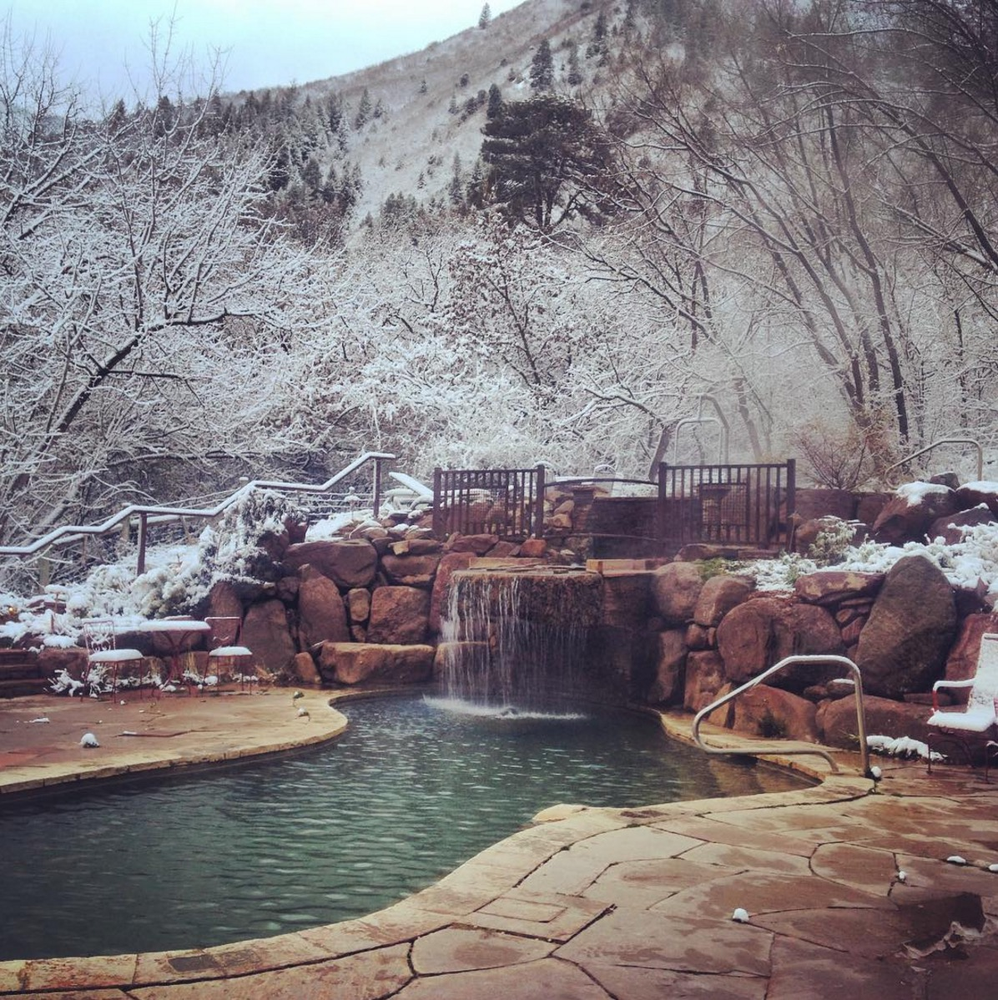
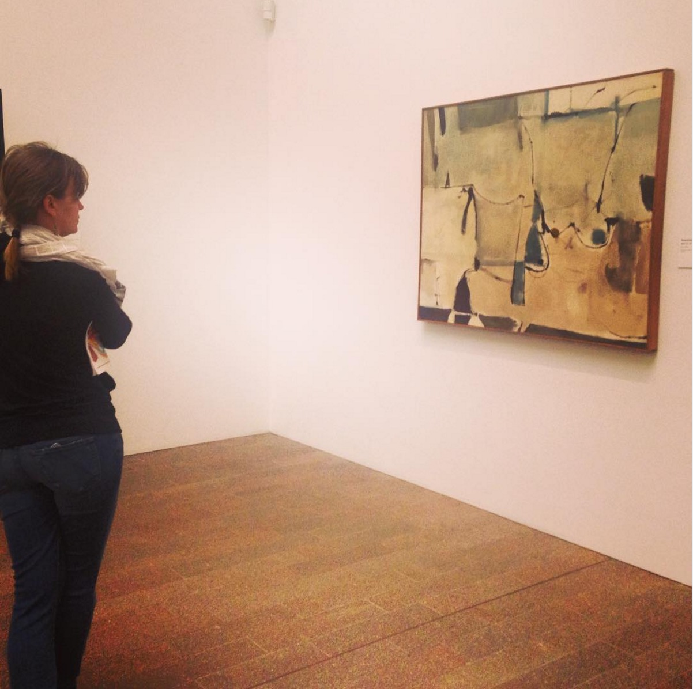
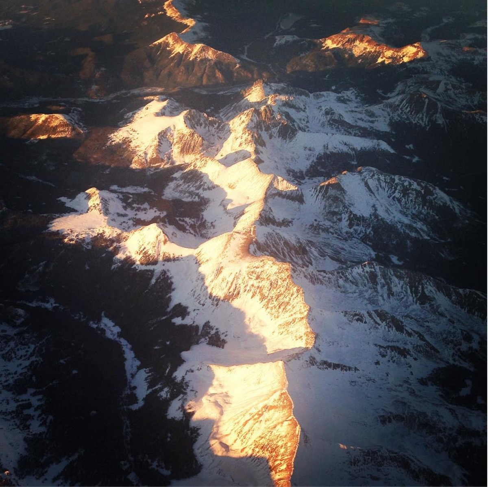

Sometimes I get completely myopic about the to-do lists. Especially those ones at work, where I want to do a good job and be a team player (my team does a really, really good job).

I need to remind myself from time to time that you can't do a good job if your job is all you do, so recently I put all the responsibilities up on the shelf and visited some favorite places - Moab, San Francisco, Carbondale.  

Now I'm back, grateful for good work to do and the to-do list is front and center again.  Happy Monday, folks!

 

  

   
