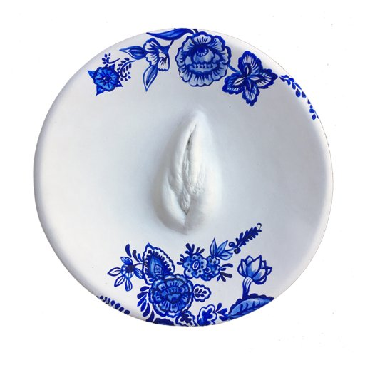
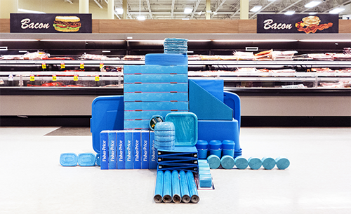
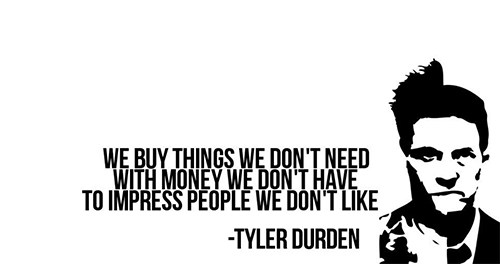
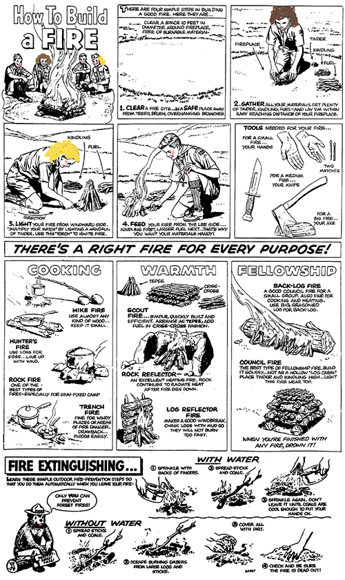
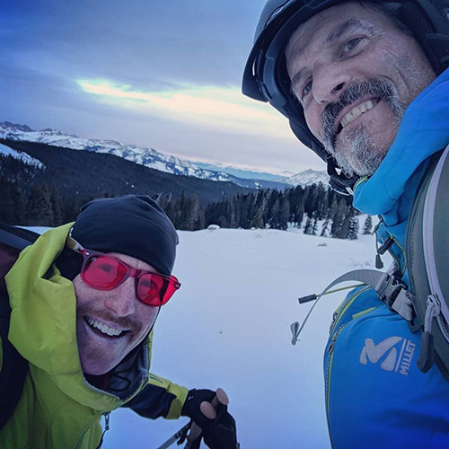
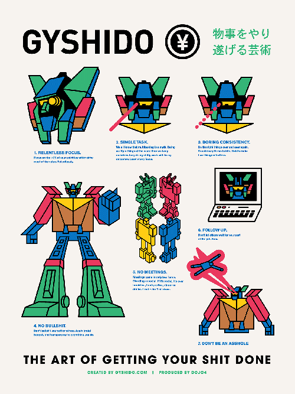
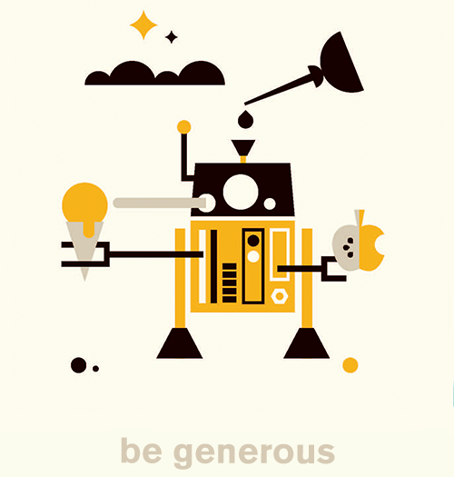

What does better mean? It might mean better than [previous years](https://www.newyorker.com/culture/jia-tolentino/the-worst-year-ever-until-next-year), or it might mean making the most of existing goodness, and transforming existing challenge. Relativity leaves it up to you, but here are some suggestions that are likely to help, possibly (but not likely) in some order: 

1. listen to this year's [dojo4 songbook mixtape](https://www.mixcloud.com/BlackSwanSounds/all-systems-are-dojo-the-2017-dojo4-songbook-mixtape-produced-by-joel-davis/) while you read this post and while you do anything this year

2. discover more new music every week with on [Bandcamp](https://bandcamp.com/) and [Conduit](https://blog.conduitmusic.co/) 

3. get a full dose of nutritious funk from [Tank and the Bangas](https://youtu.be/QKzobTCIRDw) and [Sylvan Esso](https://www.youtube.com/watch?v=mhyD2qchkEw) and clean your plate with help from all the [Tiny Desk Concerts](https://www.npr.org/series/tiny-desk-concerts/)

4. be cheerful - despite the dismal state of things there are [“there are actually a LOT of encouraging things going on around the world”](http://davidbyrne.com/news/reasons-to-be-cheerful-talk) and lots of reasons to be cheerful - [follow David Byrne](https://www.instagram.com/p/BdaecgDlA1p/?taken-by=davidbyrneofficial)’s *Reasons To Be Cheerful* project and/or start your own complementary project

5. meditate - it's the master skill that supports mastery of all other skills
> *“You should sit in meditation for twenty minutes every day — unless you’re too busy. Then you should sit for an hour.”* -Zen proverb

6. drink more water

7.  join the future. the [future is now and it’s female](http://www.cnn.com/2017/12/14/opinions/2018-will-be-the-year-of-women-schnall/). read what [our best minds](http://rebeccasolnit.net/) are writing about it.

8. keep it in your pants and do something useful instead, like [your fucking job](https://www.mcsweeneys.net/articles/things-to-do-at-work-besides-showing-your-penis-to-coworkers)

9. get to know your body- cast your vulva with [Vagina China](https://www.vaginachina.org/)

10. dig [Shantideva](https://www.shambhala.com/authors/o-t/shantideva.html)'s advice and wish happiness for others. 
> "[If you want to be miserable think about yourself. If you want to be happy, think about others.](https://www.youtube.com/watch?v=CJRiG3Ngbxs)" - Sakyong Mipham Rinpoche

11. read about fashion - make sure [it's a radical anti-capitalist, intersectional feminist, and body-positive political fashion blog](http://www.joojooazad.com/) written by a sarcastic (& angry) Muslim-Iranian creative and community organizer living in Chicago

12. enjoy [visual distruptions in places of mass](http://carsondavisbrown.com/#/mass/)

13. boycott consumerist obsession 
 

14. resist - [Resistbot](https://resist.bot/) will help you write to your Congresspersons every day

15. take action now - [sign up](https://www.thenation.com/take-action/) to receive 3 actions you can take every week to help build a more civil society

16. don't 'other' the need for liberation - be an [accomplice](https://www.whiteaccomplices.org/), not an [ally](http://www.codepink.org/be_accomplices_not_allies) 
>*“If you have come here to help me, you are wasting your time. But if you have come because your liberation is bound up with mine, then let us work together.”* -Lilla Watson

17. learn to build a fire and if you already know how, go build a fire

18. watch [The Detectorists](http://www.bbc.co.uk/programmes/b06l51nr),  the best show on television (spoiler alert: it's about [detectorists](http://www.dictionary.com/browse/detectorist))

19. think outside of the box ([Pandora’s that is](http://www.christenlien.com/about/)) - hear [Christen Lien](http://www.christenlien.com/music/)

20. see the world through rose-colored glasses, or [yellow or blue or green or purple or orange ones](https://rainbowoptx.com/)
 

21. explore what it means to [write well](https://www.goodreads.com/review/show/2226986126)

22. if you Twitter, follow [@danmayer](https://twitter.com/danmayer), a shining example of a person making the world a better place inside and outside the workplace through the practice of technology

23. know more about lots of things but especially [brain-machine interface](https://waitbutwhy.com/2017/04/neuralink.html) and [colonizing Mars](https://waitbutwhy.com/2016/09/spacexs-big-fking-rocket-the-full-story.html)

24. get timely and regular insight into [tech & society](http://www.exponentialview.co/newsletter/)

25. walk - move your body for at least a little while most days of the week- it [works better than medication](https://www.theatlantic.com/health/archive/2014/03/for-depression-prescribing-exercise-before-medication/284587/) for treating the blues  

26. fill your instagram feed with artists and their art, e.g.: 
    * https://www.instagram.com/okudart/
    * https://www.instagram.com/zioziegler/
    * https://www.instagram.com/raviamarzupa/
    * https://www.instagram.com/zoots/
    * https://www.instagram.com/kaws/
    * https://www.instagram.com/lucas_beaufort/
    * https://www.instagram.com/sophie_roach/
    * https://www.instagram.com/stuartsemple/
    * https://www.instagram.com/mtnburo/
    * https://www.instagram.com/ogmikegiant/
    * https://www.instagram.com/earlatron/
    * https://www.instagram.com/strangedirt/
    * https://www.instagram.com/lelashields/
    * https://www.instagram.com/julilunkart/

27. find your temple in your closest relationships and be prepared for "[holy dismemberment and reassembling](https://alovinghealingspace.blogspot.com/2017/12/the-temple-of-human-intimacy.html)"

28. follow the [Rules](http://www.velominati.com/the-rules/) and remember: it never gets easier, you just go faster (also: support your local bike shop)

29. also follow [Lael’s adventure](https://laelwilcox.com/) - she is one of the strongest endurance athletes in the world and is shattering the mold on how to make this life worth living

30. master the art of getting your shit done, aka [GYSHIDO](https://gyshido.com/):
   * relentless focus
   * single task
   * boring consistency
   * no bullshit
   * no meetings
   * follow up
   * don’t be an asshole
 

31. [generosity](http://little-startup-handbook.dojo4.com/be-generous) is the virtue that produces peace and we always need lots more of that
 

32. run with the [dazzle of Zebras]
(https://www.zebrasunite.com/)

33. spice it up with [chiles pop rocks & chocolate](https://chuaochocolatier.com/firecracker.html)

34. listen to  [Jane Kenyon](https://www.brainpickings.org/2015/09/15/jane-kenyon-advice-on-writing/), who said:
> *"Be a good steward of your gifts. Protect your time. Feed your inner life. Avoid too much noise. Read good books, have good sentences in your ears. Be by yourself as often as you can. Walk. Take the phone off the hook. Work regular hours."* - Jane Kenyon

35. be quiet and [listen](http://little-startup-handbook.dojo4.com/listen-up)

36. listen some more

37. listen even more

38. stop reading this blog post

39. [step away from the computer](http://www.timewellspent.io/problem-solution/)

40. stop looking at your phone

41. go outside

42. stay outside for a while

This was compiled as a collaborative effort by the [team](http://dojo4.com/team) at dojo4. 