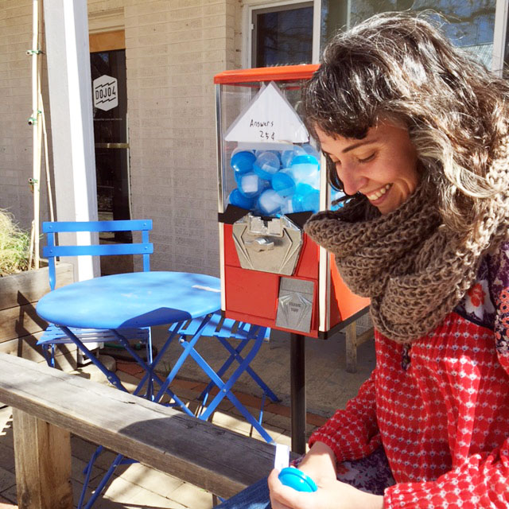
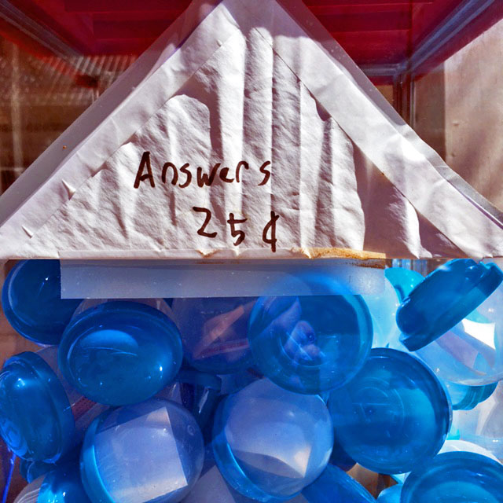
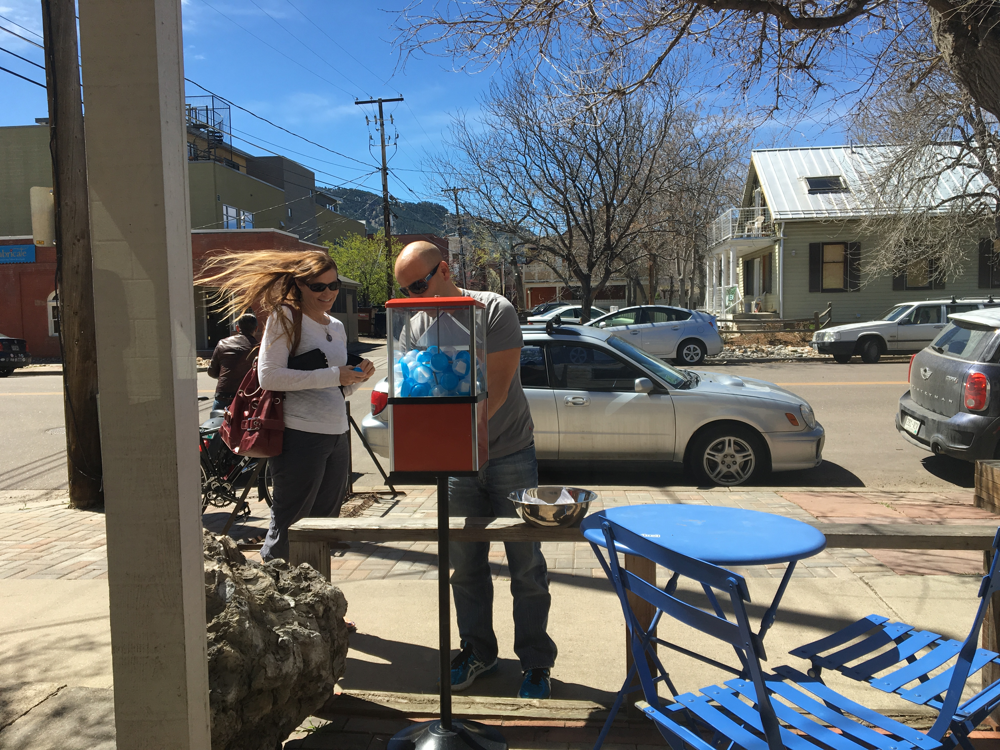
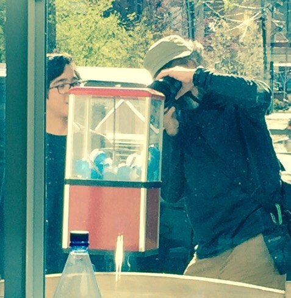

 

You've got questions, we've got answers! But they'll cost you. 25 cents to be exact. 

In collaboration with the inimitable [Spike Ilacqua](http://youtu.be/cT0pGKaPdLc), dojo4 is now offering illuminating answers to any curious passerby in need, for the mere price of a gum-ball. 

Currently, answers are dispensed only during business hours, but you can look forward 24-access answers soon. And once this batch of useful and applicable answers has been dished out, we will be supplying our worthy community with tiny-art, at the same low, low price. *(Please note: we are now in soliciting tiny art for the tiny-art and answer dispenser. So if you are a tiny artist and would like to contribute, please send an example of your submission to tinyart@dojo4.com asap. Fame and appreciation await you.)*

Our answers have been extremely popular. Come by 2030 17th St., Boulder, CO and get your's soon. Available while supplies last. 

 

 