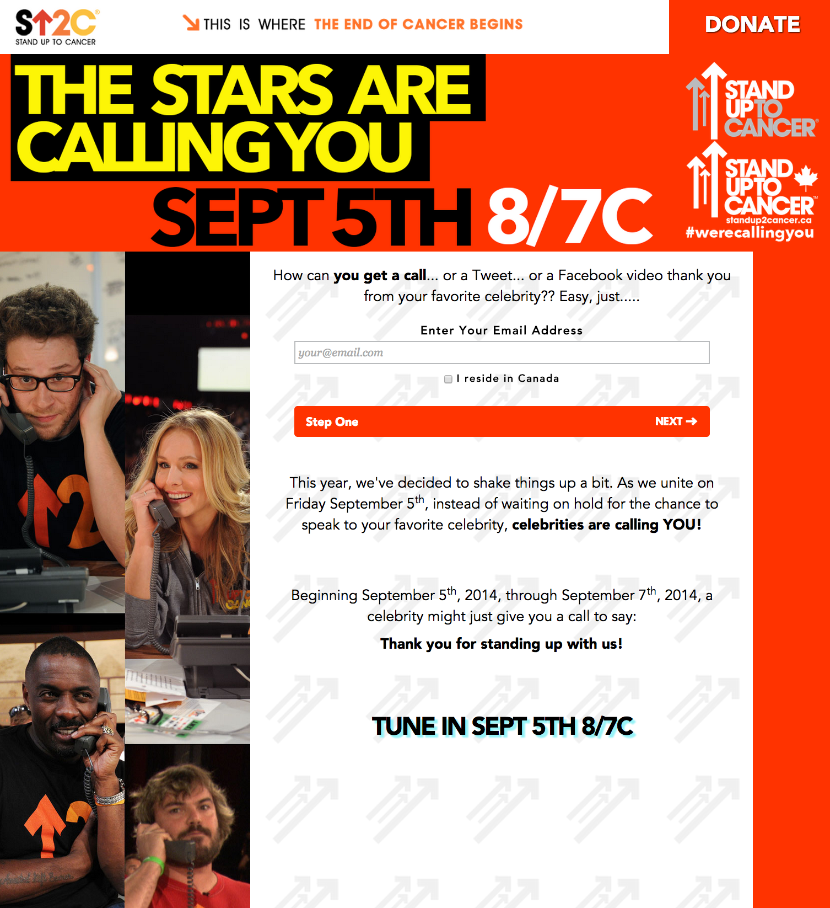

We're Calling You! Dojo4 creates a highly available, scalable, and beautiful solution for Stand Up To Cancer's live telethon.

[Stand Up To Cancer](http://www.standup2cancer.org/) is a non-profit that aims to raise money and awareness for cancer research. It's funded by the Entertainment Industry Foundation, so many celebrities are hands-on involved. Every 2 years, they host a telethon on primetime television and on multiple networks in the US and Canada that raises hundreds of millions of dollars. This year [their telethon is Friday, September 5th, 2014 at 8:00 PM ET AND PT / 7:00 PM CT](http://su2c.standup2cancer.org/press_release/view/hollywood_stars_align_for_su2c_telecast_new_were_calling_you_campaign) on nearly every channel! 

 

Naturally, when Stand Up To Cancer came to us for help with one of their websites for the big telethon, we jumped on the opportunity.

## Registering for a celebrity to contact you!

Normally on their telethon, SU2C has celebrities answering the phones so that when people call in to donate to cancer research, they'll have a chance to talk to a celebrity. This year they had the idea that they could allow people to register to possibly **receive** a phone call from a celebrity.

We designed and built them a unique application that allows thousands of people from US and Canada to sign up to possibly be contacted via phone, Twitter, Facebook, and Instagram by their favorite celebs. Since this is an important and well-known site, it simply can't go down. dojo4 put substantial energy into making sure it stays up, loads quickly, and looks great.

The site is live at [werecallingyou.org](http://werecallingyou.org) and people are getting really excited! See the live conversation on Twitter using the hashtag [#werecallingyou](https://twitter.com/search?q=%23werecallingyou).

## Helping celebrities contact the registrants on the live show!

During their [live show](http://su2c.standup2cancer.org/press_release/view/hollywood_stars_align_for_su2c_telecast_new_were_calling_you_campaign), Katie Couric will be hosting a "Digital Lounge", where the celebrities will be contacting people who registered to receive a call, Tweet, Instagram, or Facebook post. For this, SU2C asked dojo4 to develop an "index-card-like" app that would allow celebrities to get info about the people whom they're calling during the show and to mark those people as "contacted" after they called, tweeted, or instagramed participants. To remain aligned with the event promotion, we extended the show's branding to the admin app without having said branding complicate what was effectively a simple "todo" list.

The digital lounge is sponsored by [Samsung](http://www.samsung.com/), so testing the app on the latest Samsung devices was imperative. Training the SU2C staff and in turn, the celebrities on how to use the Samsung devices was important for the live show to go smoothly, so we took the time to write a detailed manual for them to read that was complete with screenshots and pictures of the devices.

To iterate quickly, we made the "dashboard" app a static website that can be added to the home screen via mobile Chrome. In this way, the site behaves like an app but allows us to iterate and distribute much more quickly than a native app. This became crucial since the weeks leading up to the live show naturally contained lots of adjustments. Since it is a website, we had to make sure the site would be guaranteed to be up during the live desired resulhowWe used CloudFront and S3 signed URLs (generated by a rails app) to deploy private content in a high-availability method. And for the initial quick iteration phase, we used the password protection feature at [bitballoon](bitballoon.com).

## Summary

Although we've done it before, it's still exciting and challenging to know our work will be relied on in a cannot-fail method on live, international television. Stand Up to Cancer has been a privilege and joy to work with. We're really proud to be able to help them on their quest to cure cancer.