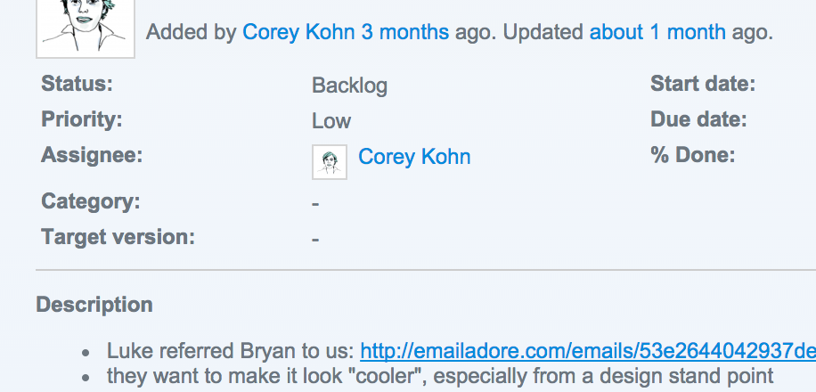

Emailadore: It's adorable, *and* useful.

Recently we posted one of our internal tools, [Emailadore](http://emailadore.com), to [ProductHunt](http://www.producthunt.com/posts/emailadore). It got a few upvotes and ~500 visitors over 2 days. Awesome!

One piece of feedback we got was that the landing page didn't offer much information on why it's useful. Yup, that's what you get when it's an internal tool! We'll update the landing page at some point with some ~~better explanation~~ prancing unicorns, but in the meantime, here's a short write up about why we find it useful and some use cases.

Ticketing systems are really useful for having a single place where everyone in an organization can see past, current, and future activity about projects. If it's not recorded in a ticket, it didn't happen. 

However not everyone is comfortable using a ticket system to communicate, or they simply forget. Clients will email us directly instead of using the ticketing system and we'll want to record that conversation in the ticket. Or we'll email a potential client before they have any tickets in our system, and when we start creating tickets for them, we'll want the history of our email conversation in the ticket. Most ticketing systems allow you to forward an email thread to the ticketing system to create a new ticket, but what if you want to add the email conversation to an existing ticket?

We used to click "Print" on an email thread and instead of selecting a printer, we would select "Save to PDF", which would download a PDF representation of the email conversation that we could then attach to the ticket. It was an awkward solution, so we tried to think of a better way.

Thus we created [Emailadore](http://emailadore.com). Instead of printing the email conversation to PDF and then uploading a file attachment, we simply forward the email to email [at] emailadore [dot] com, and emailadore emails back with a direct link to the email it received.

Now instead of uploading PDFs of emails to tickets, we simply paste the URL of the email into a ticket. Here's a screenshot of a ticket where instead of uploading a file of the email conversation, we simply pasted a link for referencing the email thread:

 

FAQs:

* Why not just CC someone on an email to show them the email thread?

Our whole team doesn't have access to your inbox - we all share our ticketing system as a centralized place of record. Plus, email gets used as a place to store things, but that's really not what it's designed for. Ever tried searching for a specific email among your hundreds of thousands of emails in your inbox? Yea, it sucks.

* What about attachments?

They'll be there too!

* Do I have to sign up?

Only if you want to. The email you receive from Emailadore not only provides the URL of your email, but it gives you instructions on creating a user account. You'll want to do this if you'd like to list all of the emails you've ever forwarded to emailadore for reference.

* Will my emails get deleted?

Nope - they're safely stored on one of our production servers. If we ever decide to shut down the service, we'll be sure to give everyone plenty of heads up, along with a migration strategy.

* Is it free?

Yup! We don't have any plans for monetizing Emailadore currently, but we'll give you plenty of heads up if we do in the future. Right now, we just thought it's a cool internal tool we use frequently so everyone else might want to use it too!