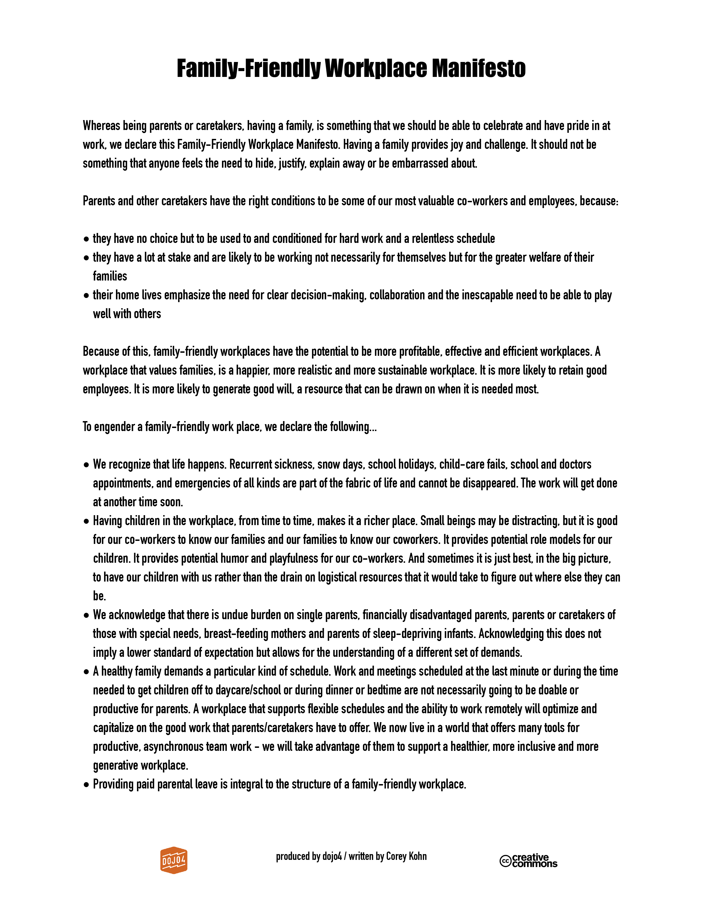

 

One of the most rewarding opportunities we have as entrepreneurs is to build a dynamic, reliable and resilient team. And yet, hiring and retaining the "right people" is also one of the greatest challenges in business. Over the years of running dojo4, the most important lessons I've learned about building a truly wonderful team come down to these three guiding principles:

* *[hire people you'll be happy to spend time with;](http://little-startup-handbook.dojo4.com/hire-people-you-like)*  

* *when it comes to hiring and firing, [trust your gut](http://little-startup-handbook.dojo4.com/courageousness-conquers) - even if it's unconventional or inconvenient to do so;*

* *and most importantly, people's life experience is equally (if not more) valuable than their professional skills.* 

Whether or not they have the appropriate skills on their resume, people who lead full and varied lives often have better social skills, greater emotional intelligence, psychological resilience and plasticity, [a bigger perspective](http://little-startup-handbook.dojo4.com/never-lose-sight-of-the-big-picture) and a [wider network of valuable connections](http://little-startup-handbook.dojo4.com/call-on-community). My business is built almost entirely on the strength of these qualities in the team I work with.

Although they certainly don't have a corner on rich and varied life experiences, I've found that parents have often developed many of these invaluable traits in the process of having and raising children. Families have been immeasurably integral and valuable to our business.  In the open-sourced, dojo4 [Family-Friendly Workplace Manifesto](https://github.com/dojo4/policy/blob/master/family-friendly_workplace_manifesto) we note that parents tend to be some of our most valuable team members because:

* *they are conditioned for hard work and a relentless schedule;*

* *they have a lot at stake and are likely to be working with the world their kids will inherit in mind;*

* *their home lives emphasize the need for clear decision-making, collaboration and the invaluable ability to play well with others.*

[A parent's resume](http://www.huffingtonpost.com/kiri-westby/a-mothers-resumebecause-i_b_8901326.html) also usually includes years of experience honing applicable skills such as the ability to multitask, attention to detail, negotiation and diplomacy, humility and empathy. The competitive advantages of running a family-friendly workplace are [persuasive](http://images.huffingtonpost.com/2016-01-01-1451613159-9989301-AMothersResume1.png). 

Supporting families in the workplace provides direct financial benefit to your company through cost-saving retention of employees and their institutional knowledge. This view recently made headlines when Vodaphone revised its parental leave policy to offer [at least 16 weeks paid maternity leave and full pay for 30-hour work weeks in the six months following their return](http://adage.com/article/agency-news/huge-investing-moms-good-business/298398/). Their video [Maternomics](https://www.youtube.com/watch?v=FpxYpymkyt8) argues that businesses that view maternity leave as a loss, are letting the valuable resource of working mothers slip through their hands.  

As entrepreneurs, in order to take advantage of the human resource of parents, we have to advocate for two things:

* hiring and supporting parents
* offering **[paid parental leave](http://www.lifehack.org/310307/why-companies-should-value-parental-leave-for-both-men-and-women)**

Before you say, "That's all well and good but I'm financially responsible to my shareholders and benefits like paid parental leave will never fly," you might be interested to know that more and more [experienced investors](http://www.xconomy.com/national/2014/07/21/sexism-and-misogyny-in-tech-how-investors-can-help-drive-change/) agree with Vodaphone. In a survey of almost 100 tech companies, [one study](http://women2.com/2014/05/05/establishing-maternity-leave-policies-help-startups-close-gender-gap/) found that while 0% of seed-funded companies have a maternity or paternity policy, 50% of funded startups began implementing such policies at Series A; and 100% of startups put both in place by the Series D and post-IPO stages.

[Even a small business is likely to lose money on retention costs and efforts to maintain a healthy workplace culture](https://www.themuse.com/advice/hey-startups-why-you-should-think-about-your-maternity-leave-policy-now) in the long run if they are not able to offer support to new parents.  Astute employees and [prospective hires](http://www.nytimes.com/2015/04/08/upshot/silicon-valley-perks-for-some-workers-struggles-for-parents.html?abt=0002&abg=0) will value parental leave benefits and the sacrifices it may take to offer them - and smart, fair-minded people like these are the ones you want on your team. 

Cultivating family-friendly workplaces means cultivating more profitable, effective and efficient workplaces. [A workplace that values families, is a happier, more realistic and more sustainable workplace. It is more likely to retain good employees. It is more likely to generate good will, a resource that can be drawn on when it is needed most.](http://dojo4.com/blog/family-friendly-workplace-manifesto) And whether or not doing this is a matter of social responsibility, it is an opportunity that entrepreneurs cannot afford to miss. 

 

<small>*Stay tuned for our next post on what running a family-friendly workplace actually looks like, written by my collaborator and editor, [Emily Utz](http://dojo4.com/team/emily-utz).*</small>

 

 

