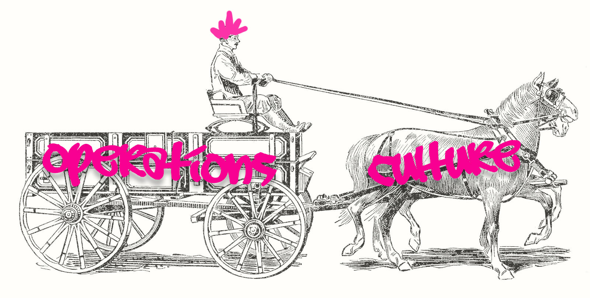
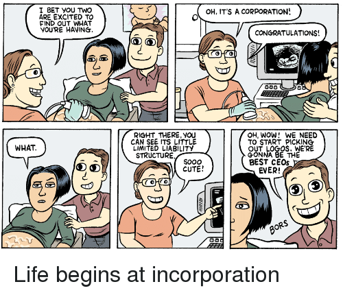
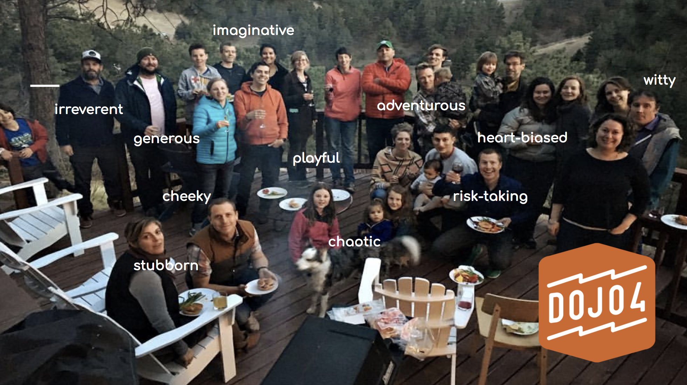
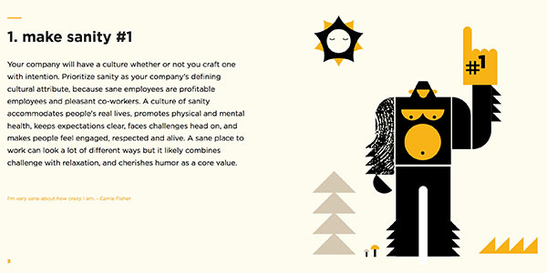
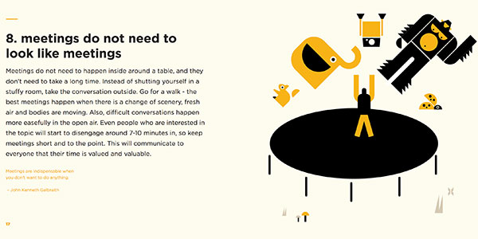

  
For a long time a I had the misconception that culture was born out of operations. I thought that if a company was structured a certain way and created a scaffolding of certain processes, that would allow a culture to be built based on those structures. I thought that the *personality* of a business (what we usually call *culture*) could be shaped by it's operations. While this may, in some cases, be partially true, I've found that it's much more of a two way street- and more often than not, it's the other way around. More often than not, it is useful and prudent to let culture dictate operations. Let *nature* (culture) set the ground for *nurture* (operations) and both will thrive.

Whether or not there is conscious effort dedicated to cultivating a company culture, every organization has one. Every organization has its own personality, and just like a human being, often that personality is there from day one. The conditions of a company's birth - its founders, its funding, its physical environment, its initial employees - often set a blueprint for that company's culture that can endure for its lifetime. 

 

A company's personality traits can come in all shapes and sizes. For example, each organization likely falls on one side or another of many of these types of traits:

* risk-friendly vs. risk-averse
* chaotic vs. orderly
* transparent vs. private
* goofy vs. serious
* frenetic & fast vs. steady & slow
* imaginative vs. practical
* adventurous vs. cautious
* intuition-based vs. data-based
* democratic vs. monarchical
* collaborative vs. competitive
* heart-biased vs. mind-biased

None of these are necessarily better than the other, but it's good to be honest about who and what your company is so that you can own that and use it rather than be trampled by it. You have to be able to build your operations to leverage the strengths of your culture rather than minimizing them or working against them. It's possible to power your operations with your culture rather than having them work against each other. 

For a long time I tried to fit our operations around a culture that was not ours. I thought that by doing our operations a certain way, that would nudge our culture more in line with what I imagined a successful company culture should be. These are the things I thought we should be doing:

* have more regular, standing meetings in order to get our internal communications into a predictable mold
* have polished proposals to woo potential clients
* have project managers to keep us on track and to relate to clients instead of our developers and designers being in touch with them directly
* have lots of employees that acted like employees and generally worked at the office between certain times 

As it turns out, we’re an unruly bunch. This is us (or at least one version of us):

 

It turns out that:
* we can’t have regular meetings
* we can’t produce polished proposals
* we can’t work with project managers
* we can’t have employees at all 

This is all part of a culture that was baked into our company from the very beginning. We attracted a combination of people that can’t have regular meetings that are more than 5 min long. We aren’t interested in creating anything more than bullet points in an email as a client proposal. We can pretty much manage ourselves. None of us do well as employees, nor do we want to have jobs. 

And we've been in business now for 8+ years and going strong, because or despite all of this. So something must be working! I tried to make us more conventional but that wasn’t going to fly and would have probably killed our business if I had really pushed it. Instead I found operations that supported the culture we have, cultivated that culture further and used it rather than working against it. 

We found out that business at dojo4 thrives when our operations are in line with our culture, and that means they need to be lightweight, adaptable, informal, transparent, asynchronous, and automated. Here are some practical examples of some of those operations:

**status emails**
At dojo4, whether we are working in the office or some somewhere else, first thing each day (whatever that means to each of us) we send an email to status@, to check in with each other and share info on what we are doing and when. This allows us to easily coordinate with each other, avoid unnecessary meetings, and get by without extraneous management.

**transparent accounting**
Trust is really important to us.
So we built a system for keeping all our passwords and credentials and share access to ALL (e.g. all bank logins, credit card #s, etc.) of that with anyone who works with us. This allows us to each take ownership of our work and the company, and the accountability that comes with that. It also serves to remind us that trust and transparency some of our core tenets, and as such, we don't f*** around.

 

**frequent invoicing**
By invoicing often, it cuts down on the need to micromanage projects (it’s quick feedback loop for our clients) and it allows us to pay our people often. It it's another tool to support project management without project managers.

**noon standups** and **[Friday standups](https://unreasonable.is/52-questions-get-heart-team-make-meetings-matter/) / lunch**
Although we have no internal interest in having regular work-related meetings, we have a 1-5 min “standup” meeting every day at noon to check-in, in-person or by video. We also have a non-work standup for dojo4 workers and friends every Friday, to understand ourselves & each other better. 
These meetings support cadence, communication and team cohesion. 

**worker-owned structure**
dojo4 always seemed to behaved like a co-operative. In March 2017, [we finally made it official](http://dojo4.com/blog/on-the-lip-of-shared-ownership-dojo4-becomes-a-co-op-series-number-4) and became a LCA (Limited Cooperative Association). 
Our company now operates entirely as co-operative. 

Another pretty example of the marriage of operations and culture and how they support each other is our [Little Handbook for Sturdy Startups](http://little-startup-handbook.dojo4.com/). Like "meetings don't have to look like meetings" and "make sanity #1". 
 
 

Like each person, each company has a unique personality. And each personality has something to offer- build your company to leverage that personality, and go far!

