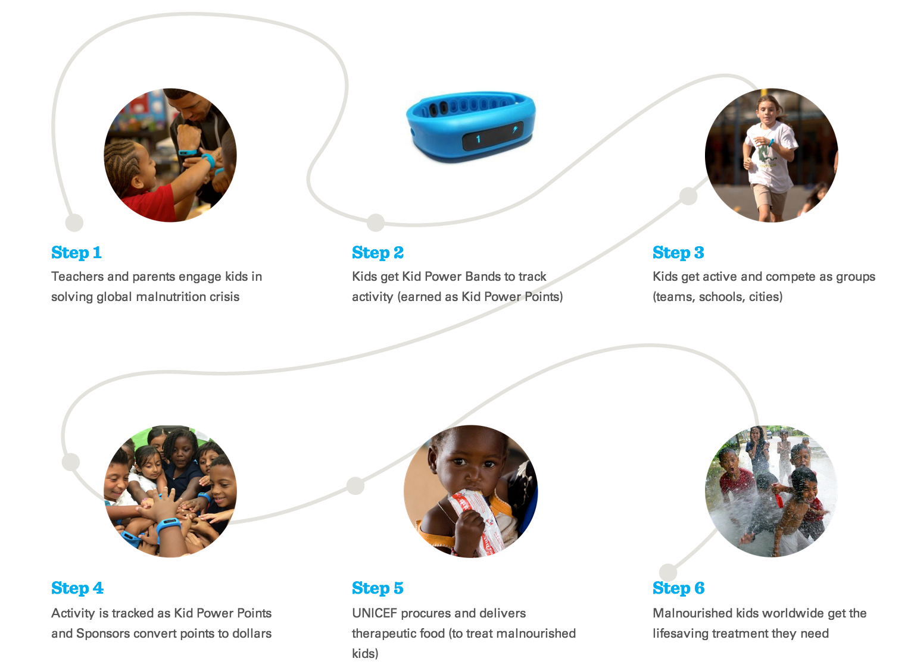

It's been our recent privilege to be doing some design and development for [Calorie Cloud](http://caloriecloud.org/) to support the work they're doing with [UNICEF USA](http://www.unicefusa.org/) in a series of programs being rolled out in over 1300 schools in New York, Boston and Dallas this month. [The program](http://www.unicefkidpower.org/), first piloted in New York and [Sacramento](http://www.nba.com/kings/news/kings-mayor-johnson-unicef-launch-kid-power) in 2014, gets American kids to be active, which then directly benefits under-nourished children in the developing world. Classrooms compete against each other to be the most active, and [for every so many units of activity measured by the Calorie Cloud activity wristbands](http://mashable.com/2015/02/25/unicef-kid-power/), UNICEF sends lifesaving [RUTFs](http://mananutrition.org/what-is-mana-whats-rutf) to severely malnourished children around the world. 

 

With [1 in 3 American school-aged children being overweight](http://frac.org/initiatives/hunger-and-obesity/obesity-in-the-us/) and [less than 5% of U.S. elementary schools offering physical education programs](http://images.agoramedia.com/everydayhealth/gcms/Childhood_Obesity_Infograph.jpg), it's not surprising that [the USA has one of the highest level of childhood obesity in the world](https://www.pinterest.com/pin/28710516347879737/). These [numbers](http://www.childstats.gov/americaschildren/tables/pop1.asp) mean that there may be more overweight children in the US in 2015 than the 
[approximately 20 million children that are expected to suffer from severe acute malnutrition this year] (http://mananutrition.org/severe-acute-malnutrition). So these programs, designed by Calorie Cloud, create the conditions for an ingenious win/win for children facing very different, but parallel and exceptionally challenging health problems.

"Malnutrition is responsible for over a third of all deaths of children under the age of five globally. By putting children first, we believe we can reach a day when no child dies of a cause we know how to prevent," said [U.S. Fund for UNICEF President and CEO Caryl M. Stern](http://www.prnewswire.com/news-releases/unicef-launches-new-kid-power-program-empowering-american-youth-to-get-active-and-save-lives-around-the-world-300041224.html). "I can't think of a better motivator for kids to get active than the fact that they're helping save lives. We're grateful to the cities of New York, Boston and Dallas, their sports teams and all the teachers, students and parents who are getting involved in helping malnourished children get the treatment they need to survive."

We worked with Calorie Cloud and UNICEF to hone and implement the design for the site and mobile app, collaborating with their teams to make the UX intuitive and working within the UNICEF branding guidelines to make the design compelling. We also pulled in some Tumblr and Zendesk integrations and got the whole thing in nicely deployable form for their team to work with as the program expands. The Calorie Cloud team was truly great to work with- and we're happy to have another project underway with them... more on that soon! 