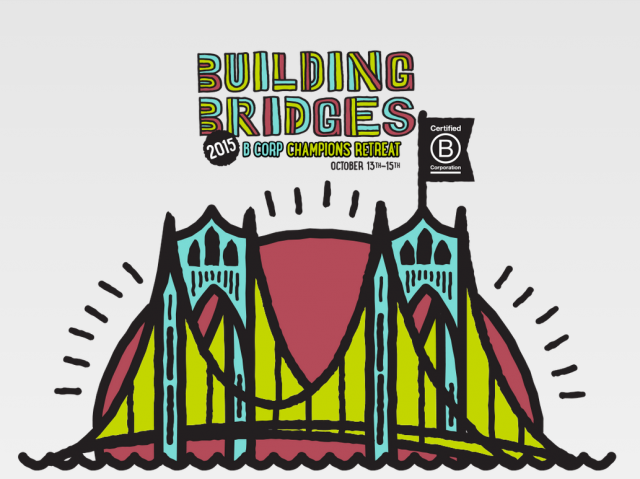
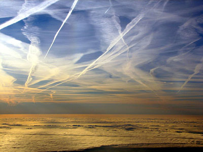

*This blog will be the first in a series on the carbon costs of our Internet activities, and what to do about it - woot!*

 

DOJO4 recently co-hosted an "unconference session" at the [B Corp Champions Retreat](http://www.tripzero.info/b_corp_champions_retreat_2015.html) near Portland, Oregon called "Championing the Conversion to a Carbon-Neutral Internet." With our kindred colleagues at [Manoverboard](http://manoverboard.com/) and [Mightybytes](http://www.mightybytes.com/) we circled up with some other tech-savvy B's to foment a movement of certified B Corporations to lead the way on both measuring and mitigating the carbon footprint of our websites and internet usage. 

Why?

No one has said it better than [Andrew Boardman](https://twitter.com/deckchairs), so below we repost part of his article [Creating a Responsible, Earth-Friendly Website](http://).

* * * 

According to a stellar new [report by Greenpeace](http://www.greenpeace.org/usa/global-warming/click-clean/), internet and IT services comprise approximately 2% of all carbon emissions — or approximately the same as that of the aviation sector. **In other words, those crowded lanes in the sky are putting out as much carbon as the cable beneath our roads.**

 

In the report, the authors point out that while there have been some improvements (and Apple comes out smelling great with a 100% Clean Energy Index), for a number of internet behemoths like Facebook and eBay, there is much to be done if we want to stay ahead of a sustainable growth curve.

**THE INTERNET IS EXPECTED TO CONTINUE ITS GROWTH TRAJECTORY**

According to Doug Webster, Vice President of product and solutions marketing at Cisco “Cisco’s VNI Forecast once again showcases the seemingly insatiable demand for bandwidth around the globe and provides insights into the architectural considerations necessary to deliver on the ever-increasing experiences being delivered. With more and more people, things, processes and data being connected to the Internet of Everything, the intelligent network and the service providers who operate them are more relevant than ever.” 

By 2017, there will be about 3.6 billion internet users — more than 45% of the world’s projected population.
In 2012, there were 2.3 billion internet users — about 32% of the world’s population.

By 2017, there will be more than 19 billion global network connections, up from 12 billion in 2013.
By 2017, the non-PC share of Internet traffic will grow to 46% from 26% in 2012.

In its report, Greenpeace goes on to summarize: “From music and video to communications and mail, more and more of our ‘offline’ world is moving online. We can expect that trend to continue and accelerate as the global online population reaches 50% of the world’s projected population.”

All of this leads to one conclusion: In the short term, the Internet has helped offset carbon emissions through greater connectivity leading to less travel worldwide. However, access in the long-term will demand as much if not more energy to keep the infrastructure sound and safe. And we need to keep our sites, tools, and applications online as green as possible if we expect to have a chance at reducing carbon emissions.

**WHAT CAN WE DO?**

So how do we create a more sustainable web? How can we design our internet lives and websites to minimize, if not negate, our impact? And what can designers, marketers, and web serfs do to keep it green?

There is one basic premise on which everyone seems to agree when designing any website and especially a green one — Keep It Simple. This was always one of the most basic rules to follow from day one. When I designed my first (and crappy) website in 1995, the web forced us to keep it simple. There wasn’t much we even could do. And in 2001, designer Steve Krug wrote the book on KISS — called Don’t Make Me Think (and now in its third edition). These principles of design are still highly relevant to all digital interfaces not only for ease of use and human engagement but also in determining energy consumption that powers our online behaviours.

**DON'T REPEAT PAST MISTAKES WHEN DESIGNING FOR THE WEB**

Given the increase in bandwidth and speeds over the last ten years, many designers and developers ignored the ‘KISS’ principle. Flash scripts created bulky downloads. Larger and larger images are currently used to showcase product lines. Massive JavaScript libraries are being served to control features and functions on websites, often with varying success. Slideshows of large images can create performance slowdowns, making users wait for information and forcing servers to use unnecessary energy. (Our own homepage featured heavy images requiring large downloads; this is something we addressed in the past few weeks.)

The euphoric response by designers and developers to faster online speeds have made websites bigger (or heavier, when thinking about data and performance). This might have been fine if billions of internet users hadn’t also been added to the mix — straining networks, demanding additional infrastructure, and consuming more energy.

**THREE REASONS (AS IF ONE ISN'T ENOUGH) FOR INCREASING SITE PERFORMANCE**

First, heavier, more complex content requires additional infrastructure, bandwidth and energy to move data from point A (a server) to point B (your device). With more people using mobile devices to connect, speed is at a premium.

Second, as noted earlier, a greener web will create less carbon emissions and a healthier planet for all of us.

Finally, Google and other search providers are [starting](https://moz.com/blog/how-website-speed-actually-impacts-search-ranking) to prioritize the rank of those sites that are speedy. There may come a time when a bandwidth-heavy site will be penalized in search results.

The hard and wonderful reality is this: **Mobile performance, green web design, and SEO are all interconnected.**

We need to return to a simpler and bandwidth-conscious time. We know that lots of data-consuming animation doesn’t get a visitor’s attention but great content and design does.

* * * 

*So there's the WHY.  Stay tuned for the next installments in this series, which will focus on the HOW of greening up your website.*

