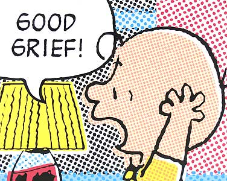

  

As entrepreneurs we are often expected to tell a seamless and aggressively positive story about the dauntless progress and profit that our businesses are making and the unparalleled "solutions" we're offering. "We're killing it!" There should be no chink in the armor, not a moment of visible doubt. And there certainly shouldn't be any breakdown into utter despair and grief. 

Yet, we run in our businesses in a world where every day people are being gunned down, exploded in the street, spurring on destructive cycles of hatred and confusion. We hear about both specific and general instances of environmental degradation on an unfathomable and possibly irreversible scale; people living in such systemic and wretched poverty that they are reduced to animal conditions. The news brings us an unceasing narrative of illnesses, natural disaster, and social disfunction reaping inconceivable levels of societal and personal loss. Furthermore, we are living with our own personal ups and downs, transitions, heartbreaks and losses. 

Through all this we are working hard, either not letting ourselves feel anything as destabilizing as grief, or at least not showing it. Letting that much be felt, or be shown being felt, is too uncontrollable, too uncomfortable, too vast. It's easier to convey confidence and accomplishment by projecting a sense of comfort and ease. In this way, [disassociation and numbness become the standard and we bury our grief deep within our subconscious](http://www.theguardian.com/sustainable-business/2014/oct/02/grieving-pathway-destructive-economic-system).

However, that **dissociation is the mark of a lost opportunity. We rob ourselves of the ability to see things clearly, to have insight and to act effectively with clear intention**. By not feeling things we make ourselves numb to real risks and dangers, and cloud our awareness of what is really at stake. Rather than avoiding or hiding the raw grief that arises as part of living in our difficult world, going right into it may be the most helpful thing we can do - not only for ourselves but for [ensuring that our businesses are providing solutions to real problems that truly matter](http://dojo4
com/blog/program-like-you-give-a-damn). 

> ["In our culture, despair is feared and resisted because it represents a loss of control. We’re ashamed of it and dodge it by demanding instant solutions to problems. We seek the quick fix. This cultural habit obscures our perceptions and fosters a dangerous innocence of the real world."](http://www.yesmagazine.org/issues/climate-solutions/the-greatest-danger) ~[Joanna Macy](http://www.joannamacy.net/aboutjoannamacy.html)

Here are a few reasons why good grieving is actually a powerful skill for entrepreneurs to cultivate:
 
1. **Connection**. For entrepreneurs, relationships are everything and genuine connection is powerful. Allowing ourselves to feel grief enhances our ability to empathize with the suffering and circumstances of others, which is a precondition for deep connections - be they with family, team members, colleagues, clients or investors.   

2. **Innovation**. At its best our drive to innovate is fueled by real insight about what the world needs most and how we can best deliver that. From the acknowledgment of pain comes clear insight and a transformation in the way we see and understand the world around us. 

    > [Great sadnesses...they are the moments when     something new has entered into us.](https://www.brainpickings.org/2015/03/10/rilke-letters-to-a-young-poet-sadness/) ~ Rainer Maria Rilke 

3. **Purpose**. When it feels like all is lost, whatever is most important rises to the top. How often do we hear the story of [the successful business mogul who gives it all up because they want to do something meaningful](http://news.nationalgeographic.com/energy/2015/10/151006-energy-drink-billionaire-wants-to-power-homes-with-bikes/)? Many entrepreneurs go through their whole careers denying themselves the opportunity to actually feel the anguish in the world around them, and don't get to do anything they actually care about until they reach some kind of crisis. By being available to that anguish we are empowering ourselves to lead purposeful organizations throughout our careers. 

There are, of course, many reasons why we don't give ourselves up to grief - foremost of which is probably that it hurts. My own experience of heartbreak in its purest form is not lugubrious or depressive, but actually has a quality of cutting through distraction and superficiality. Clearly, we can't very well walk around sobbing all the time, however we can acknowledge that this sadness is a sane reaction to a distressed world. We might be afraid that we'll be overcome with the sheer force and vastness of our grief, but when we stop avoiding it we can actually receive its gifts. We *can* develop the capacity to grieve well, and to allow that grief to support us in our life's work.

>[“Once we understand the art of suffering, we will suffer less.”](http://peacethroughgrief.com/tag/thich-nhat-hanh/) ~Thich Nhat Hanh

<small>*Many thanks for the inspiration for this post to [Joanna Macy](http://workthatreconnects.org/), the mistress of generative grief, and good, late night conversations with [Sera Thompson](http://www.a-new-leaf.ca/New_Leaf/Bio.html), [Claudia Chender](http://www.mindful.org/about-mindful/) and [Michael Rich](http://www.goodworkcoaching.com/about-michael/). And thanks, always, to [Emily Utz](http://dojo4.com/team/emily-utz) for her brilliant editing insights.*</small>

