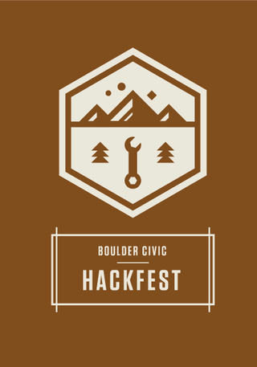

[National Day of Civic Hacking](http://hackforchange.org) in happening on June 1-2 this year. [There are events happening in over 70 cities around the country, from Alaska to Puerto Rico.](http://hackforchange.org/events) So we decided to band together with the good folk at [Quick Left](http://quickleft.com/), [Ad.venture.io](http://ad.venture.io/), [Rally](http://www.rallydev.com/community/rallyforimpact/) and [HUB Boulder](http://www.hubboulder.com/) to put on an [event](http://www.bouldercivichackfest.org) here in our own fair town of Boulder. We chose the [Random Hacks of Kindness](http://www.rhok.org/) format for a hackthon that will use all open data sets to support whatever civic projects we all decide to build together. Projects will be seeded, can be at any phase of completion, can be brought by anyone to be hacked on and designed and will be rewarded with prizes of all sorts! Coders, designers and regular ol' citizens are all invited. 

When: Saturday, June 1, 12am-8pm & Sunday, June 2, 11am-4pm

Where: [HUB Boulder](http://www.hubboulder.com/)

How: [Boulder Civic Hackfest registration](http://bouldercivichackfest-es2005.eventbrite.com/)

More info: [bouldercivichackfest.org](http://bouldercivichackfest.org/)

And just let us know if you want to be involved as an organizer, team leader, sponsor or generally helpful person at bouldercivichackfest@dojo4.com.

See you there!

(And if you're of the Denver persuasion, there's also a big event happening at [Galvanize](http://galvanize.it/) that weekend: [hack4colorado.com/](http://www.hack4colorado.com/))