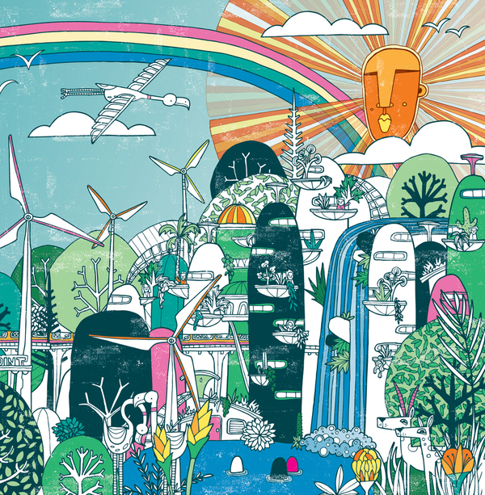

 

When I first became a partner at DOJO4 in 2011, things were rocking steady, decent clients were finding us with little or no effort on our part, and a general sense of creamy, rich ease pervaded the business. Nevertheless, our then CEO, [Justin Crawford](http://hoosteeno.com/), and I spoke often about the longevity of the industry and the fact that DOJO4's success was tied to the bubble-like nature of the tech industry. 

We talked a lot about business development and how to best insulate ourselves in the long term against an eventual downturn. At the time,  I could not foresee the tech "bubble" bursting any time soon, but the answer to where we should be putting our energy for long-term stability and success was crystal clear to me from the get go: human suffering. 

That's right.  The painful truth is that solving the problems of human and environmental dis-ease is one of the only guaranteed growth industries. That may sound like a dismal pronouncement, but I also see it as the greatest opportunity of our time.  At DOJO4- and many, many other tech businesses- we have all the circumstances in place to apply our skills, talents, and ingenuity to solving real problems,  using the same technical and design innovations that we had been applying mostly just to commercial endeavors.

Making that shift would allow us to engage our work in a genuinely meaningful way, and allow us to have a sustainable, impactful business at the same time. This line of thinking can run somewhat counter to conventional business-school wisdom. *Make money and help people at the same time? No way. Helping people and the environment is the domain of NGO's, non-profits and philanthropies.* 

This reaction is an unfortunate outcome of our cultural approach to altruism. Donating our time and money for the benefit of others can be a wonderful thing but it is not the only, and maybe [not even the best](http://dojo4.com/blog/the-problem-with-volunteerism), way to galvanize our best efforts for the benefit of ailing social and environmental systems. The relatively recent rise of social entrepreneurship has exposed this approach and solution- using the power of business to provide [innovative solutions to society’s most pressing social problems, tackling major social and environmental issues, and offering new ideas for wide-scale change. Rather than leaving societal needs to the government or business sectors, social entrepreneurs find what is not working and solve the problem by changing the system, selling the solution, and persuading entire societies to move in different directions.](https://www.ashoka.org/social_entrepreneur)

At their best this is what technologists can do, too: 

> ...[solve the problem by changing the system, spreading the solution, and persuading entire societies to move in different directions](https://www.ashoka.org/social_entrepreneur).

With my outsider's perspective on the tech industry (I was educated as a scientist and have spent most of my career in documentary film), I continue to marvel at the fact that the most inspired technologists have essentially the same [qualities as social entrepreneurs,  (such as the willingness to self-correct, share credit, and break free of established structures)](http://unreasonableinstitute.org/blog/6-characteristics-of-successful-social-entrepreneurs/). 

Unfortunately, [we've squandered a lot of our developer smarts and talent](https://www.youtube.com/watch?v=21Jj2ObZI9M) on creating commercially self-fulfilling junk food for the mind and an intricate digital economy stickily entwined with proprietary software, profits and data appropriation. Many technologists feel like they are stuck with that as their only option. But, if you really want a better world, a successful career and a more meaningful life, writing code that directly alleviates human and environmental suffering is a real option and living, breathing opportunity.

*It is possible*. Several years after those initial conversations at DOJO4, we've committed to that triple bottom line of people, planet and profits. We see that the alleviation of human, social and environmental suffering is the best use of our energy because:

1. this 'sector' has essentially endless needs, and is thus a fertile, demand-full market;
2. it draws on the best qualities of developers innate approach to problem-solving and knowledge-building;
3. it allows us to feel more engaged in a meaningful life, and that means we do better work.

So far, acknowledging that solving 'real' human and environmental problems is a valuable growth industry, and choosing to put all our eggs in that basket, is the best business decision we've ever made.

 

*Note: Illustrations without permission but thanks to [Allan Deas](http://www.allandeas.com/) and [Processed World](http://www.thebaffler.com/salvos/world-processor).*

 

