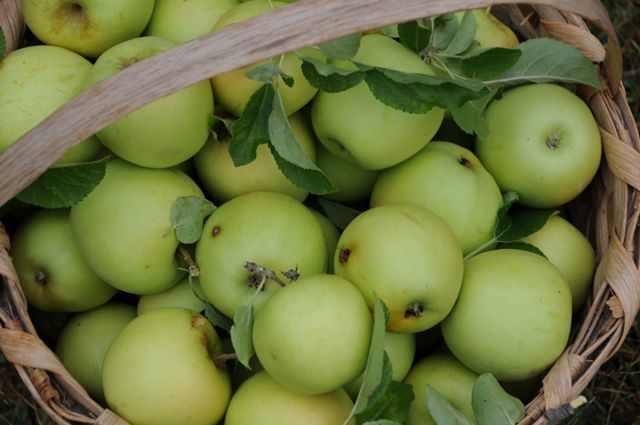
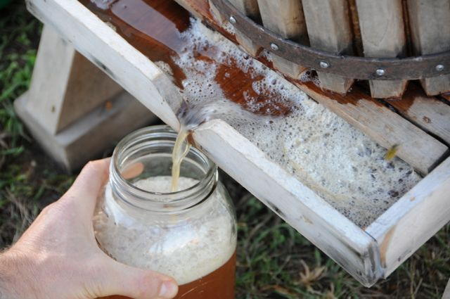

It’s that time of the year when your CSA drops off the last of the eggplant and apples at your door and you start Googling *babaghanoush* and making cider.

dojo4 recently reconnected with our favorite farmers up North at the [Calgary Farmer's Market](http://www.calgaryfarmersmarket.ca/).  For a number of years, dojo4 has assisted CFM in maintaining its ExpressionEngine website - one we designed and built for them many moons ago. 

We've lent a hand with everything from design micro-adjustments to full-page overhauls, such as making their ["Explore the Market" map ](http://www.calgaryfarmersmarket.ca/vendors)interactive with hover states, tooltips, and light boxes. 

On every occasion, it's been a pleasure working with Mark Franssen; he never seems to get tired of Steve asking "How's the weather up there?" either. Thanks for being such a great client, CFM!

And while you're out there perusing blogs, check out [CFM's mouthwatering recipe index for the fall harvest](http://www.calgaryfarmersmarket.ca/seasons).  

 

 

  

