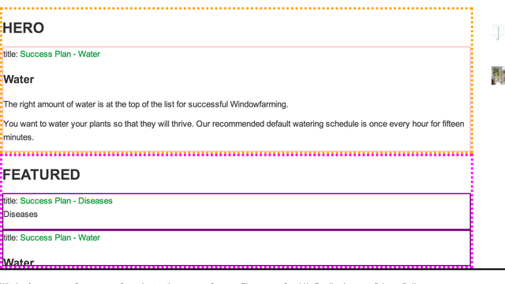

first you check in code like this

````ruby

<!-- FIXME STEVE -->
<!-- FIXME STEVE -->

  <div class='STEVE'>

    <% unless Rails.stage and Rails.stage.production? %>

      <%
        @hero = Article.hero.limit(1).to_a
        @featured = Article.featured.limit(3).to_a
      %>

      <div style='border:4px dotted orange;'>
        <h1> HERO </h1>
        <% @hero.each do |article| %>
          <div style='height:12em;overflow:scroll;border:2px solid pink;'>
            title: <%= link_to article.title, article %><br>
            <%= article.to_html %>
          </div>
        <% end %>
      </div>

      <div style='border:4px dotted fuchsia;'>
        <h1> FEATURED </h1>
        <% @featured.each do |article| %>
          <div style='height:4em;overflow:hidden;border:2px solid purple;'>
            title: <%= link_to article.title, article %><br>
            <%= article.to_html %>
          </div>
        <% end %>
      </div>


    <% end %>

    <script> $(function(){ App.blink('.STEVE') }); </script>
  </div>

<!-- FIXME STEVE -->
<!-- FIXME STEVE -->


````

renders like



and then you just sit back and wait ;-)
