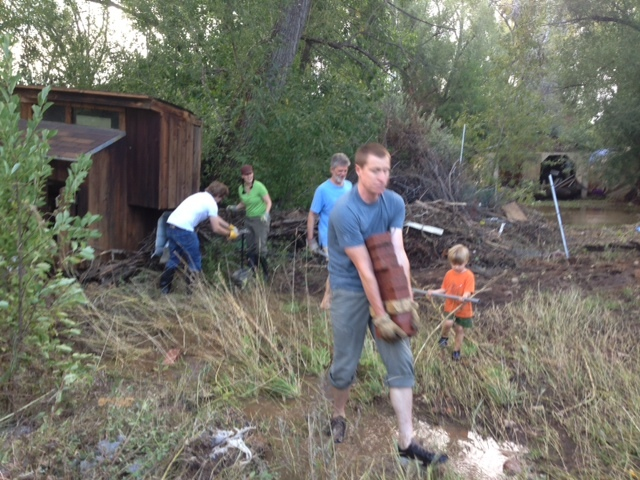
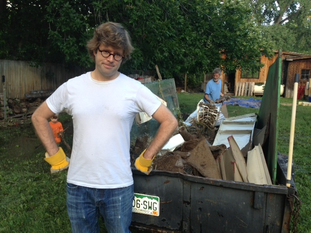
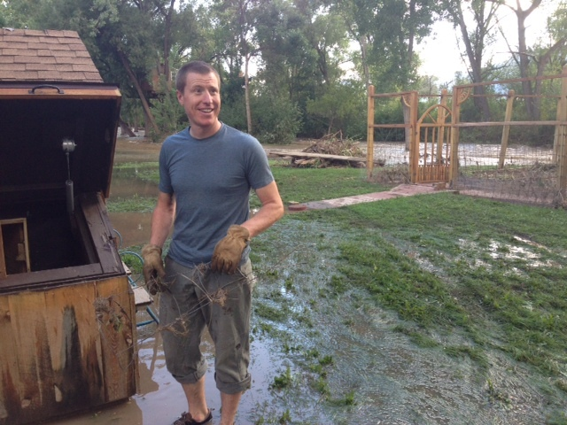
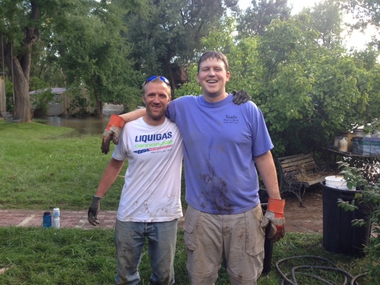
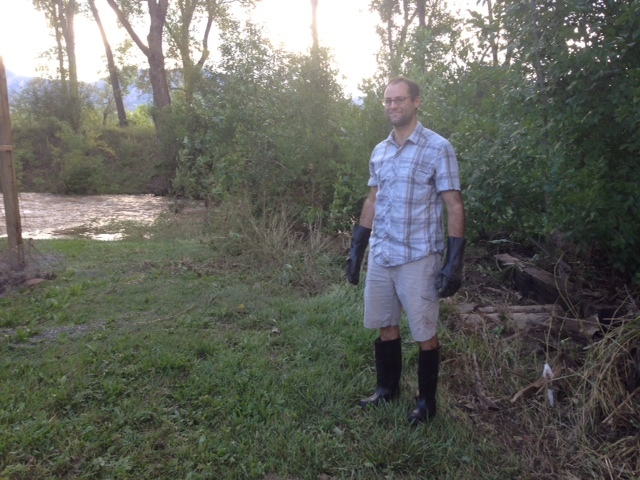
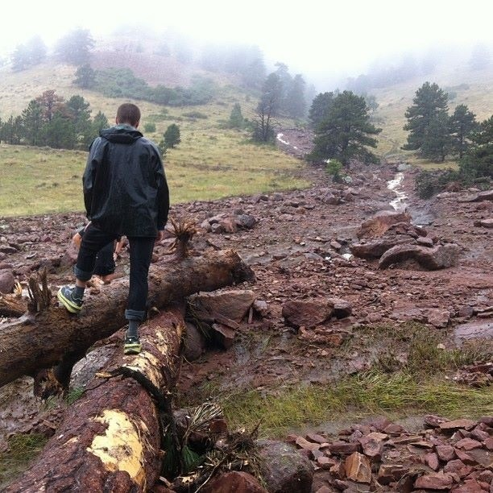

Despite the torrential flooding and [emergency-level havoc](http://www.fema.gov/news-release/2013/09/12/president-obama-signs-colorado-emergency-declaration) that's been happening in our state, our town and our neighborhoods, we've been pretty cheerful here at dojo4 this week. Granted none of us suffered the catastrophic and [tragic loses](http://www.reuters.com/article/2013/09/15/us-usa-colorado-flooding-idUSBRE98B0KM20130915) that many of our neighbors have, but [Garett](http://dojo4.com/team/garett-shulman) and his pregnant wife, Molly, has been without potable water all week, [Ara](http://dojo4.com/team/ara-t-howard)'s been housing [Greg Greenstreet](https://twitter.com/ggreenstreet) and his family since the emergency evacuation from their inundated house in Four Mile Canyon, and [Luke](http://dojo4.com/team/luke-miller)'s parents house looked like an ark about to float away on the lake that was their yard. 

But it's certainly not because most of our immediate team came away mostly unscathed that we are cheerful. Instead I chalk our cheerfulness up to having taken the opportunity that this natural disaster has afforded us to think about and pitch in for other people. As the [adage](http://en.wikiquote.org/wiki/Shantideva) goes: “All the happiness there is in this world comes from thinking about others, and all the suffering comes from preoccupation with yourself.” And if there is one thing that this type of catastrophe brings it's the inescapable obviousness of others' suffering that gets us outside ourselves. 

After weathering the storm ourselves, we all went over to Luke's parents house to help clean up the wreckage and haul out the flood waste. Ara and friends have been hiking up Four Mile to help salvage the Greenstreet's valuables and rescue their pets. And we've all been checking in on our neighbors and friends to see how we can help. 

This week has brought story after story of nearly inconceivable destruction, calamity and misfortune. And along with those, it has brought even more affecting stories of neighbors, friends and strangers helping each other and being cheerfully relieved of the burden of thinking only of ourselves. 

At the Miller's house:

 

Landslide on the way to Four Mile:
 

The Greenstreet's home:
 
