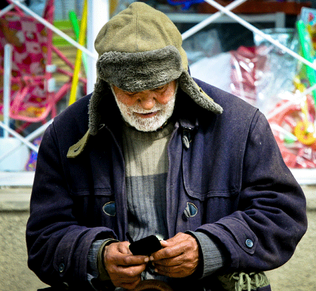

# Impact Project Idea

## Panhandling app for bums

 

I was just hit up by a bum on the street today who asked me for spare change. I told him I didn't have any. Then I saw his smartphone in his hand and asked him about it. He said it was an LG. It was in a nice case. I asked him if he had a decent ability to use his phone and he said yes. I told him that all my money basically flows through my phone now and if he had an app that could easily facilitate a small donation, I'd give him a few pieces of spare change. I told him to invent that app and he could make a million dollars instead of begging for spare change. He didn't respond. I walked away.

I wondered if someone is already working on this. It looks like [these guys](http://www.ctagroup.org/) are working on something similar in Silicon Valley but I think they're missing the mark a bit by aiming to be the "first place in America where homelessness doesn't exist." There are plenty of gated communities, small towns etc. where homelessness doesn't exist. And, I don't think this should even be the goal. The goal should be to facilitate a higher quality human experience for those living on the margins through smartphone technology, period.

These guys present this info-graphic that shows a lot of opportunity for purpose-driven entrepreneurs to help those among us in the most need. C'mon, humanity, let's fix the biggest problems human dignity as our next big thing.

 [img reference](http://forums.techsoup.org/cs/community/b/tsblog/archive/2014/12/09/can-mobile-phones-solve-homelessness.aspx)

My friend who I was walking with suggested I could perhaps just put a few bucks on the guy's EBT card. "Great Idea"

I'd love to hear your thoughts and/or help you create this vision for our brothers and sisters on the street.