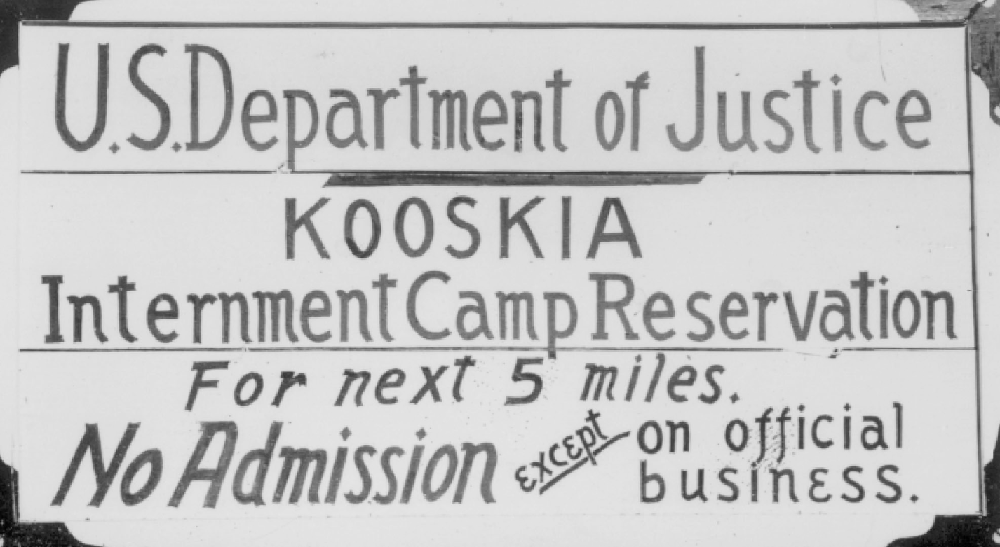
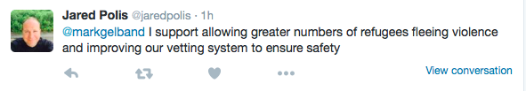

 
The U.S.(eless) House of Representatives voted 289-137 today to more severely restrict Syrian and Iraqi refugees wanting to immigrate. Get that - they are restricting the ability for some of the world’s most vulnerable people (refugees are people) from relocating to our country.

We’ve all seen this before, many, many times. We’ve heard the arguments about security. We know the racism of Japanese internment and some of Roosevelt’s decisions when Jews were trying to escape Nazi Germany. 

And we know Benjamin Franklin's great quote: "Those who would give up essential Liberty, to purchase a little temporary Safety, deserve neither Liberty nor Safety."

The vote in itself is appalling to me - especially as the son of a Holocaust survivor whose family was denied access to the U.S. I am lucky to be alive.

However, I cannot believe my House Representative Jared Polis, an openly gay man, was the only Democrat to vote in support of this measure. I have taken to Twitter today to demand an explanation for his vote, and this was his response:
 
Read what he is saying carefully.

Here is my response: "I support allowing greater numbers of homosexuals to adopt children and improving our vetting system to ensure no pedophilia." It uses his very logic, and I am only trying to make a point.

His logic makes even less sense when you consider the current process:

- takes two years 
- includes in-person interviews and supporting documents 
- has experience of conflict cross
- checked against intelligence 
- and allows about 50% of applicants to get approved

I am deeply saddened, disappointed and enraged by Representative Polis’ vote. Please join me in demanding he retract his position.

    