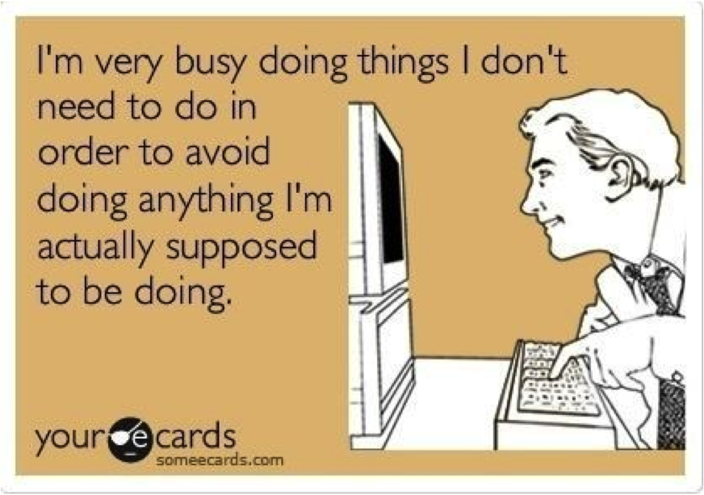
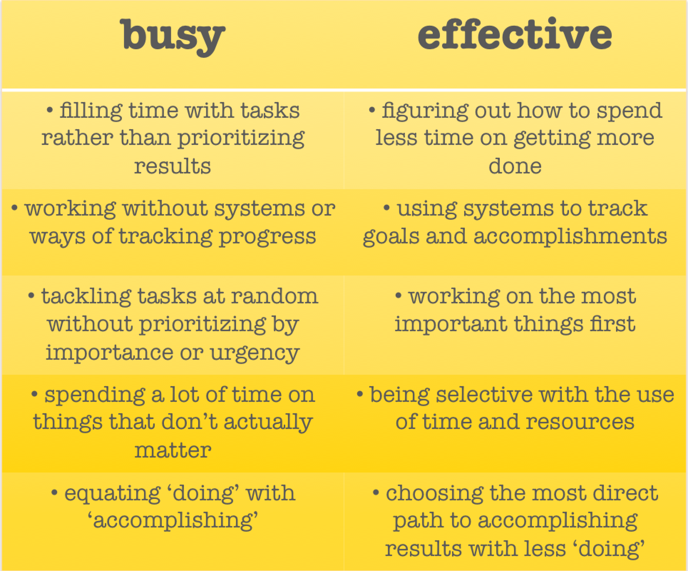
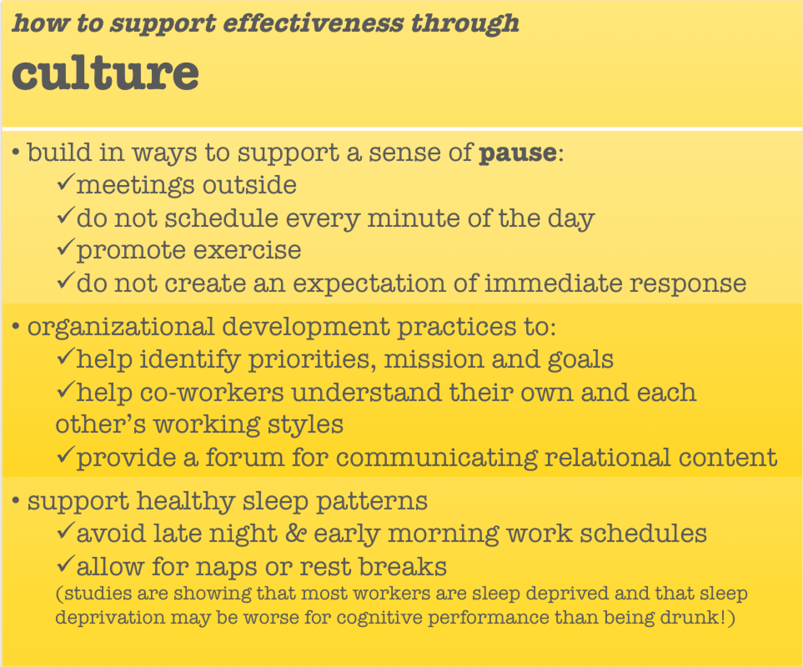
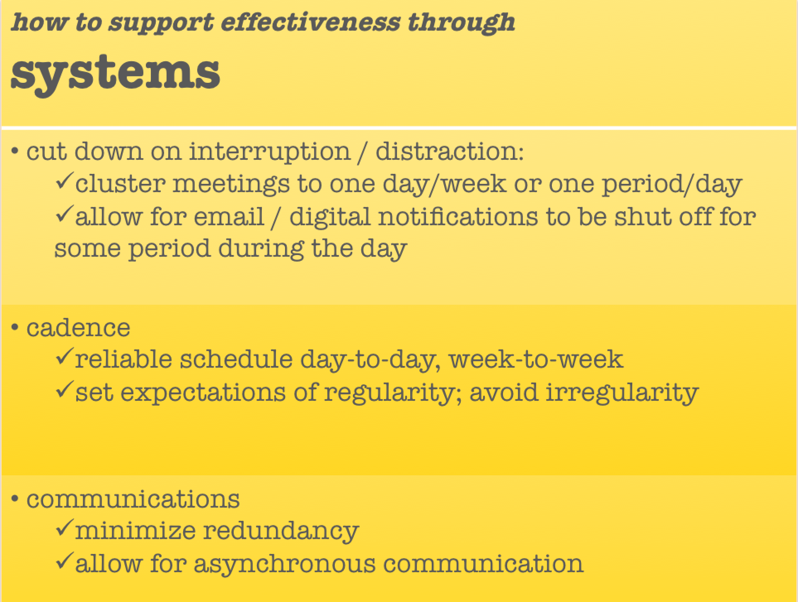

 

There is a difference between having a lot to do and being busy. And there is an even bigger difference between being busy and getting things done, i.e. being effective. 

When asked "how are you?," how often do many of us respond, with a bedraggled, hassled air, "Busy, so busy!" Our culture and our ever-connected, high-speed times have made 'being busy' one of the highest valued currencies in our social market. We use it to pad our egos- saying "I'm busy" is a proxy for saying "I'm important", "I'm a valuable person" and "I'm living a full, engaged life." And being or even just seeming, busy is considered a valid excuse for almost any of life's demands. It's considered a justification for not actually listening, not speaking genuinely, being late, being inconsiderate, and, perhaps most ironically, for not actually getting much done. Being “busy” is an excuse to ourselves and others for not doing the important things, the scary things, the difficult things. 

>[Busy is the new lazy.](http://www.fastcompany.com/3008263/busy-new-lazy)

There is a difference between having a lot to do and being busy. And there is an even bigger difference between being busy and getting things done, i.e. being effective. 

When asked "how are you?," how often do many of us respond, with a bedraggled, hassled air, "Busy, so busy!" Our culture and our ever-connected, high-speed times have made 'being busy' one of the highest valued currencies in our social market. We use it to pad our egos- saying "I'm busy" is a proxy for saying "I'm important", "I'm a valuable person" and "I'm living a full, engaged life." And being, or even just seeming, busy is considered a valid excuse for almost any of life's demands. 

It's considered a justification for not actually listening, not speaking genuinely, being late, being inconsiderate, and, perhaps most ironically, for not actually getting much done. Being “busy” is an excuse to ourselves and others for not doing the important things, the scary things, the difficult things. 

>[Being busy is most often used as a guise for avoiding the few critically important but uncomfortable actions.](http://fourhourworkweek.com/2013/11/03/productivity-hacks/)

There are lots of reasons why so many of us feel so busy all the time, though. We don't get a lot of support to breathe some space into our busy-ness and find a more effective approach. Some of the main culprits that get in the way are: interruption, distraction,  lack of clear priorities, and attachment to the idea of being busy. Interruption and distraction run so rampant that apparently the average IT worker is interrupted at the jobs as often once every 3 minutes- up to 20 times an hour. The [same study](https://www.yast.com/time_management/science-task-interruption-time-management/) shows that 3/4 of all interruptions are handled immediately, whether they need to be or not. We are on a roll, filling every last moment with tasks, regardless of whether those tasks get us closer to our bigger goals. We are too busy (or lazy or intimidated) to prioritize and so we may not actually ever be getting anything important done. **We are too busy to be effective.**

The trick is, simultaneously, both the simplest and the most difficult hack there is: pausing our busy lives. Being effective means being **deliberate**, and
in order to be deliberate we have to pause. We have to create a gap in the steady stream, **we have to create openings for space to integrate and infiltrate our lives**. As counter-intuitive as it may seem, the more we look up, go for a walk, and find other ways to create space in our hectic schedules and cluttered minds, the more we can accomplish. For example, [brain-science is now showing](http://www.inc.com/magazine/201304/issie-lapowsky/get-more-done-dont-multitask.html) that the more we try to multi-task, the less productive we are.  

There are lots of tools in the box for breathing this kind of accomplishing space into our lives. And in our organizations we can support effectiveness through baking that space into our company cultures and systems. 

 

 

The more we are able to be deliberate about how we spend our time and energy, the less likely we'll be to get bogged down in trivial tasks, and the more likely we'll be to build successful, meaningful businesses and live accomplishing, engaged lives. The lineage of Zen meditators seem to have figured it out a while ago:

>*“You should sit in meditation for twenty minutes every day — unless you’re too busy. Then you should sit for an hour.” -Zen proverb*

Thanks to [B Lab Colorado](http://www.bcorporation.net/blog/announcing-b-lab-colorado) for the opportunity to offer this material as a workshop at the [B Corp Leadership Development Event](https://www.facebook.com/media/set/?set=a.1579907255613452.1073741847.1519708461633332&type=1).