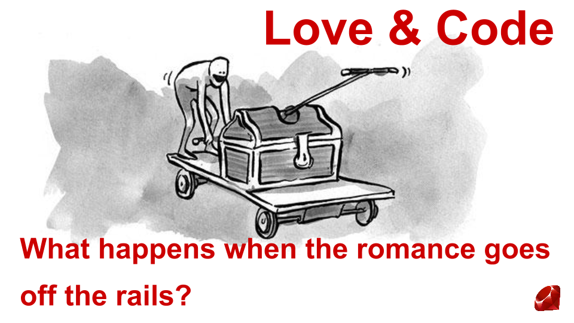
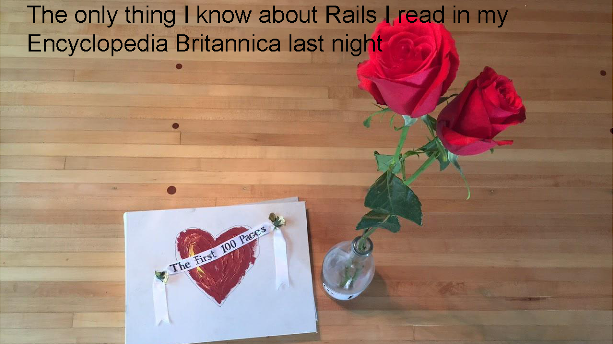
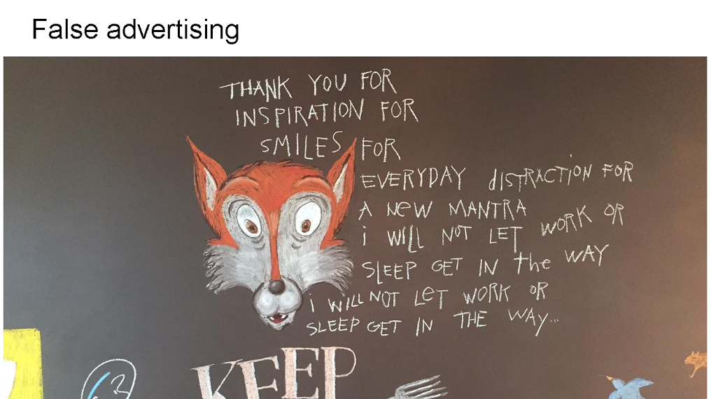
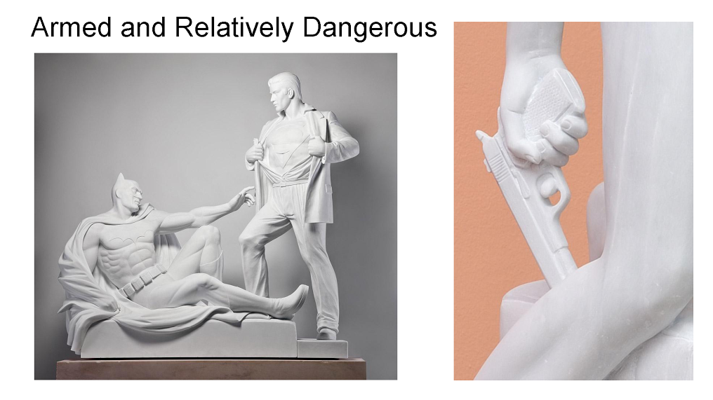
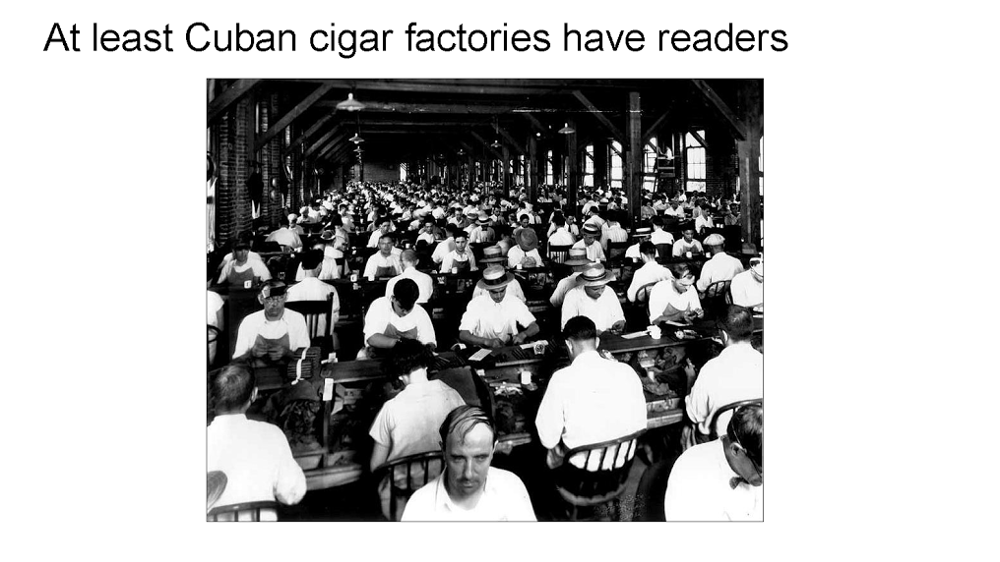
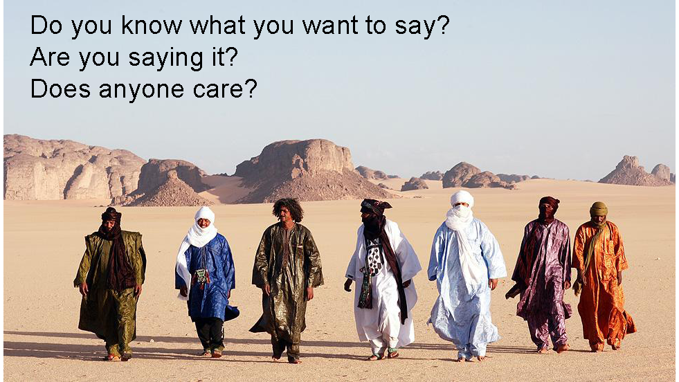
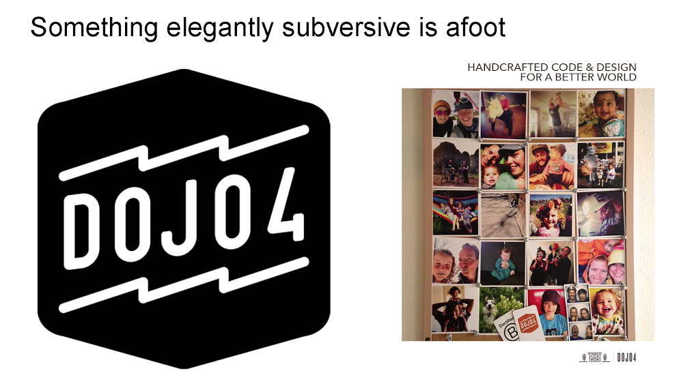
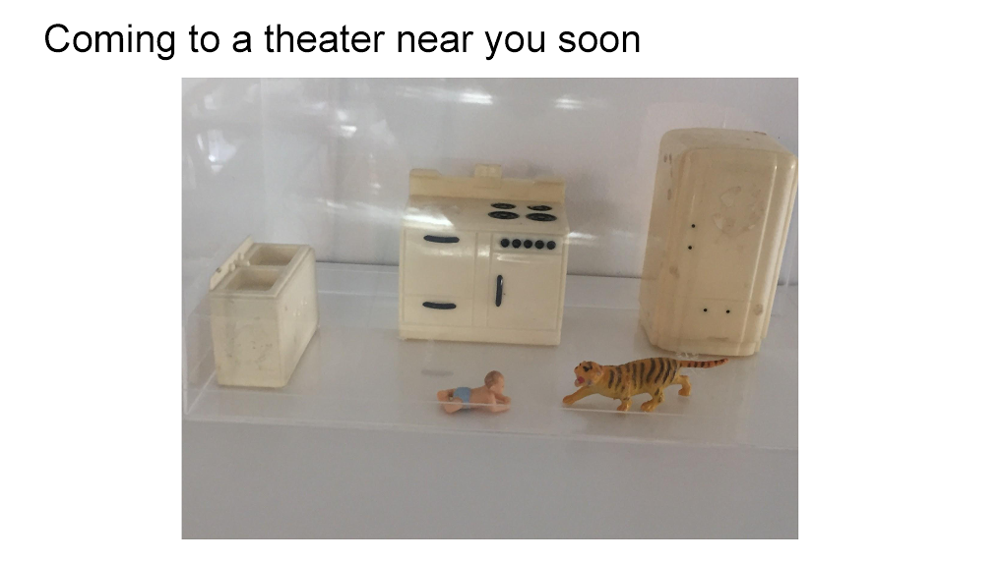
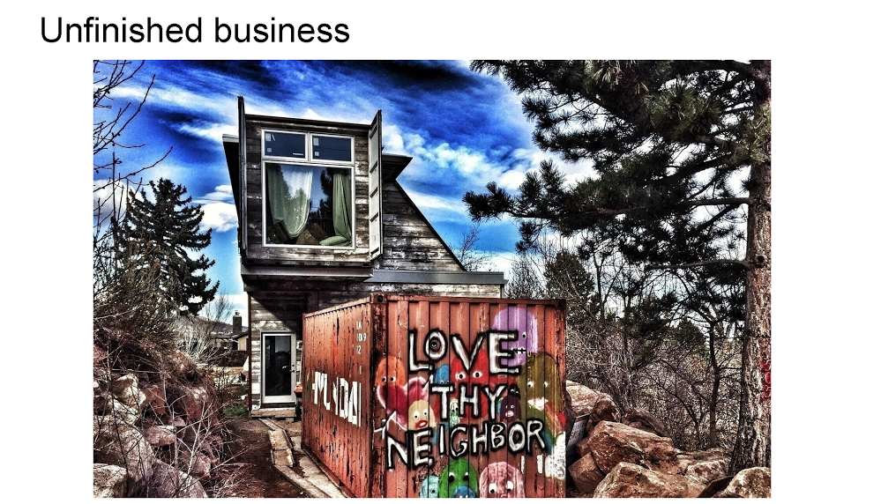
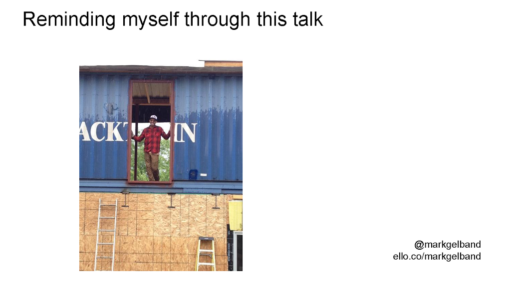

 
At 3:41 Wednesday I get a Twitter message from Graham McBain, the organizer of this event - and we should probably take a sec to thank Graham, Alissa and Zach for pulling this Rocky Mountain Ruby event together - organizing an event is pain in the ass.

Forgive my A-D-D.

That twitter message says: “Hey Mark! What are you up to Friday? Want to (speak) at a software conf for 20 min?

Speak wasn’t in there, so I wasn’t a 100% sure what he wanted me to do at a software conf, but I messaged him back “what time?” and my phone number.

And here I am. Graham and I met over a weekend at the CU Hack fest last spring - where I was a judge and equally unqualified as I am to speak here today.

But you know how sometimes you meet someone and you’re like: damn he has a good vibe and is interesting. I like him. Would love to work with him sometime.

That’s what I thought about Graham, and that’s why I’m here and hold onto that notion for the next 18 minutes and

Why am I here and what the fuck does another straight, white, male with an ego, a microphone, a big mouth and a story, have anything to do with Rails?

I grew up in Miami and rails had a much different meaning among my peers.

I’m Mark Gelband and I truly know less than one or zero about Ruby on the Rails or any kind of coding. I know when I showed up at college way back when, they had classes in Basic and Fortran, and I was far more interested in poetry, partying and satisfying my basest needs on Maslow’s hierarchy - self-esteem and self-actualization didn't matter much then.

I’m going to try and weave together three different and very important stories - How I got here? Today? Right now?

The course of a love relationship and why it matters?

And how Rails, and more specifically what each of you are doing with your coding skills and lives, can transform how we all work, live and become better versions of ourselves.

 
Here goes, please be gentle, I got the call to speak 45 hours ago, and I will share more details personally if you’re interested:

I’ve done a bunch of really cool things in my life, but I’m not sure any of them amount to anything very meaningful. It’s a fucking bummer to become 50 and still feel that. Two years ago, I got shit-canned from my safe and moderately fulfilling job. I had just got a raise and promotion 6 weeks before I got fired.

This is a book of the first 100 pages of correspondence I made with my wife. We met online. So we wrote. This book is full of romance and represents that yearning burning feeling inside you, deep inside me. You know it. That romantic phase of any relationship.

Audience participation: When you were 10 did you think: I want to be a coder. How many of you are in a job doing exactly what you want? How many of you are working for a company that treats you like a grown up who shows up? How many of you if left to your own devices do your best work from midnight until 3 am or 5 am to noon? How many of you are satisfied?

 
After getting fired, I focused on trying to finish building my family’s home - Boulder’s first shipping container home. In some way it’s more than a home, it’s a vanity art project, in some ways a “fuck you” to the rich, white, “quality of life” “neighborhood character” pseudo-liberal BS around me. and i’m part of the problem too.

don’t get me wrong, i know how relatively privileged I am; we all are.

When I met my love, she lived in this crazy cool church and had it filled with amazing art and art projects and collections and clothes and shoes and stuff. Now I sometimes wonder how I can deal with all her stuff.

“I had a lot of stuff when you met me;” it’s not like it was false advertising. From her perspective I, too, have plenty of shit - emotional and otherwise.

But we all choose where we’re at: jobs, life, here. What happens after the illusion fades. What happens after the light in which we are seen and see disappears? you’re the best kisser, the best lover, you’re so handsome,

you don’t care about your things, why are you wearing that sweatshirt i hate, trim your beard blah blah blah

This happens at work too - we have a ping pong table and climbing wall, lunches three times a week, on-site laundry and chair massages, here’s 80 grand out of G school junior coder. we want you. you’re amazing. be here at 8:30, 1 hour for lunch, stay here 70 hours and meet this deadline.

 
These are images from one of my favorite contemporary sculptors Thom Puckey. His work is provocative, controversial. Yesterday, I got challenged by a woman I respect very deeply about the two other images I had chosen.

Puckey’s work directly questions the objectification of women and cultural norms around power, weapons, war and the body.

The line Armed and Relatively Dangerous is the name of his latest show.

It also has deep meaning for anyone with an intellect and the faintest notion of emotional evolution.

My son said to me recently: “you don’t want to finish the house dad because you won’t know what to do.” He’s partially right. What I know is that I don’t want to work with people I don’t like, trust nor respect anymore doing anything that isn’t in some way helping make the world a better place for my grandchildren, your families.

I know that’s easier said than done when there are mortgage payments, two teenagers going to college, good restaurants I want to eat at - whatever.

In love, we begin to learn our partner in way where we can accept, communicate and grow or stick a knife deep in that place where we know the other is most vulnerable. I’d say in most relationships - both are happening at any given time.

Which brings me back to us - in this room - all of you who are holding so much damned power. My friend Ara Howard from Dojo 4 - someone much more qualified to be speaking code and coding with purpose - says “we - coders - are carrying AK47s. What we choose to do with that power is the story.”

 
This is a bit of a break.
My father is an old-time cigar smoker, and so I have at various times been fascinated by cigar culture. In Cuban cigar factories, the reader was one of the most respected positions in the factory.

Long before sonos, podcasts and deephouse sets, the reader in the cigar factory did just that. Read to workers for their entertainment, to help make the relatively mundane somewhat more enjoyable, fulfilling.

 
Gerald Locklin, one of my early writing teachers, said if you can answer yes to these three questions, you’ve probably written something worthwhile. The first question is the hardest part. Do you know?

If you can answer yes to the first two questions, someone cares even if it’s just your grandmother.

I want to finish building my house for myself, my family and my need to do something meaningful.

I want to continue to work on love after romance with the most beautiful woman in the known universe. This requires me to rigorously look at my bullshit and be open to criticism and grow and change.

I want to inspire all of you to think about what you’re doing with the power of code and how if the conditions were ripe to respect you as a person, coming to a space you want to work, an environment with employment practices that nurture your whole self, and provide meaningful work that does something positive in the world, would you be interested?

That’s a real question. You’ve written millions of lines of code, you’re on a path of being a better person, you’re here because you want to learn something, to be a better version of yourself. Now what?

Do you want your power to go to Drizly, so we can solve the liquor deliver problem? Or do you want to write code that helps transform our world?

Seriously, that’s a real question?

 
Here’s a bit more of how I got here: I made a whimsical investment in Ello because I believe in an elevated conversation and beautiful content and data privacy. I realize that creatives and creative technologists hold a key to the community I want to live in and help evolve.

I met Corey and Ara from Dojo 4 five months ago during Boulder Start-up week. I am fascinated by the idea of making purpose-driven work environments that build community and respect the whole person a reality for myself and more of us.

The real work of love happens after the romance dies. It’s the hard shit. We can all dream it, but sometimes we’ll need a therapist or bike ride or Red Bull or a joint.

Ara and I recently went to Telluride to explore how these ideas might have a confluence with some work the Telluride Foundation has started for its community.

More accurately, I tagged along with Ara and his family - wife and two kids - car camping along the way. It was vulnerable situation for him and his family and me. We didn’t know each other all that well, but we were both going with our gut.

My wife was like, what the fuck?!

 
Here’s what I wrote about Dojo after we got back:

Wondering off the street into Dojo 4 might feel like an alien encounter for a corporate suit. It may even feel that way to a 30-something dotcom executive who equates ping-pong tables and climbing walls to progressive corporate culture. It may also just seem as if the tapping on keyboards, house music, writing code and work are nothing more than early 22nd century business as usual.

But something way more radically subtle and elegantly subversive are afoot in the small first floor workspace in the cinder block building just north of Pearl St on 17th.

Professionals who genuinely care about what they do, their personal growth, their community of friends, families and colleagues, their larger community and the world - work in an open environment that puts as much emphasis on meaningful practice, principles, personal development, as it does on producing quality work that matters.

Just typing this sounds like pie in the sky bullshit in most contexts. Many companies talk this shit of culture and people and purpose, but few embrace it as part of their daily routine, and even fewer see it as a business necessity.

Dojo 4 has begun fomenting a unique perspective of place, people, practice and purpose as _the_ _business process_ for positive change and creating a better world.

 
When I look at the house I am building, I see all of the work I have done and my ego swells and I am psyched about what I am creating.

When my love looks at our house, she may see a piece of this too, but she sees unfinished business, missed deadlines, timelines that have not matched reality, a 7-yr project that as she has said: “i don’t think i would have signed up for if i knew then what i know now.”

That’s love after the romance, that’s pain and truth and difficult.

Coding after the romance is some version of: “i’m tired of building bullshit stuff for bullshit companies run by dumbass fuckers who are only interested in their personal bottom line.”

All of us have a responsibility to lean into love after the romance and do the hard work together to move past the status quo.

 
I don’t have the answers that’s for sure.

If I were wearing a t-shirt with one of my many red flags, it might read: Work in Progress Here… Much too slowly for many.

Why am I here? Because I selfishly hope that I can be a small catalyst for the positive change I want to see in our world. And I know that I have to tidy up my thumbs, tidy up my life as part of the process.

I want to thank my family for tolerating my crap and Courtney for loving me enough to tell me and show me when I’m wrong and how I can be a better person.

I also know that all of you have a crazy power, one you might not even realize you have. And I want to encourage you, challenge you even to use that power to build shit that matters.

 