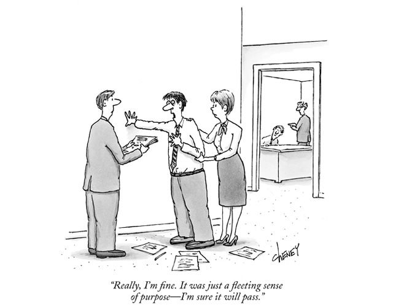

 
So, what's the point of business? For a long time I thought the point of [my business](http://dojo4.com/) was simply to design and develop software for clients and make money in the process. That turned out not to be true.

[Milton Friedman](http://www.stuartmcmillen.com/comics_en/war-on-drugs/), practicalist and Nobel Prize winning economist, said the point of business maximizing profit for the shareholders. Management visionary, [Peter Druker](http://www.entrepreneur.com/article/237484), said the point of business is to 
create a customer. And [Richard Branson](https://www.simpsonsworld.com/video/441732675508), says the whole point of business is to make a difference in the world. 

I believe that as entrepreneurs that our fundamental, core mission is to **connect**. Simplistically, that may mean connecting people with services, connecting people with products, connecting people with people, connecting people with information, etc. However, there's a difference between connection and *meaningful connection*. That being the case, then there’s an important element to examine in our mission to connect- what is that difference? What is the difference between just plain ol' connection and meaningful connection.

In my experience, essentially what makes that point of connection *meaningful* is when it is based in **purpose**. But in order to know that purpose, we each have to do the work to find out what is deeply meaningful for each of us, personally. We have to connect with ourselves, our motivations, fears, personal challenges, advantages, strengths and weaknesses, aspirations and inspirations.

What makes us feel that we are living a good life? What makes us come alive? What makes us feel grateful and appreciative of our day-to-day? What fuels our ambition, imagination, and desire to work hard? If we know that, then that sense of meaning and purpose will imbue every connection and carry outward.

Doing this investigation into what our purpose is, and what the purpose of our business really is,  is an opportunity that we have as entrepreneurs. It's an opportunity to take this fundamental mission to connect people with something they need (or something we think they need) in a more meaningful way. And people can tell the difference when these connections are meaningful. Meaningful connections are good for us, good for our colleagues and employees, good for our customers, and ultimately good for business!  

We have everything we need to investigate the real purpose of our businesses and make meaningful connections.  We have the ability to listen to ourselves and others. We have the ability to empathize, to acknowledge our own and each other’s obstacles, grief, humanness. And we have the ability to connect with our own authenticity. 

We have an opportunity to make each point of connection more meaningful, more lasting, more enriching. We have the opportunity to blow things open at that moment of connection and to change people’s minds about what that connection is. And we have the opportunity to change our own minds about what that connection is. By having a firm foundation in our own sense of purpose for our businesses, we will bring alive each connection, each sale, each service, each interaction with coworkers, clients, and competitors. I believe that if we want to have successful businesses, truly successful businesses, that this isn’t just preferable, but *necessary*.

Peter Drucker said: [“The number of people who are really motivated by money is very small. Most people need to feel that they are here for a purpose, and unless an organization can connect to this need to leave something behind that makes this a better world… it won’t be successful over time.”](http://www.druckerinstitute.com/2013/04/purpose-of-purpose/) 

I found out that point of my business isn’t actually to make technology for clients - that’s just the vehicle. The purpose of my business is to cultivate meaningful relationships, it’s to support the people and the families that work within my business, it’s about creating community and expansive human environments.  I found out that [the mission of my business, dojo4](http://dojo4.com/about), is to apply rigorous minds to meaningful work, change the way business is done and cultivate purposeful projects, relationships and environments.

We can all find ways to imbue our work, our businesses, and thus our communities with meaningful and powerful connections. We all do it in different ways because each of us is motivated by different purposes. We always have the opportunity to connect to ourselves and our sense of purpose. And that ability to connect to purpose makes our businesses create meaningful connections that do good for our colleagues, our clients, our competitors and, ultimately, our entire communities.
