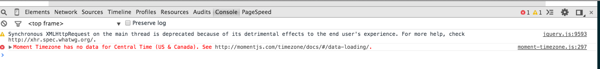

 
This error message in the console resulted from directly passing `Central Time (US & Canada)` as the value for `time_zone` in a [`moment.tz(date, time_zone)` call](http://momentjs.com/timezone/docs/#/using-timezones/parsing-in-zone/). 

Instead of `Central Time (US & Canada)`, the correct value to be passed here is `America/Chicago` - which is in line with the [zone object name property](http://momentjs.com/timezone/docs/#/zone-object/name/) that momentjs uses for uniquely identifying the timezone. 

`Central Time (US & Canada)` is the [**friendlier** name for timezone](http://api.rubyonrails.org/classes/ActiveSupport/TimeZone.html) used by `rails`.

Got around the issue by passing `time_zone.tzinfo.identifier` instead of just `time_zone`.

```ruby
> time_zone
 => (GMT-06:00) Central Time (US & Canada)

> time_zone.tzinfo.identifier
 => "America/Chicago"