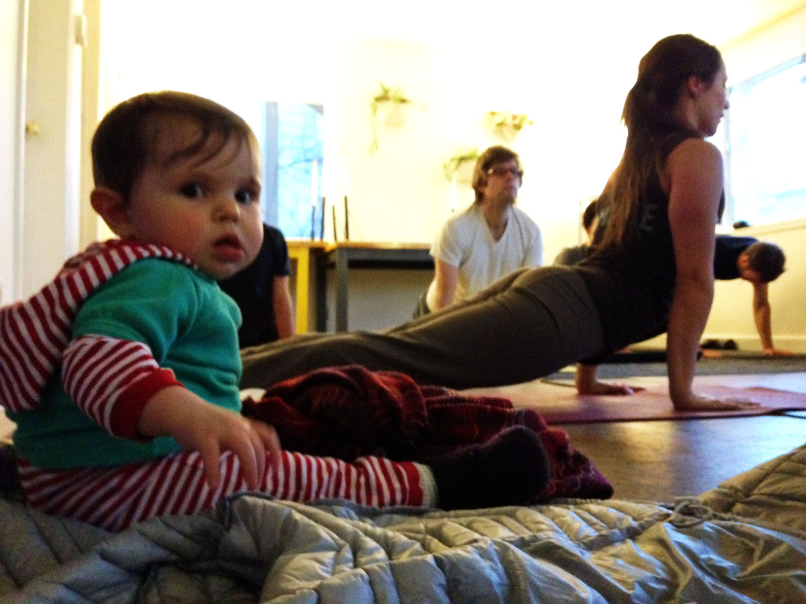

 

It's Wednesday evening, the room is full of heavy, deep breathing and I'm laying on the floor next to my co-workers. Again. 

Yoga led by the indominable and perspicacious [Angie Samadhi](http://www.angiesamadhi.com/) has become a regular and popular part of our week at dojo4. Many of us won't miss it. We'll do it in our jeans if we forgot to bring something stretchier. We've had neighbors, friends, strangers and clients drop in and get limber on a borrowed mat. We bring our babies and our dogs. Everyone loves it. 

We highly recommend doing non-work related things with the people you work with. We highly recommend it be physical. We highly recommend it make you stronger and more relaxed. Interpret as you like. We like to do yoga together.

Oh, and we highly recommend Angie. She's one of the best instructors I've ever had. Seriously. And she'll come to you. You should call her: [http://www.angiesamadhi.com/](http://www.angiesamadhi.com/).

