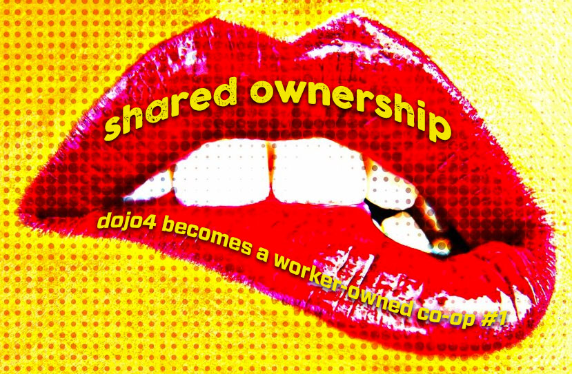
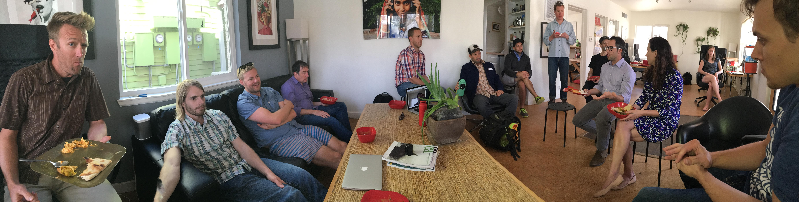
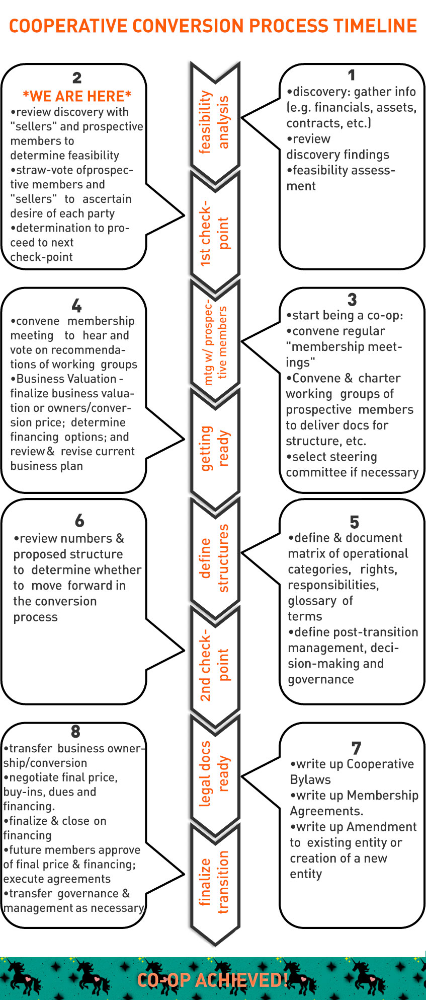

 
 

For years, we've talked about how we might diversify ownership of dojo4. [Ara](https://youtu.be/OXhiuMQchTE) and [I](https://www.youtube.com/watch?v=06v2Imhm5aQ) have been 50/50 owners of this little company for several years now, but have recently decided to move ahead and substantively explore transforming dojo4 into a worker-owned co-op. 

**WHY?**

As co-owners, we've shared all the ups and downs, decisions, responsibilities, risks, mistakes, and triumphs. Over those years we've also found some real balance with each other as owners. The business has been running smoothly and the happiness quotient has been high. So why throw a wrench in the gears at this point? What advantage could there be in turning dojo4 into a worker-owned co-op, at this point? 

Also, we had already decided a while back to share whatever was left in the bank account at the end of the year with everyone who had done work for dojo4 that year. So essentially we had already gone ahead and shared the majority of the upside with our community of contractors (we moved to a purely contractor model at the beginning of 2015), but still retained all the risk. Why would any dojo4 contractor want to share in that risk, especially since they were already enjoying what profit there was? 

Here's our reasoning:

* growth: we're done well with this business but it's likely not going to become substantially more innovative or enriching / enriched under it's current ownership
* flow: the inevitable bottlenecks that are created by having just two people at all the leverage points may be alleviated by having a broader ownership
* potential: co-oping will diversify inherent business risk, and it will very likely also increase potential upside
* longevity & replicability: we have a good thing going here and want to give it its greatest chance of surviving individual circumstances, and if a co-op model does that, it may also be something that can act as a model for similar businesses in other places

**HOW?**

First we talked to as many people as we could find who had gone in this direction, in tech. We had some really valuable conversations with people like [Yochai Gal](http://www.bostontechcollective.com/bios/).  
This led us to ask around until we found a really great lawyer who has made it his business and expertise to shepherd organizations on the path to co-ophood. [Jason Wiener](http://www.co-oplaw.org/statebystate/colorado/) and his associate, [Jessica Allen](http://www.jrwiener.com/about-jason/), are now providing us with legal counsel, a roadmap and a structure for potential stakeholder engagement in the process. Although not specifically endorsing anything we're publishing about this process, he's super supportive of us open-sourcing the process and the artifacts of the process so that other organizations can use our experience as a resource for a similar process of their own. 

This is where we are at with things right now (based on a timeline outlined by Jason and Jessica)...

 

**WHAT?**

At this point in the process, this is how we see the co-op taking shape and being structured:

* 3-7 people buy into the company and become c-owners with Ara and I
* we start this ownership diversification by choosing one person, and then having the 3 of us choose the next by consensus, and so on
* new owners buy in to the tune of $5k-$10k each (yet to be determined), which can be financed over the period of ~1 year
* co-owners at this level are a part of council that makes decisions by quorum according to a super majority about certain specific things:
- which clients we take
- which contractors we hire
- who other members of the co-op are 

**CONCERNS**

We're pretty excited about this potential transformation, but that doesn't mean that it doesn't come with its own worries and concerns, such as:

* something essential about what has made this business work, and successfully support many individuals and families for many years, will get lost if its ownership is diversified - will we dilute not just ownership, but some essential essence of the organization?
* even if we guard against the dangers of group decision-making, everyone involved has expressed concerns for the "too many roommates" syndrome- we'll need to work to structure an organization that respects our aversion to process-heavy operations
* our potential members / stakeholders have various levels of involvement with the current business of dojo4 (e.g. some are current contractors, some are past contractors, some are "friends of the family," etc.)- how complicated will it be to structure a [patronage system](http://www.co-oplaw.org/topics-2/patronage/#How_Patronage_Works) that accommodates members' various contributions and levels of involvement?

No doubt each of these concerns can be adequately addressed, but there are also likely to be more that will arise as we make the transformation to this new model of shared ownership. Despite this, we also have little doubt that this is a positive, generative reshaping of this business and that we can work with those challenges as they arise!

*This is the first of a series on our process to becoming a co-op. We hope it is useful to anyone who may be considering or in the process of doing the same. Please know, however, that:*

*- nothing published here (or, I think, ever on this site) is a substitute for legal counsel*
*- any reference to legal documentation or counsel is my interpretation*
*- our lawyer approves whole-heartedly of us open-sourcing this process but is not involved, nor has any editorial approval of anything we publish*

**OTHER RESOURCES**
* [http://www.co-oplaw.org/](http://www.co-oplaw.org/)
* [http://techworker.coop/](http://techworker.coop/) and [http://techworker.coop/resources/technology-freelancers-guide-starting-worker-cooperative](http://techworker.coop/resources/technology-freelancers-guide-starting-worker-cooperative)
* [http://www.geo.coop/](http://www.geo.coop/)
* [https://usworker.coop/](https://usworker.coop/)
* [http://cdi.coop/](http://cdi.coop/)
* [http://community-wealth.org/content/worker-cooperatives-models-best-practices](http://community-wealth.org/content/worker-cooperatives-models-best-practices)
* [http://american.coop/](http://american.coop/)

>>see [#2](http://dojo4.com/blog/on-the-lip-of-shared-ownership-dojo4-becomes-a-co-op-series-number-2) [#3](http://dojo4.com/blog/on-the-lip-of-shared-ownership-dojo4-becomes-a-co-op-series-number-3) in this blog series<<

