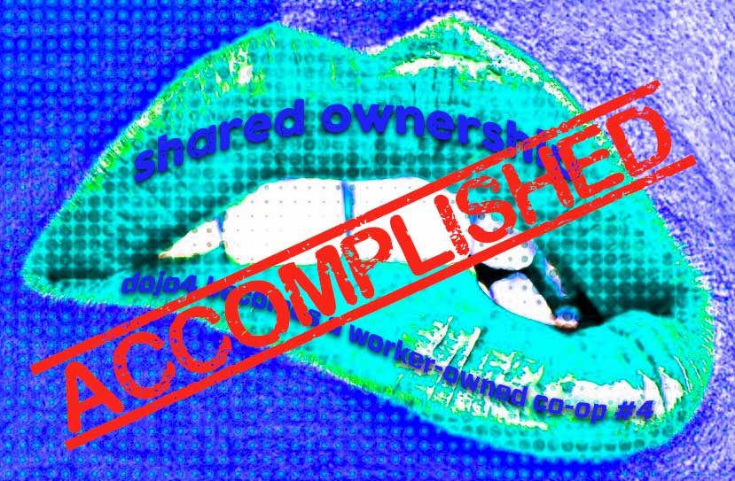
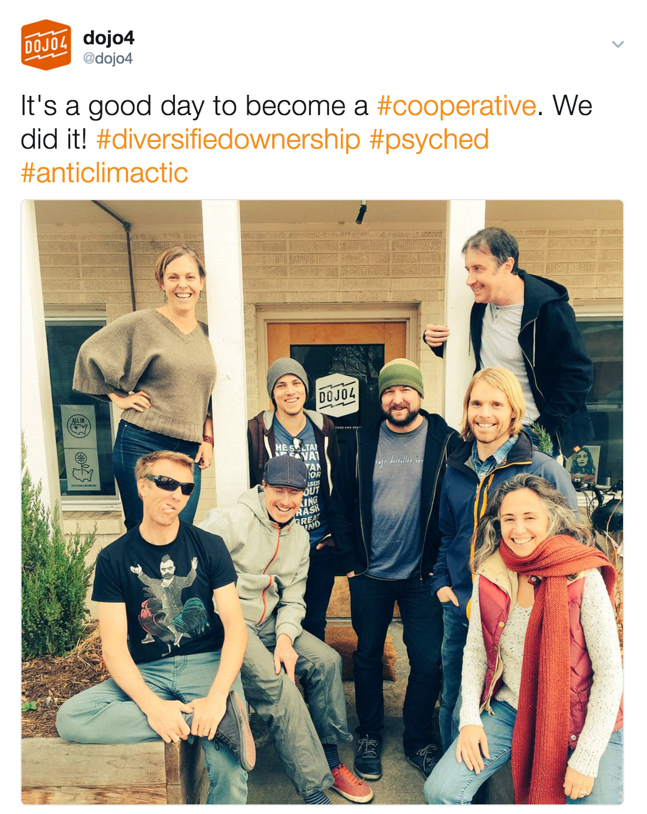
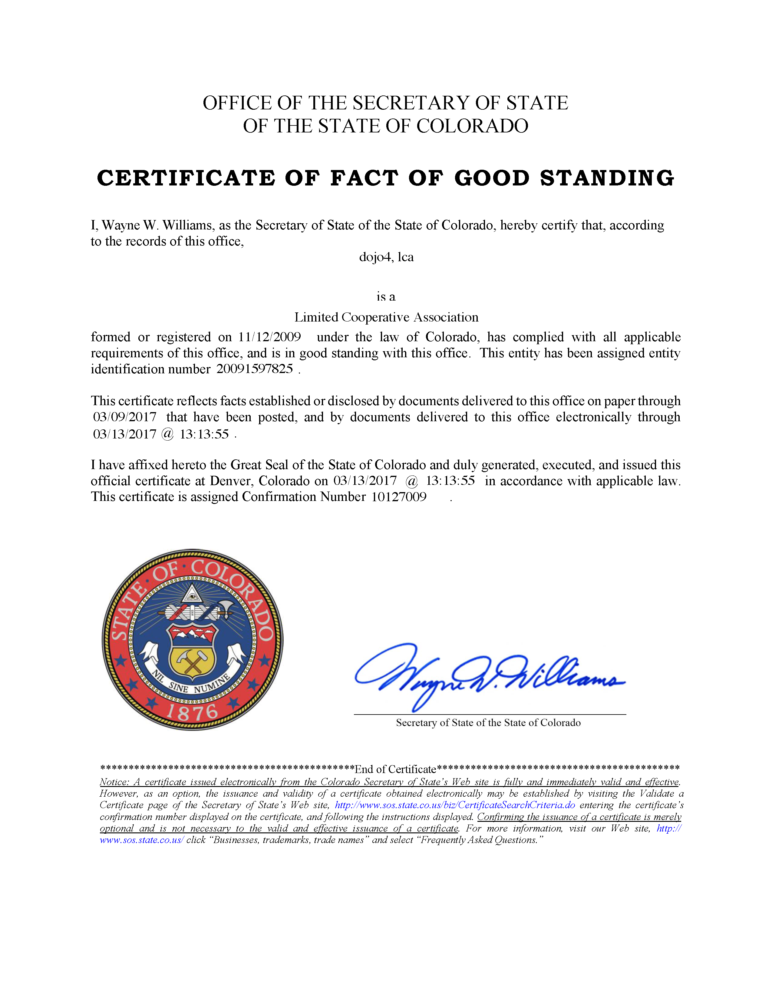
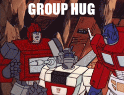

 

*> see [#1](http://dojo4.com/blog/on-the-lip-of-shared-ownership-dojo4-becomes-a-co-op-series-number-1), [#2](http://dojo4.com/blog/on-the-lip-of-shared-ownership-dojo4-becomes-a-co-op-series-number-2) and [#3](http://dojo4.com/blog/on-the-lip-of-shared-ownership-dojo4-becomes-a-co-op-series-number-3) in this blog series*

 

We did it! We cooperated. We cooperate. We are a cooperative.

[Almost six and a half years after filing our dojo4 articles of organization as a Limited Liability Company, we've converted to being a Limited Cooperative Association (LCA).](https://d3vv6lp55qjaqc.cloudfront.net/items/2M3N2k3f1E0C0h0E2l1M/Image%202017-03-16%20at%2010.02.57.png) 

 

We chose being an LCA over a being a Cooperative Corporation, mostly because it meant that we did not have to make any substantial changes to our accounting system or corporate structure. Now we just issue K1s both to the founders and the new members. Plus, as a LCA, it's easy to become a Cooperative Corporation later, but hard to go the other way.

As promised, and with the blessing of [our deeply cool lawyer, Jason](http://www.jrwiener.com/), we've open-sourced all our legal documents for you to reference or draw on in whatever way is most helpful to you. You can find them here: 

> [https://github.com/dojo4/policy/tree/master/co-op](https://github.com/dojo4/policy/tree/master/co-op). 

You'll likely still need Jason, or [another attorney](http://www.co-oplaw.org/), to help you draft documents that take your organization's particularities into account, including some specific conversion documents, but hopefully the documents we've shared are supportive to your conversion process (that sure does have an ecclesiastical ring to it). 

But before you go and take a look at all that legalese, outlined here are some of our learnings, so far:

*  Although not overly complicated, the co-op conversion process can take a looooong time. And we're small, so if your business is larger or more complex than ours, apply a multiplicative factor to how long it could take. It took us almost exactly a year. It's hard to run a business and turn it into a co-op at the same time. (Granted, we did [buy a building](https://twitter.com/coreykohn/status/781555418417946624) and [have a baby](https://twitter.com/coreykohn/status/793128317410906113) during that time.)
* Communication is key. As a small organization with lots of immediate and asynchronous communication tools, we tend to have fairly informal communication channels. For the most part this worked well throughout the process. We used email, [Redmine (a project management tool we use)](http://www.redmine.org/) [Flowdock](https://www.flowdock.com/), and [in-person meetings](assets/e.html). However, we're having to deal with how to keep those channels transparent and communicative now that some people at dojo4 are members and some are not. For the most part all our communications are transparent (e.g. we try to keep important messages out of email and in Flowdock and Redmine, where anyone can easily see them), but there are now more communications that concern only members. We are seeing how we have to be aware of inadvertent clubbiness and opacity. So far, we've addressed this by assigning a liaison who is not a member to make sure that important co-op information gets out properly to the non-member dojo4 contractor community. We're doing this through the [Redmine news feature](http://www.redmine.org/projects/redmine/news). 
* Legal documents vs. actual operations. All the paperwork is signed and that paperwork specifies some of the ways in which we decided we wanted to run this co-operative, but are very quickly feeling the gap between what's on paper and how to actualize it all the myriad real-life scenarios that dominate the day-to-day of running a business. For instance, the voting protocols that are outlined in the [term sheet](https://www.gitbook.com/book/dojo4/dojo4-coop-member-handbook/edit#/edit/master/term-sheet.md), aren't really operationalized. The terms sheet specifies one-member = one-vote, that being operationalized using [fist-to-five](http://agileforall.com/learning-with-fist-of-five-voting/), and a passing vote requirement of super-majority (2/3) vote of the members. But what does that actually mean? After several ebullient hours of conversation it was clear that there are many possible interpretations. For this and a number of other important reasons to flesh out operational procedure, we are creating a [dojo4 co-op members handbook (a work in progress!)](https://www.gitbook.com/book/dojo4/dojo4-coop-member-handbook/). 
* As we learn (or not) and incorporate our learnings (or not), we will document any relevant and useful information in this blog series.

So here we are. As per our [term sheet](https://github.com/dojo4/policy/blob/master/co-op/term_sheet) and [bylaws](https://github.com/dojo4/policy/blob/master/co-op/bylaws) we nominated new members by consensus decision - we are lucky to have had a pool of many long-term contractors and colleagues who were interested in becoming members. So now we are a total of 6 members (2 founders, 4 new members) and already enjoying the responsibilities and necessary collaboration of diversified ownership. I feel very proud and appreciative to have have helped make this conversion happen and to now be a member of a [real, live member-owned co-operative](https://cooperativesforabetterworld.coop/). Viva la dojo4! 

 