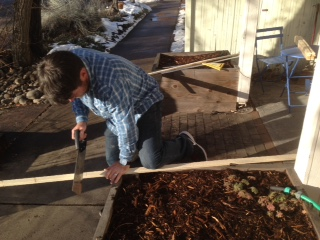

From: orgdev 
To: Boulder/Denver Tech Community 
re: Your opinion

First some context. Starting Jan.1 2015 my co-founder Sam Elmore and I moved our business into our own space in [downtown Boulder](https://www.google.com/maps/place/Dojo4/@40.019839,-105.273477,15z/data=!4m2!3m1!1s0x0:0xd1e17a53bc1c8230?hl=en-US). We are in the same building as [dojo4](http://dojo.com) who are our clients, family & friends. Operation **hang out a shingle**: check.

 

So what happens under said shingle? Ok, just a little more context (I swear). Sam and I created [orgdev](http://orgdev.com) for the expressed purpose of creating the *human* conditions for doing our best work. With our backgrounds in [psychology](http://naropa.edu), [authentic leadership](http://aliainstitute.org/), [mindful/awareness practice](http://www.mind-fitness-training.org/training.html), [theatre](http://www.playbacktheatrewest.com/), [life](https://www.youtube.com/watch?v=aboZctrHfK8), [the school of hard knocks](https://www.youtube.com/watch?v=zd7c5tQCs1I#t=43) etc. we have been trying to hack at the question of what supports individuals and teams in doing their best work... from the human point of view. Many efforts are made to support people from work flow/ productivity/ accountability/ and so on. Ours is an interest in the human beings themselves, not just their output (based on the understanding that you cannot separate the two). I think we've all had the experience where things just click, and we are "on" and our work with others is healthy, productive, and enjoyable. AND, sometimes things really just don't click...or worse. So what's up with that? 

(Generally, when I explain my work to people I get responses like: "better you then me," or "that is so difficult and so important," or "good luck." However, both Sam and I relish difficult problems, and find that working this material is the same thing as feeling alive.)

Ok so, again, what happens at orgdev? 

- We consult in an ongoing way, primarily with tech companies on intentional culture enhancement.
- We design and execute company retreats.
- We host and lead events and conversations about the intersection of our humanity and our work.
- We host trainings in methods of facilitation and human skill development.
- We coach individuals through the trials and tribulations of being human at work.
- We guide people and companies through transitions. 
- We play.

Now this is where your opinion comes in...we are looking for targeted feedback on a new offering: **facilitated peer groups** for folks of similar work stations. The purpose of these gatherings will be: to connect with peers, to support mentorship, to have a context to workshop some of the harder challenges we have in our work, to develop new skills and competencies and to have a space where one can be fully transparent about all aspects of their job . A critical human condition for doing our best work is connection. And yet very few resources exist for CTO's, COO's or Managers of engineers  to connect with one another. We plan to fill in this gap by creating peer groups of 6-8 people who meet on a regular cadence.  

Our direct network has responded very positively to the idea, and now we are taking our questions about this to a broader audience. So that means you. We would be so grateful if you could fill out our survey gauging both the desire for and shape that these groups could take so that what we offer actually fits the needs of the people who may use it. Please find the survey embedded in this blog post. It takes 2-4 minutes. Fill it out, share it with your networks... after-all we are smack dab in the middle of the [28 days of Kindness campaign](http://dojo4.com/blog/28-days-of-kindness). 

Thanks again. And keep you ears to the ground as orgdev and dojo4 may be throwing an awesome shingle/b-corp party soon...

<iframe src="https://docs.google.com/forms/d/1D45nGBAQwqKt7Dkn2hc6ulJbiiyFYVO7qeXBZtoUbtk/viewform?embedded=true" width="760" height="500" frameborder="0" marginheight="0" marginwidth="0">Loading...</iframe>

