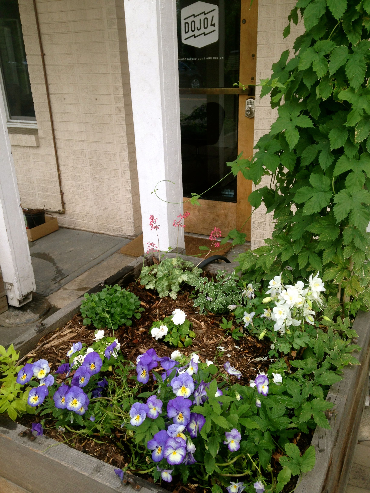
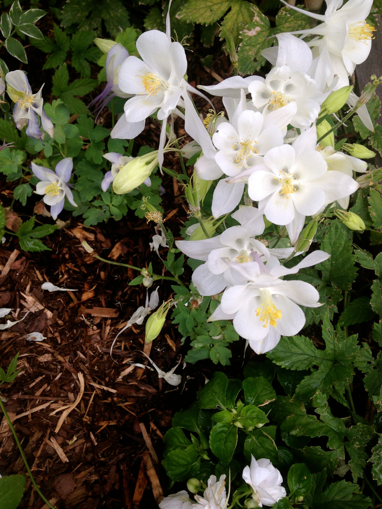
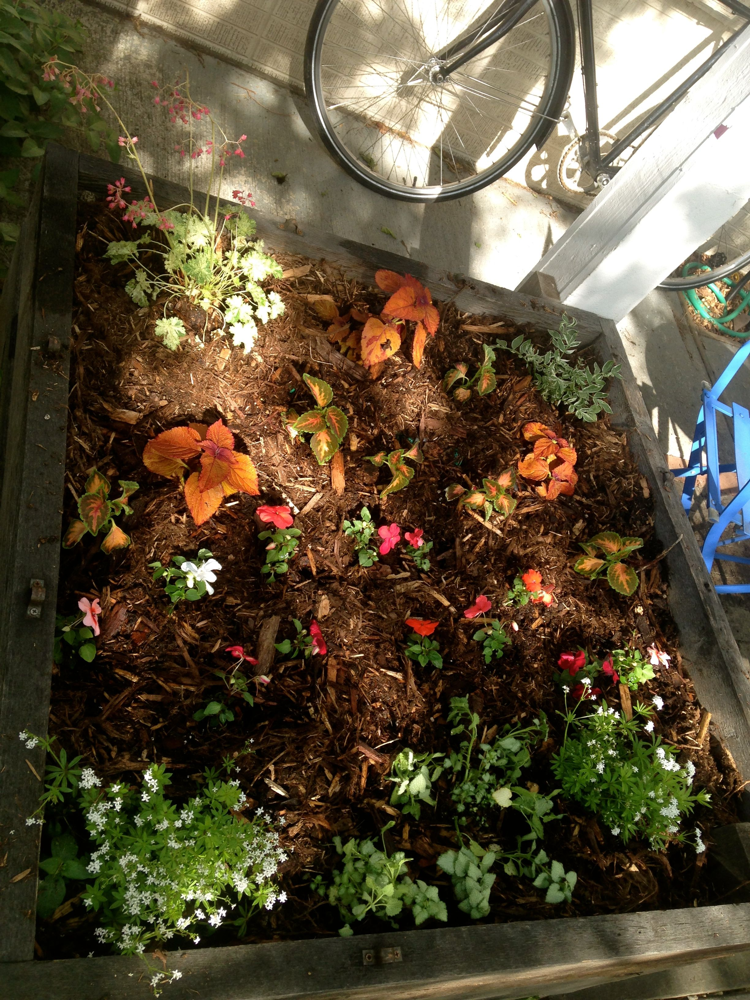

My husband says that making soil (a.k.a. composting) is like being The Creator herself, and that gardening is akin to playing God.  All I know is that it feels divine to get my hands in the dirt and cultivate green life and all the good things that go along with it.  

Finally finished dojo4's garden beds - it's been a long, wet spring!  Now, time to go home and work on my own.

Have a great weekend, folks.

 

 

 

