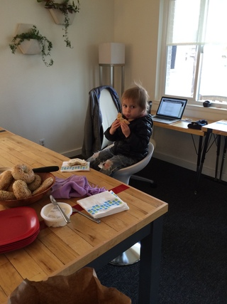
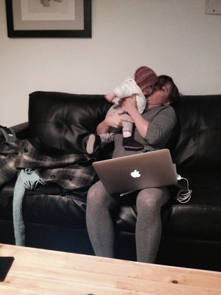

Juggling work life and parenting is an exercise in living with, and surrendering to, constant change. Read: Give into the chaos that is now your life. People often mention the phrase work/mom ‘balance.’ 

I think this is a joke. 

‘Balance’ is a sometimes moment, a fleeting second when you weren’t thinking of your growing to-do list. When we are talking everyday life, the gettin’ down to brass tasks, and moving between the roles of worker and mom, we are talking pandemonium. 

Especially if one is still breastfeeding. But that’s a different blog. 

Sometimes I think (wish) there will be a time in the not-so-distant future when things might actually smooth over, even themselves out, and, well, that’s a lie. Because, A) I have a toddler, B) I have another baby on the way C) I work part-time. I have a partner who works full-full time. We have a good, solid, supportive community and a well-established routine, but then you get sick weeks. The toddler has been ill with cold sores, and fever, and general irritability, which means that she is a miserable creature who is glued to my leg in her waking hours.

There is no getting into ‘balance,’ here, people. There is, however, leaning into our lives as they are - in constant flux, changing, moment to moment. No better teacher has come my way in that regard than my daughter. And, let’s face it - kids or no kids - we are all trying to escape the reality of  ‘not knowing what is going to happen next,’ so we might as well respond to our everyday as it happens. Easier said than done. 

What I know for myself: that the added chaos of being a working mother is a good thing. I’m positive it makes me a better parent. All the focus isn’t on my little one, who bless her heart, needs other people to shape her too. Sure, in the beginning there were tears (mine and hers). But I go away and come back recharged, showing up more fully from having spent time with adults who speak in full sentences. 

Working at dojo4 supports my life in the midst of the craziness. I like to think the ability for me to ‘do work from home,’ and, ‘do home from work,’ supports a life that is always in flux (sick kids, babysitter cancels, house floods, roof leaks, dentist will only see you tomorrow otherwise you will have to wait 3 months, etc.) I think there is tendency as a mother to compartmentalize our lives. My reality is that I am not separate selves throughout my day - I am mother, worker and me. At dojo4 I can bring all those things and this flexibility has been crucial in my ability to get the job done.

In addition, it’s the company attitude towards work flexibility. I work most of my hours remotely while my daughter takes her afternoon nap (thank you, oh nap gods). She and I come to the office for various duties throughout the week, and we are always met with warmth, and welcome, even when folks are in meetings with clients. No bother that the two-year old is in the next room drawing on walls (it only happened once, and I swear it came off easy-peasy). School-age kids drop by after school to say hi to a parent, and the babies take naps in the lounge while mom finishes up the last meeting of the day. Kiddos can attend Friday stand-up followed by community lunch, and mid-week yoga is open to all. The company’s adaptability to the many hats of their workers speaks volumes to the value they place on health, well-being and sanity. Navigating work and parenting ain’t for sissies, as I recently told a co-worker, but when you have a flexible, welcoming workplace, it makes all the difference. 

