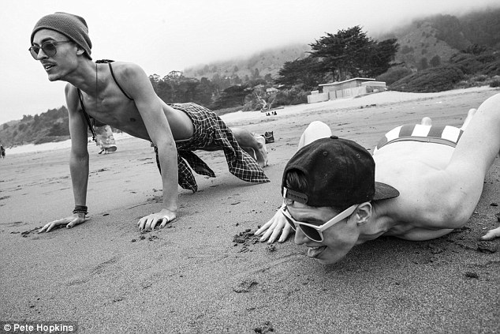
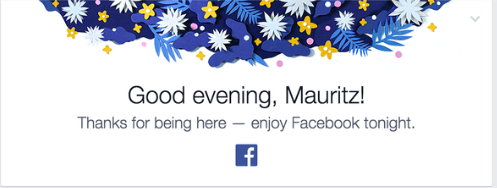

 
Essena O’Neill quit Instagram. You haven’t heard? It’s hard work being phony, hard on one’s sense of self. Don’t pretend like you don’t know. We’ve all had to play act in social situations - mother-in-law, boss, whomever or have affected some hairstyle, movement, mannerism, language, way of dress to mask insecurities and physical imperfections, or some way of being to fit in.

In an article on Refinery 29 Ms. O’Neill is quoted as saying, "Please can someone make a social sharing platform not based on validation in views/followers/likes but shared for real value and love?"

The inevitable and harsh backlash had begun within hours - the questioning of motives, anger, name calling and public shaming. Where else? In the very social media where flogging has become the norm, and the mirror for seeing one’s true self is bombarded and clouded with curated images of something. 

Undressing our vulnerabilities in public is frightening. And Essena, a teenager, had the cunt, the girl given gumption to out herself and stake a claim for something better.

Back in March, gender-bending model Rain Dove, who is already calling into question rigid views of identification, preference and style by just being, and being brave enough to do so, posted a blog titled: NEEDED: LESS SELFIE PEOPLE AND MORE SELFLESS PEOPLE

“QUICK PSA: I post a photo wearing $5k outfit... 300 Likes. I post a photo donating $5k from selling that item to a homeless shelter organization... 45 Likes. Im not looking for applause or validation from the world. But I am wishing that people valued GOOD ACTIONS as highly as GOOD CLOTHING.”

Meanwhile, over on the Wal-Mart of social media where original thought has long been replaced with a weird mix of pettiness, Thanksgiving day politeness and second hand showmanship, the Zuck-machina is now serving up a “healthy” dose of ersatz emotion.

 

As the father of three teenagers, two girls 17 and 14, and 17 year old son, all of this has deep meaning. That crazy human transition from the parental nest to forming an identity, a sense of self, becoming more adult was difficult enough when not every waking second was easily documented, shared and compared. But externalized pressures of what it means to be successful, beautiful, worthwhile have ramped up considerably, making it that much harder to discover and know one’s true self. 

At 23 I dated a beautiful young woman who had modelled almost all her life. All that time in front of a camera, being complimented on her physical appearance, jaded her sense of self. How deeply she wanted someone to know her inside, to care enough. She was also smart enough to know the doors her physical opened - which actually made her even more self conscious.

My son told me this week about a weekend of relative debauchery. One of his buddies had rented an AirBnB or VRBO in the foothills, and the house was used like a bit of a one-hour motel (though more likely an 8-minute motel). He said he and his buddies were talking Sunday morning about how all the girls are: “someone’s daughter or sister.”

My daughters, his sisters, experience the disconnect between a sense of self and peer-group perception. It’s an odd feeling watching one’s daughter be objectified, and even much harder when it happens outside her peer group, at a restaurant say, on the street, a man not much younger than I am. 

Social media in some ways objectifies the self, commodifies in a way that cannot be great for self-esteem. I am not a social scientist - not one with a PhD from a reputable university. I cut my teeth behind bars, a gin and tonic psychologist who just likes to watch people. I’ve done my share of objectification as well in my day, still probably slip more than I should, especially as the father of three teens.

If I were Essena’s father, I'd tell her she should be proud of herself for choosing a different path, learning herself in real time, feeling. I’d say: remember that place that felt hollow and lean into the places that feel good for you.

Rain Dove, too, sets a shining example for all of us on the path of emotional evolution. How special that her sense of self cannot be defined by social norms. That her gender fluidity manifests itself in so many beautiful ways. 

Wouldn’t it be nice if instead of selfie-sticks, we started honoring self through acceptance of, empathy for and learning to love what is beneath the surface. Wouldn't it be nice if our social media presence matched that place.
