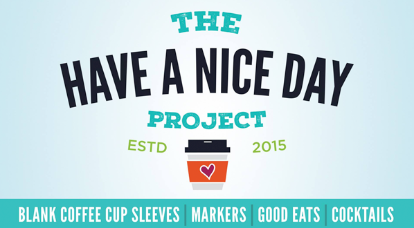
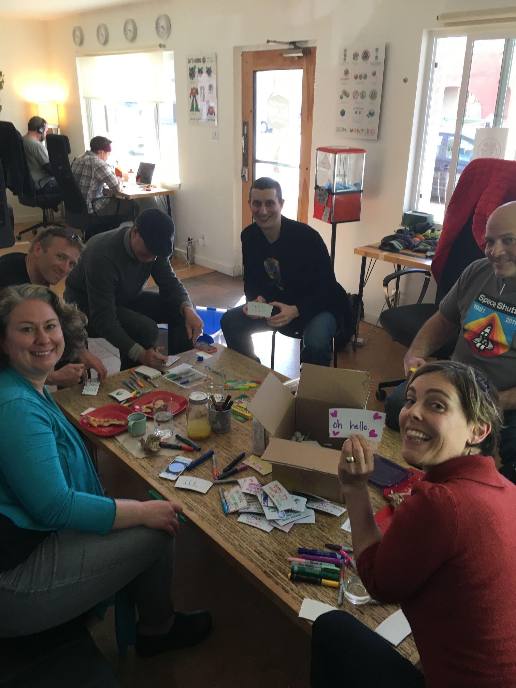
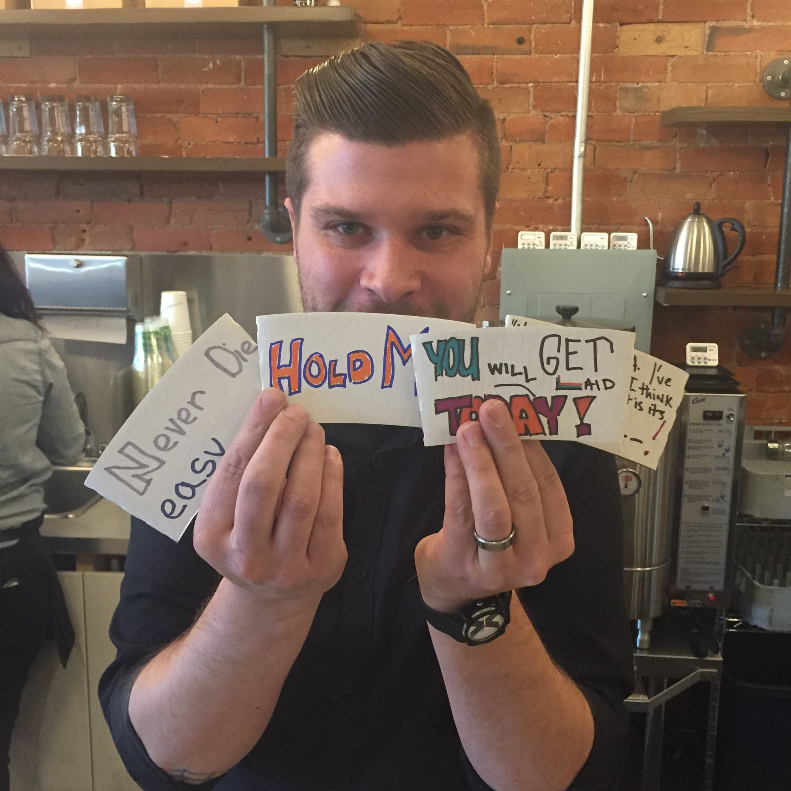

              Spreading The Good Feels

  

Jessica Watson, of the design firm [Points North](http:http://www.pointsnorthstudio.com//) reached out to us with a spunky idea of spreading some love to a local stranger. As part of her [#28dayskind](https://twitter.com/search?f=tweets&q=%2328dayskind&src=typd), she sent us a box of blank coffee sleeves and we were tasked with coloring, offering jokes and words of wisdom and kindness. Here we are, dojo4 peeps and friends, yukkin’ it up over delish Audrey Jane's Pizza  all while listening to the tunes of our in house DJ Joel of [Conduit](https://conduitmusic.co/). We got some serious giggles and ‘awwww’s’ by offering our best in an effort to let some random folk how awesome they truly are (or simply make them laugh). 

    

Coffee cozies were dropped at our local, and beloved, [Boxcar roasters](http://www.boxcarcoffeeroasters.com/). Baristas had some favorites and there was nothing but delight as their patrons enjoyed their tea/coffee! Thanks again to Jessica, who gave us a reason to gather, brainstorm, feel inspired and laugh all for the joy for another human!
 
 

