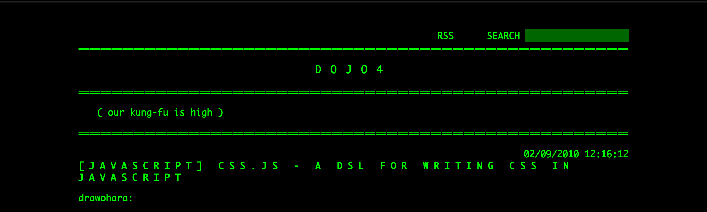
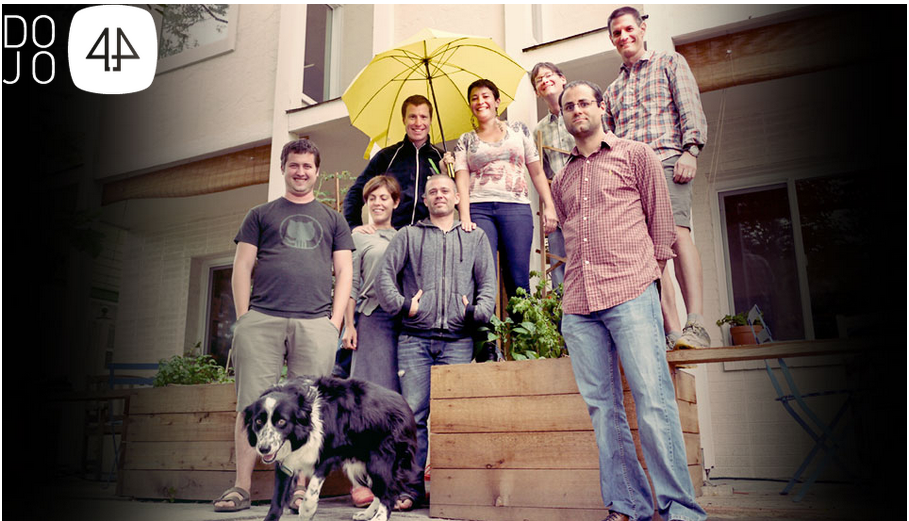
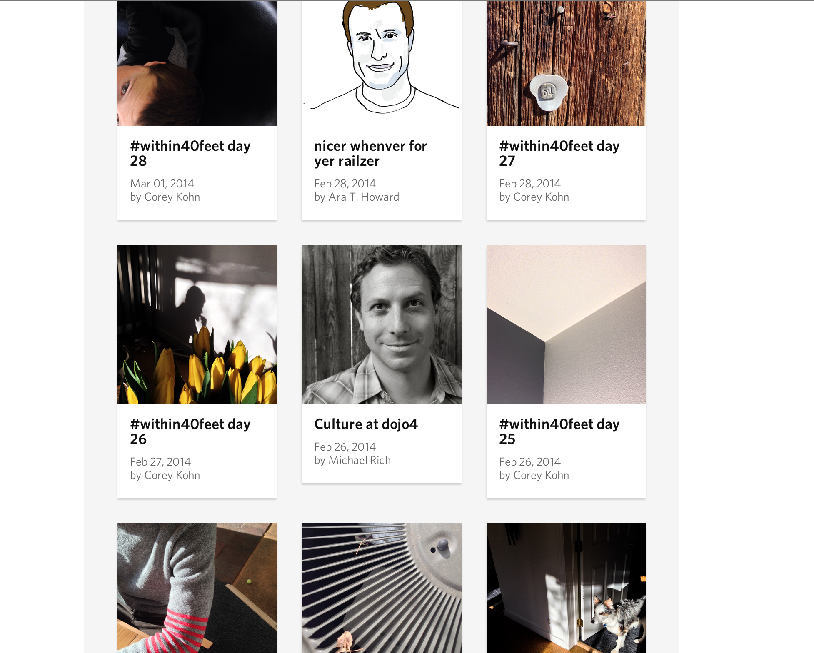
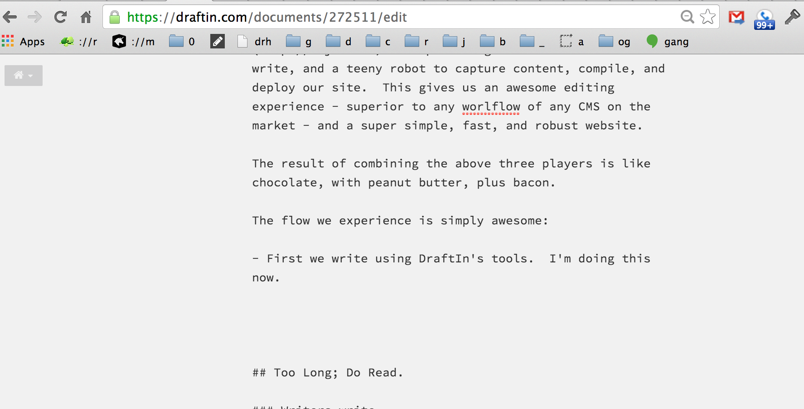
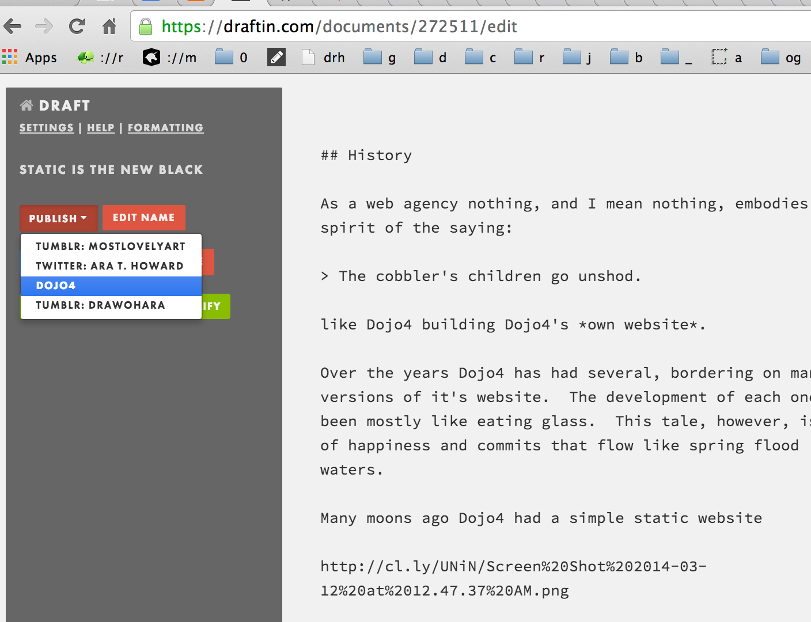
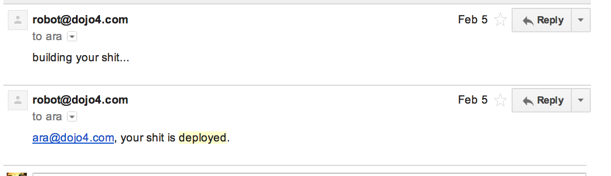
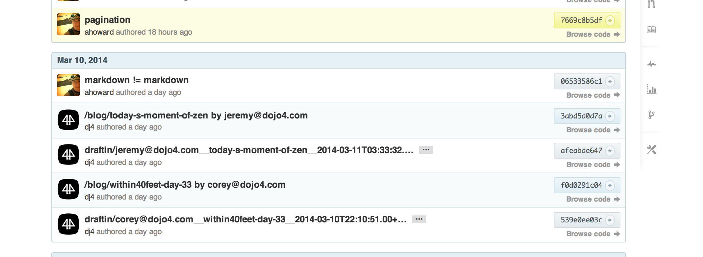
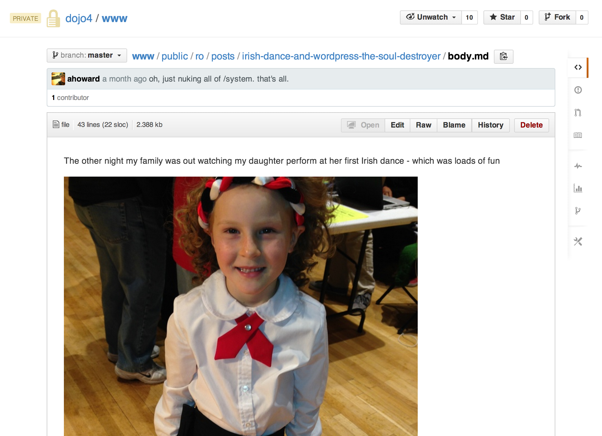

## Prologue

As a web agency nothing, and I mean nothing, embodies the spirit of the saying:

> The cobbler's children go unshod.

like dojo4 building dojo4's *own website*.

Over the years dojo4 has had several, bordering on many, versions of it's website.  The development of each one has been mostly like eating glass.  This tale, however, is one of happiness and commits that flow like spring flood waters.

## History

Many moons ago dojo4 had a simple static website

This was fun, we changed it daily and enjoyed the creative freedom that only static can bring.

Of course we eventually had to grow up: we designed things, we 'needed' a CMS, budgets were allocated.  We launched a new site, based on [Refinery](http://refinerycms.com/), in the hopes that people would continue to hack, to play, in the awesome sauce that a Rails' backed CMS should bring

No one hacked.  No one played.

(well [Brett](http://www.brettgoulder.com/) did do one sweet konami code thing that involved unicorns pooping rainbows, but that's the subject of another post...)

Our next iteration was the 'craftsmen' edition.  Homespun fucking everything: ground up re-brand, custom crazy design.  Custom Rails.  Custom Javascript.  The works.

Before we did it I had reservations: why not simply return to static?  Learn a little code.  Write some HTMLz.  What's the big deal?

I gave in.  People were convinced that *only* a fancy UI would allow
non-technical authors to publish.

So we did it.  Built a really great custom toolchain. It *was* beautiful

We enjoyed our custom solution for quite a while.  But then we noticed
something.

No one hacked.  No new design happened.  The same people wrote.

It turns out that the barrier to writing isn't, and never has been, a technical one: people write because they must, no matter what the tooling.  Every one else simply cannot or will not write, sexy interface or not.

It turns out that the people that want to open up the can of creative whoop-ass on web site, lo and behold, aren't designers, they aren't backend developers, they are front-end engineers that can power 10,000 lines of CSS before breakfast.  They are people don't want to muck with database migrations, with servers and processes, with complicated deployments; these things simply get in the way of 1000 watts of front-end talent.

So we started over again.

It began with quiet conversations with [Steve](https://twitter.com/wouldthatiwere).  We talked about rebuilding the site in a day - beautiful and static.  Liberating ourselves from the ball and chain a server, database, and admin interfaces bring with them.  And then, we did it in a weekend:

Our new site is %100 static:

Yet [content is developed and deployed every day](http://dojo4.com/blog)

The rest of this story is about how we did it, and how you should too.

## Now

We love building sites with [Middleman](http://middlemanapp.com/).  It's a simple static site generator that lets us stay in Ruby while building data driven, templated, and well-factored websites.  The benefits of this toolchain cannot be overstated.  When dojo4 builds something on this toolchain, front-end engineers are fully liberated - sorta like reaching nirvana - but more like not being bogged down getting some backend developer to come up for air to implement some data interaction needed to drive the view layer.  Designers are liberated too: freed from rigid frameworks, slow times to pivot concepts, and complicated infrastructure required to put something into people's hands to solicit feedback.  Middleman solves all this and so much more.  There are many other players in the static site generator space, and I encourage you to [check them all out](http://staticsitegenerators.net/).

[BitBalloon](https://www.bitballoon.com/) is everything you wanted from Amazon's S3, but were afraid to ask.  Build your static site and deploy in 3 lines of code.  Let BitBalloon handle asset minification, image compression, content negotiation, and pushing everything out onto Akamai to be stupid fast.  It's sprockets as a service, and s3 on steroids - eating meat and pumping iron.  It's that awesome.  Oh yeah, they do atomic deploys and rollback for you too.  Did I mention not needing a server and the [wicked cheap](https://www.bitballoon.com/pricing) part?

[DraftIn](https://draftin.com).  This part starts to get crazy y'all...  So some of you are probably thinking - how lame must it be to publish content when you have to write code all day long!?  DraftIn has you covered.  It's the bestest writing tool of all time; try it now and you'll see: nothing beats the workflow of writing markdown, soliciting feedback, easily managing edits from a dozen contributing authors, and finally getting ready to publish your content. They even have an army of editors sitting their you can click to solicit - getting your stuff edited for a teeny fee by NDA signed professional editors.  DraftIn just does writing, but they support the notion of pushing content (via WebHooks) to every service from WordPress to Tumblr to Facebook.  They also support pushing to arbitrary robots listening in the cloudz.  

We have such a robot

She is a teeny robot that listens for publishing events from DraftIn, captures the content, commits it to git, builds the site with Middleman, and then deploys via BitBallon to produce what is currently [http://dojo4.com](http://dojo4.com).  

In plain english we use draft to write content, push a button, and then a teeny robot captures the content, compiles it, and deploy our website.  This gives us an awesome editing experience - superior to any workflow of any CMS on the market - and a super simple, fast, and robust website.

The result of combining the above three players is like chocolate, with peanut butter, plus bacon.

The flow we experience is simply awesome:

- First we write using DraftIn's tools.  I'm doing this now. 

- Next, we publish to dojo4's robot 

- The robot informs us of her progress 

- Content shows up, and even renders, on [GitHub](http://github.com)  

And, a few minutes a new [http://dojo4.com](http://dojo4.com) is born.

## Too Long; Do Read. 

### Writers write.

Other's don't.  No tool in the world will cause creative kundalini energy to wake someone up at 3am to post a new blog.

### Static is magic.

Give up reasoning about caching: just cache it all NOW.  Static serves like lighting, for next to zero cost, and it unshackles the inner designer of everyone that touches the code.

### GitHub is king.

You want all your content in revision control.  We can roll our entire site back *exactly* as it was 7 days, 4 hours, and 2 minutes ago including styles and data.  We can pinpoint every single change, no matter how small, that was made to our website by whom and when; we can undo these changes too.  We can re-create our entire site in seconds on any platform capable of serving simple HTML.

Can you?

### Design is dead.

I don't know what you call it, but the people that are building the modern web are technicians - front-end engineers.  The proliferation of devices, technologies, and expectations has kersploded into a landscape that can only be managed by people with meticulous notes in moleskines that obsess over web standards and - wait for it - code.  Ideas have gotten complicated and the ancient 'design and build' philosophy that worked with 960 pixel screens (for a week) has gone the way of the Dojo.  Er, Dodo.

We aren't in Kansas anymore and your designer had better know how to code.

## Epilogue

There is so much more I'd like to say about why going static is awesome.  Awesome seeing everyone in the shop contribute to the code in the *first week* after being deployed.  Awesome seeing new bits of [creativity come to life](http://dojo4.com/fun).  Awesome seeing [new people writing](http://dojo4.com/blog/today-s-moment-of-zen).  Awesome sleeping at night and not giving a shit if 'the server is up'.  Awesome spending 10x less money doing something 10x better than anything we've done before.

But that'll have to wait - we've got more beautiful, screaming fast, responsive static sites to build.

## Coming Soon

In the next installment I'll write about how we are taking our site build time from 180 seconds, down to 3.  With no new tooling.  On Ruby.  In about 100 lines of code.

## Refs

For those of you that prefer to read code over blogs, here's the money shot:

- the entire dojo4.com, sans a bunch of content and some passwords [middleman app](http://assets.dojo4.com.s3.amazonaws.com/m.tgz)
- the draftin/webhook, lacking only config [rack app](http://assets.dojo4.com.s3.amazonaws.com/r.tgz) that listens for our posts, compiles, and then deploys the site on our behalf
