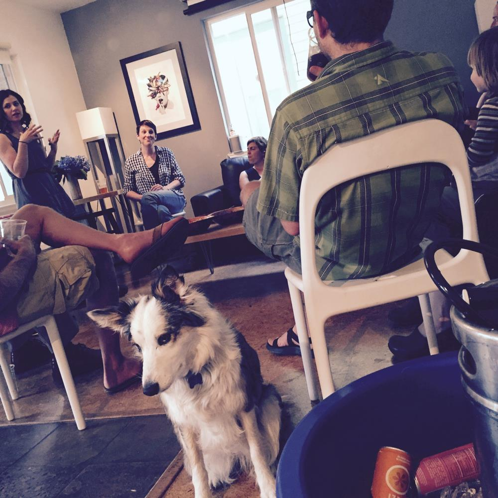
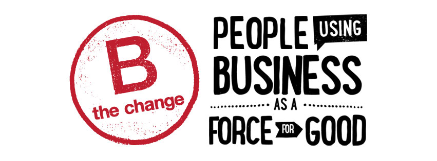

Last week DOJO4 hosted [B Lab](https://www.bcorporation.net/what-are-b-corps/the-non-profit-behind-b-corps)'s community development maven, Kara Peck, to test our B Corp movement trivia knowledge.  How many can you get right? (More than Olive the Dog, we hope).

 

**QUESTIONS**

1. How many B Corps are there around the world? In Colorado? 

2. What is the difference between a Certified B Corp and Benefit Corporation? 

3. What three things does a company have to do to get certified?  

4. What are the main topics covered in the B Impact Assessment?  

5. How often does a B Corp have to renew their certification? 

6. This local spicy chai tea producer holds a yoga and music festival each year.

7. What Colorado B Corp celebrates their employee owners 5-year anniversary by giving them a paid trip to Belgium?

8. This B Corp is located in Boulder, on the corner of Broadway and Walnut.  They offer a co-working space for companies dedicated to having a positive social and environmental impact in the world, including B Labs Colorado. What is their name?

9. Which two Colorado B Corps just celebrated their 10 year anniversaries - hint, you might find one on your roof, and one on your doorstep.

10. What B Corp recently re-located to Colorado from California, and sells socks and t-shirts in Whole Foods?

11. Name one of the three Certified B Corp law firms in Colorado. 

12. Name a Colorado B Corp that certified in 2015.

13. This B corp sells sturdy comfortable shoes that certain types of professionals swear by: nurses, hair stylists, waiters, chefs? What is the name of this company?

 

**ANSWERS**

1. 1300 / 55.

2. Here's [a good explanation](http://www.nonprofitlawblog.com/what-it-means-to-be-a-b-b-corp-v-benefit-corporation/) of how the two differ.

3. Performance, Accountability (legal), Transparency.  

4. Governance, Workers, Community, Environment, Impact Biz model.

5. Every 2 years.

6. [Bhakti Chai](http://bhaktichai.com/).

7. [New Belgium Brewing](http://www.newbelgium.com/).

8. [Impact HUB Boulder](http://www.impacthubboulder.com/).

9. [Namaste Solar](http://www.namastesolar.com/) and [Door to Door Organics](https://colorado.doortodoororganics.com/shop-good-food).

10. [PACT Apparel](https://www.wearpact.com/).

11. [Jason Wiener PBC](http://www.jrwiener.com/about-jason/), [Moye White](http://www.moyewhite.com/default.aspx), [Blue Dot Advocates](http://www.bluedotlaw.com/).

12. [DOJO4](http://dojo4.com/), [Conservation Impact](http://conservationimpact.com/), [Nava Real Estate](http://), [Purely Elizabeth](http://purelyelizabeth.com/), [Jason Wiener PBC]([http://www.jrwiener.com/about-jason/](http://))  

13. [Dansko](https://www.dansko.com/)!