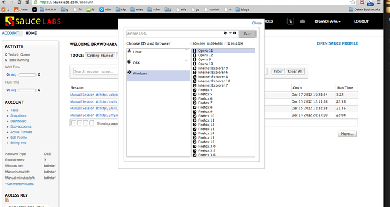
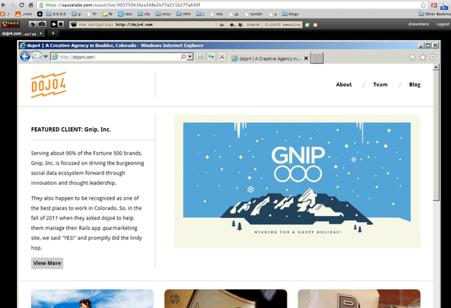
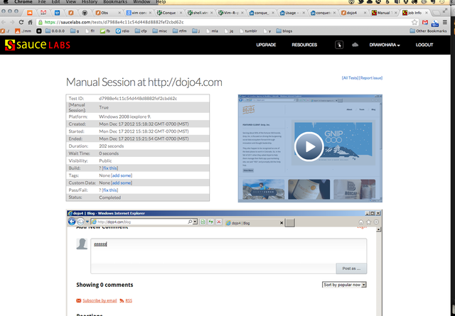
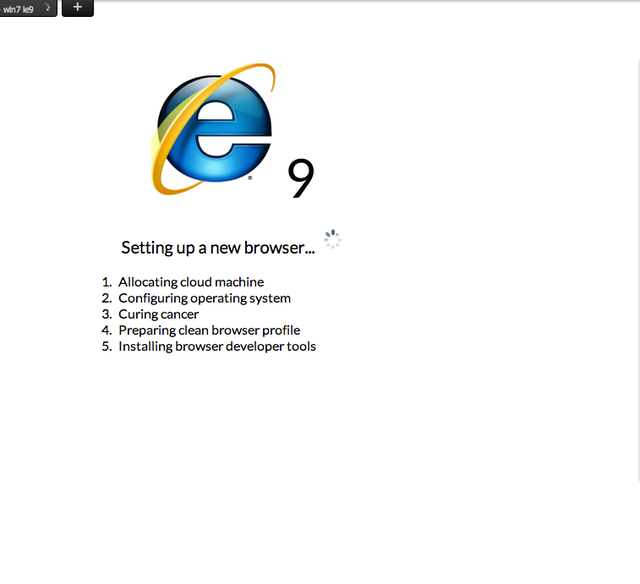

This weekend I was hammering out some bugs in two projects (http://dojo4.com itself and http://my.windowfarms.com).  I'd been putting them off for a long time because testing in IE9, traditionally, is like eating glass or slamming your woo-woo in the car door.

It'd been a while since I'd expore the options for "not having to bootstrap an actual windows machine" and was pleasantly suprised to find two radically awesome alternatives:

The first is http://saucelabs.com/ - they pretty much let you boot any browser in the web browser

That's me booting an instance of IE9.  Once yer done it looks like so:

They record and let you share all the sessions:

PS.  it is a paid service, but they give you a free account if you are certified OSS.  With > 150 rubygems out there I took advantage of this to preview, but I plan on folding paid accounts into http://dojo4.com because it's fast, rad, and also extremely fast and rad to test a stupid IE bug in a hurry using their platform.

That's pretty much it.  You boot it, you use it.  It's kinda slow.  

BTW - the boot screens are the *best*:

The next tool is used is less fancy and extremely slow to install, but it gives you real live IE instances inside a https://www.virtualbox.org/ instance in a hurry.  The screenshots look just like bloody windows: but head on over to

https://github.com/xdissent/ievms

and follow the destructions.  4-8 hours later you'll have easy to fire up full-on IE VMs on yer OSX/linux box.

*HUGE* shout out to https://twitter.com/janeqpublic // https://github.com/xdissent for the fine work.

