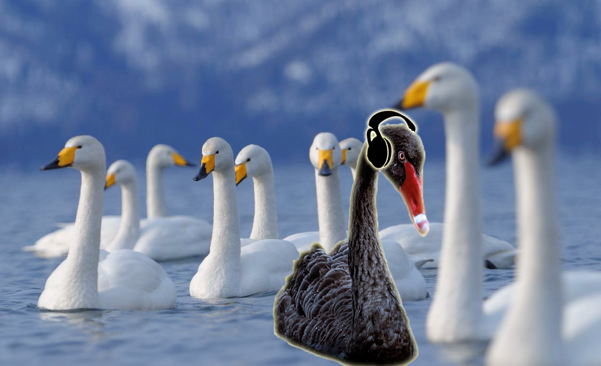

 

I’ve been working on my own since the beginning of 2014, running the [Black Swan Sounds](http://blackswansounds.com) record label (yes, those do still exist) out of my basement in south Boulder. It’s a pretty good gig, as gigs go, but this fall I was spinning my wheels, stuck in a rut I wasn’t sure how to get out of.

In October, a friend offered me some office space in his warehouse in Boulder. A couple of other friends — an [artist](http://juliemaren.com) and a [graphic designer](http://sarahchesnutt.com) — were moving in as well, and it sounded like a great situation; my way out of the basement and into the light. But the rent, as cheap as it was (for Boulder or anywhere else), was out of reach for my meager record label budget. Sadly, I had to decline the offer.

A couple of days later, I gave my longtime friend [Mark Gelband](http://dojo4.com/team/mark-gelband) a call. It had been a while since we’d spoken and I wanted to catch up. Sensing my mood and, as always, acting out of kindness, Mark said, “Come meet my friends at DOJO4. Bring your laptop, do some work, play some music, have some lunch.” I didn’t know anything about the place, but I trust Mark implicitly and gladly accepted his invitation.

The next day, a Friday, I met up with Mark at [Caffeinated Mornings](http://caffeinatedmornings.com/), where he introduced me to some of the founders and staff at Ello. We had a discussion about music that led to my starting a music community called [@radiofreeello](http://ello.co/radiofreeello). Already, the day was off to a great start. 

We headed over to DOJO4 afterwards, and Mark introduced me to the friendly people there. I found a spot, opened my laptop, did some work, played some music (and, yes, had some lunch). 

Thanks to their warm and gracious hospitality, I felt at home from the get go. Perhaps it was [Ara](http://dojo4.com/team/ara-t-howard) and the others responding positively to the music I played that afternoon. Or, it may have been my awesome [“Caucasians” t-shirt](http://www.huffingtonpost.ca/2014/07/29/caucasians-t-shirt-tribe-called-red_n_5631865.html). Whatever it was, at the end of the day, [Corey](http://dojo4.com/team/corey-kohn) invited me to keep coming back. “Get out of the basement. Do your work here. Play music for us.”

It all sounded good to me, and for the last two months that’s what I’ve been doing. Going to the office instead of living at it. Feeding off and perhaps even contributing to the abundant energy flowing through that place. It was exactly the situation I’d been looking for, without even really knowing that I was looking for it. The last time I had that feeling was when I began volunteering at [KGNU Community Radio](http://kgnu.org) 25 years ago. That move led to a foundational shift in my life, cementing music as the center of it. Everything I’ve done since then stems from that.

Now, thanks in large part to the unique taste in music that KGNU instilled in me, I’ve been welcomed into a new community and am already feeling that shift. Ideas are turning into plans. I see the opportunity to engage the primary aspects of what I’ve been doing for most of my life: sharing music as a way to create community, positively impact the world around me and, simply, spread joy. 

It’s all very cool and exciting. I’m honored, grateful and humbled to be the Resident DJ at DOJO4. It’s a great way to end the year, and has me amped for the big things yet to come. 

Today, Corey asked, "what's the most unexpected thing that happened to you this year." My answer came easily: landing at DOJO4. As I write this, it occurs to me that this was sort of a personal ["Black Swan event,"](http://blackswanevents.org/?page_id=26). Auspicious (for me, anyway), as that's part of the inspiration behind the Black Swan Sounds name. 

To celebrate (and demonstrate) this unforeseen and very welcome turn of events, here’s a mixtape of some of my favorite songs from 2015. Thanks for listening and Merry Everything.

[Merry Everything: A [special] Friday Mixtape](https://www.mixcloud.com/BlackSwanSounds/merry-everything-a-special-friday-mixtape-18-december-2015/)

