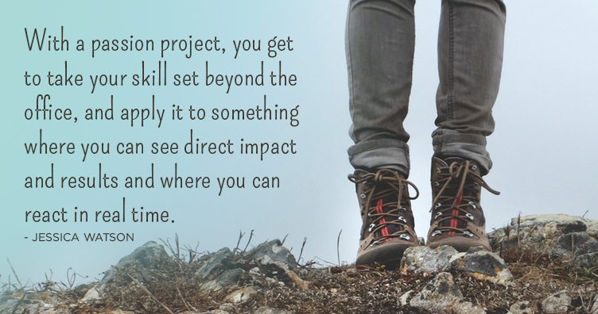

**The Power of Passion Projects**

I've long been in the habit of asking people "what are you passionate about?" verses "what do you do?" When you ask this question, in the right circumstances, you'll get juicy nuggets of wisdom, experience, and things happening behind the scenes. It's tough to define a person by his or her job, and more authentic to think about the bigger picture. 

Many say I'm fortunate enough to do work that I love. And while I agree, I don't want to downplay that it took a lot of time, commitment and dedication to set my life up this way. Even with a profession that I love, I still have side projects. I've nicknamed this "Passion Projects," which I deem things that you pour your heart and soul into, things that you spend hours on, and things that you're probably not getting paid for (and perhaps you're not looking to get paid for). These are projects that you simply just believe in. You usually are trying to fill a need or a void, to solve a problem, to make something better. And that, far outweighs the long nights, or trying to squeeze it in around an already tight schedule.

 

With a passion project, you get to take your skill set beyond the office, and apply it to something where you can see direct impact and results and where you can react in real time. Over time, a passion project could generate some income, get you recognition, and open the door to larger opportunities. But, more often than not, it could take years if it happens at all, and that's not why you're in the game. If you retrace the steps of some of the unique things happening in your community, or follow some of the spinoffs created by successful business owners, you'll learn that a lot of these scenarios started as ideas. They started as some wild idea that perhaps no one believed in. They started as the thing that kept someone up at night, or the faint notion that something indeed might be possible, if there was one out there willing to dedicate the time and advocate for it. These are not accidents.

You probably have unique ideas floating around in your mind right now, that perhaps for whatever reason you've decided not to explore. Let's recap and rethink this:

**WHAT IS A PASSION PROJECT?**
A passion project is a task, not bound by normal constraints of time and resources, based on an idea that could solve a problem and better something in some way. It's the sketches in your notebook, it's the "what if?" factor. It's often something only you can see at first, but slowly as you work through the project, others will rally behind you as well. There are no size restrictions, but the standard advice is to think big while starting small. Not all passion projects bring wild success or sustain a legacy, but they are still worth exploring. As an additional note, make sure you're in it for the right reasons, as authenticity is highly valued here.

**WHY ARE THESE PROJECTS IMPORTANT?**
Because you should be more than the sum of your 9-to-5, or your home life, or your current circumstances and situation. Because you have talents and abilities that can be put to use beyond the classroom or the office. Because this is the free space that we used to have as children, where anything was possible, where we could use what we knew to create, to adjust, and to achieve. Because win or lose, you're getting in touch with a different side of yourself, and you're affecting those around you by pursuing your project.

**HOW CAN YOU START ONE?**
Start small. Think of your skills (this can be as far fetching as "I'm a developer" or as simple as "I have good organization skills."). Think of something that interests you. Look in your community. Ask around. Look beyond your community, perhaps other places around the country or world. Are there opportunities for you to reach out, to get involved, to start a conversation?

Start with a blank page and then fill it in with your thoughts. There's something lingering in your mind, something that doesn't add up. Write about it. Sketch it out. Is it solvable? 

Find others. You are not alone. There's actually a tribe of folks (oh yeah, I said *tribe*) who support various different causes, and applaud people who put in the time or effort to make something better. Passionate people will get excited about what you're working on, offer constructive feedback, share life experiences, as well as what they're working on too.

There's an undefined world out there, that doesn't fit within most of what is structured, but still has notable qualities that you can apply to all areas of your life. It's the world where you feel enabled and empowered to make a shift, and to get things done.

If you're still stuck on what you can do, join up with another cool project and get your feet wet (search the start-up and volunteer scenes for starters). Eventually, I promise you, the ideas will start flowing. And what happens next, could change your world.

*My passion projects of the moment include [28 Days of Kindness](http:/www.28daysofkindness.com/), and [the Have A Nice Day Project](https://www.facebook.com/events/1413233662313531/).*