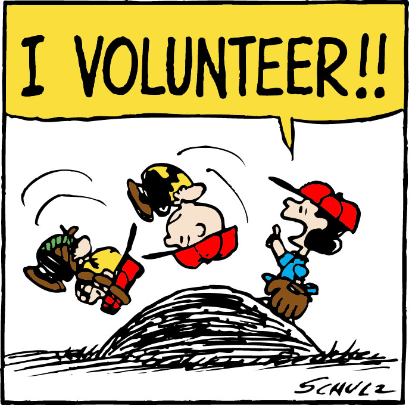

The problem with volunteerism is that it doesn't really work. Not over the long haul - and if you really care about impact, then you'd better be in it for the long haul. The simple truth is: *whenever we ask for work to be done for free, we diminish its inherent value.*

Before you disagree, let me clarify that I'm not talking about the kind of volunteer opportunities that were *made* for volunteers - like [natural disaster response](http://dojo4.com/blog/if-you-want-to-be-happy-think-of-others), Rylan's [weekly gig with Boulder Food Rescue](http://dojo4.com/blog/dojo4-ninja-rescues-boulders-food), or B Lab Colorado's recent [#BofService day](https://www.facebook.com/bcorpcolorado/timeline/story?ut=43&wstart=0&wend=1435733999&hash=2972421971526564280&pagefilter=3). These types of mutually enriching engagements are AWESOME win-wins, of course.

 

There are many other time-tested organizational models that create volunteer opportunities as part of their mission. For example: missions.  I'm also not talking about when people volunteer for their own startup - that's sweat equity (or just your own special brand of crazy, depending on who you ask).

What I am talking about is trying to get people to do for free what they would (and should) otherwise get paid to do. Sometimes it's called working pro bono, often it's called activism.  

In the beginning of most worthy endeavors, a few core people arrange their entire lives to work mostly for free at least until "we get it off the ground." What is accomplished in these initial sprints is often amazing, but it's not sustainable. 

No one has examined the dilemma created by working our hearts out for free better than my friend, [Jane Barry](https://en.wikipedia.org/wiki/Jane_F._Barry), in her groundbreaking book on [sustaining activism](http://urgentactionfund.org/wp-content/uploads/downloads/2012/06/WTPR-Final-Book.pdf).  See if this sounds familiar:

    *"At first, you use your own home as an office. You work every spare hour you can to organise, often
after your ‘day job’ is finished and everyone else is in bed. Slowly, other activists join you. Usually, for little or no pay...And when you do find a way to bring in outside support and funding, you are so driven and passionate about getting the real work done, at first, you only ask for money to do more...*

  *This kind of organising is amazing. It is enormously powerful, flexible, responsive, grounded in real
issues, and deeply connected to community. For many, it is also the beginning of a cycle that will eventually threaten their ability to work safely and sustainably.*

    *Because you have built everything yourself, those enormous contributions of time, energy, and resources — the true price of your work — are hidden. Since the real costs of activism aren’t factored into initial requests for support, it creates an artificial impression that an extraordinary amount of work can be accomplished with tiny amounts of money. It makes activism a bargain.*

    *Everyone loves a bargain. That sharp, sweet sense of satisfaction at finding something you really want,
and getting it at a fraction of its real value.
But here’s the thing: When you keep finding bargains, they start to lose that special something. That sense of value...* 

    *And that’s a big problem with activism. We set the bar too low...It comes down, once again, to what we truly value. What we recognise as important."*

So, before you "find a volunteer to do that," consider that you might be better off in the long run using the resources it will take to recruit, train, supervise and retain volunteer(s) in fundraising for a paid position. Have the vision to think long-term, and build a foundation for your efforts that will [sustain the people who are core to its success](http://dojo4.com/blog/so-you-want-to-change-the-world-we-do-too-by-building-better-businesses-aka-the-little-handbook-for-sturdy-startups). 

If you do decide that volunteers are going to be an important part of your organization, train yourself to be (or hire) a kick-ass - and I mean *take-no-prisoners* - volunteer manager.  [Create solid policies and use contracts](http://www.idealist.org/info/VolunteerMgmt/Developing) with your volunteers to ensure total alignment of expectations.  [Fire volunteers](http://www.forbes.com/sites/michaellindenmayer/2012/10/15/fire-dangerous-volunteers-rid-your-charity-of-vampires-and-zombies/) who don't follow through and find ways to [worship those who do](http://www.forbes.com/sites/michaellindenmayer/2013/06/03/7-traits-of-amazing-volunteers/).

And, if you're a professional who is considering volunteering your services, make sure you fit these three criteria first:

1. You have *extra* time that's truly *extra* - beyond what you need to make a living, spend time with friends and family and take care of yourself.
2. You're financially secure, meaning you won't ditch your volunteer gig to take on paying work when it comes along.
3. You're truly compatible with the organization you'll be working with - both its mission and its team members.

I've contemplated these dynamics for years from many angles - as the volunteer, as the volunteer manager, as the funder looking for a bargain.

It's fascinating to now look at this issue from within a technology organization.  Most people, including myself, [don't really understand tech](http://www.bloomberg.com/graphics/2015-paul-ford-what-is-code/), and this contributes to not really valuing it.  

From what I've seen so far with both non-profit and for-profit clients: success is cheaper in the end if you prioritize paying for really high quality people and solid tech from a reliable firm, establishing long-term relationships to support the co-evolution of both.

You get what you pay for, folks.  On that note, [drop me a line](http://dojo4.com/contact) - I'm happy to help you explain to your funders and investors why you don't want to skimp on good people or good tech!

