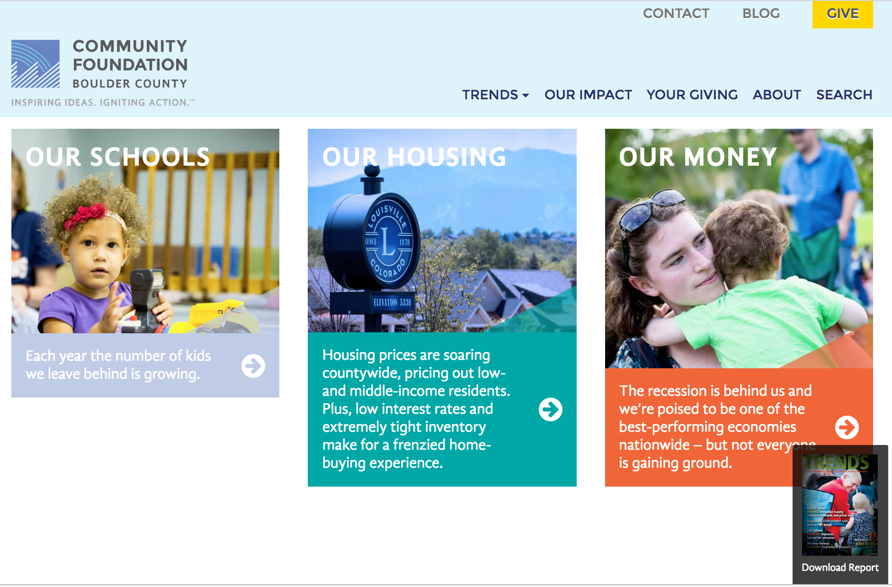

 

The [Community Foundation Boulder County](http://www.commfound.org/)'s annual [*Trends*](http://trends.commfound.org/) report provides "a common set of measurable data to help improve the quality of life in the community." And [Code for America](http://dojo4.com/work/code-for-america) recently partnered with the Foundation to make this community data more accessible. The partnership, called [Code for Boulder](https://github.com/CodeForBoulder/trends-online), invited dojo4 to get involved. After a community ideation session used to uncover the potential methods that could be used to expose the valuable data content in the [*Trends*](http://trends.commfound.org/) report, dojo4 worked with the partnership to implement a fully responsive, standalone microsite that the Community Foundation could easily maintain. The main Community Foundation site was being redesigned by [Vermillion Design](https://www.vermilion.com/), so dojo4 distilled the design patterns from their desktop mockups.

We started our work by building a static "placeholder" site to determine what pieces of content would need to be updated regularly and what bits were more permanent. Ultimately, this rendered the job of integrating the site's admin backend much, much more quickly.

Initially, we weren't sure how the site would be updated: 1) using our favorite static site generator [Middleman](https://middlemanapp.com/) or 2) using our homegrown rails-based CMS. But since it was a stipulation of the project that the site be easily updated by Code for Boulder volunteers, we chose an option that prioritized maintainability by a rotating, short-term staff of varying technical abilities. We chose a new CMS tool called [DatoCMS](https://www.datocms.com/), "a fully customizable administrative area for static websites". Indeed, [Stefano Verna](https://github.com/stefanoverna), Dato's founder, reached out to us and explained how simple it was to integrate DatoCMS, and more importantly, how easy it was for non-technical users to manage it. It was perfect timing and everyone can more effectively engage the web resource that reports the key indicators of quality of life in the Boulder community.

*Written with [Steve Bailey](http://dojo4.com/team/steve-bailey), who did most of the work on this project.*