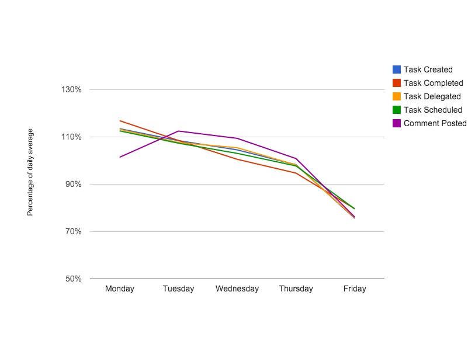

Happy Monday, folks.  Today is likely to be at least 14% more productive for you than any other day this week, so you should probably stop reading our blog and get busy!

Here @dojo4 we manage our never-ending workflow with the aptly named and exceptionally well-designed [Flowdock](https://www.flowdock.com/).  As I post this blog I'm sure my colleagues are virtually there, sharing their morning gifs and speaking in code - literally. 

Getflow - a similar product that we don't use - recently shared [some interesting productivity stats](https://www.getflow.com/blog/2014/09/how-to-make-the-most-of-mondays/) based on their data from tens of thousands of worker bees just like us.

 

The data points are noteworthy, but the key take away for me was that, "We come back from the weekend with new ideas and perspectives on what we want to accomplish. **Time off makes us both more inspired and more productive.**"  Amen.
