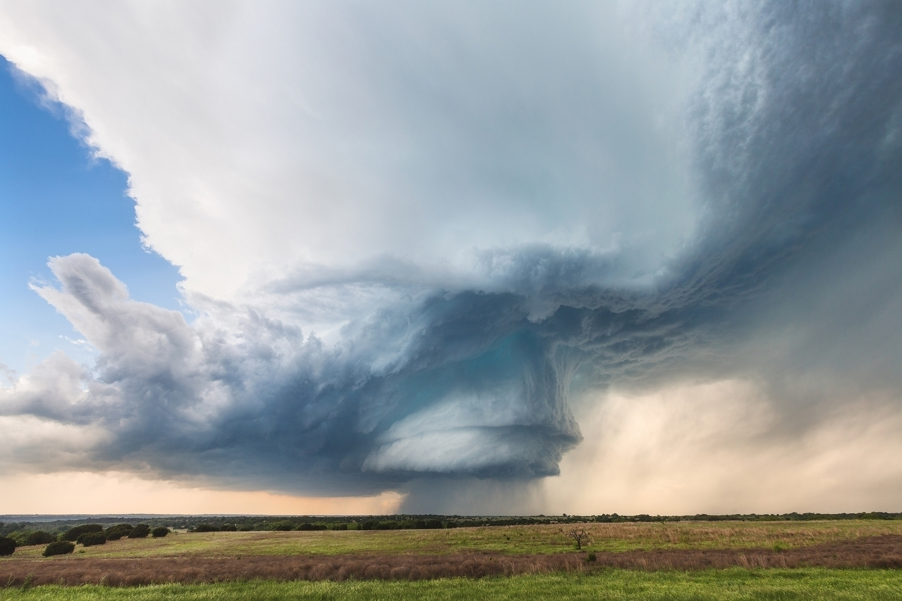

 <small>Photo by @KellyDelay [ello.co/kellydelay](ello.co/kellydelay)</small>

My father has experienced an inordinate amount of loss in his life. He is a holocaust survivor - born in Vienna, his home stolen as a child, escaped to Cuba, made it to Newark, NJ. At 12 when he got home from school, he found his mother dead of a stroke on the kitchen floor. His father had a heart attack and died next to him in bed when my dad was 24, home from medical school, studying to become a cardiologist.

Cruel irony.

His wife of 25 years - my mother - died when she was 47.

People who’ve met my father in the past 20 years often tell me what a kind and gentle man he is. Yes, no doubt, but I always think, you weren’t raised by that prick. Sometimes I might say it. Explain how his mesmerizing blue eyes could be like ice, his silent disapproval a Bruce Lee blow - so compact, precise, piercing.

Of my two brothers and I, I most physically resemble my mother. The only times I saw them really fight was in discussing how I should be punished, my mother almost always giving me the unconditional love it’s nice to think all children deserve. As my 17 year old son says to me based on my descriptions of my youth: “you were a bad kid, dad.”

Truth. And these truths led to some deep tensions between my father and me.

After my mom passed, I bought a round-the-world ticket for $1,700, took another 10 grand I had saved and left to discover a piece of me. I was 23. When I returned, one of my father’s closest friends told me: “your dad talks about you, your trip with such pride. He really identifies with you in ways you might not imagine.”

Like most young men, I wanted to hear it from him. Wanted to know the ways he felt he identified with me. So much so - I wanted the journey of self I was beginning then to include him.

He gave a hint of it once briefly - “Rich or poor,” he said, “it’s good to have money, but it’s way better to be rich with life. And you’re lucky Mark, even when you haven’t had a pot to piss in, you’ve been rich with life. You live so freely. I've always wished I could do what you do.”

And I wanted more of that - to ask him about his youth, learn about his parents whom I never knew, about leaving Vienna as a child, his fears, his triumphs and disappointments, his deeper views on life and living and love. But he couldn’t really meet me there, and I didn’t want to push.

I appreciated the smallest connections.

During those years - 25 years ago, I remember consciously thinking that it’s better to have some connection than no connection. Meet him where it feels comfortable to him and maybe he will open up.

I would bring a Cuban cigar to our regular dinners. We would talk Dolphins and women, weather and politics a bit. Rarely did we go much deeper than that. I’d bust out a Cuban after dinner, and we’d walk Lincoln Road mall in relative silence - sharing the quiet company and the joy of a good cigar.

One night I joined him and his friend Herbie and Barbara, Herbie's new girlfriend at Pacific Time. It was an early successful place on Lincoln Rd. We ate there several times with my mother’s parents before they passed. Herbie and my father were great friends from high school, and I learned that Barbara was the widow of one of their other good friends from those days.

It was a great evening. I asked Herbie how he met my father. He said they went to different middle schools but had overlapping peer groups. A girl in that group had a big party and my father wasn’t invited. He said my dad rode his bike to the girl’s house and threw a rock through the window. All the kids ran outside to see who did it, and my father was there yelling.

I smiled at that, felt connected in a new and different way.

Twenty or so minutes after I got home that night, my father called. It was a little unusual.

“You okay,” I asked?

“I’m a little sad,” he said.

“What’s up?”

“I’m jealous of Herbie a bit. Not that Barbara is that attractive. I never thought she was - physically, but they have a shared history. He’s just lucky to have that. I don’t think I’ll ever have that again. Dating at this age is hard. I really miss your mom.”

“I miss her too,” I said.

His vulnerability was immensely beautiful to me that night and right now as I type this. It opened something deeper and more special than we had ever shared.

And lately I’ve been thinking about how I often fail to accept others where they are emotionally, that it inhibits my ability to be vulnerable, my ability to communicate and affect change and grow. That what I tried to get from my father was only available for the gentle years of accepting him where he was, meeting him where he felt comfortable.

Not 100% sure how this applies to business, but in its basest form someone says: where can we meet. Think about it. Alpine Modern, The Yellow Deli, Ozo, your house, mine (mine might be cooler and more controversial), The Cup, Boxcar, wherever, whatever. Your choice. Think about it.