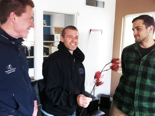

What is *company culture*? And why does it matter?

The culture of a company is how it *feels* when you are there. It describes the expectations that the people that spend their time there can have about their daily and long-term experience at that organization. It is a set of t*raditions, practices and policies*.  It’s expressed in *how the place looks*, *what it sounds like*, and in the *demeanor* of the people that work there. 

[Adult Americans spend more time at work than at any other activity.](http://www.bls.gov/tus/charts/#work) We spend [at least an hour more time working than sleeping](http://www.theatlantic.com/business/archive/2012/06/your-day-in-a-chart-10-cool-facts-about-how-americans-spend-our-time/258967/) every day and way more time than that on eating/drinking, taking care of our households or care for other people. For many of us, we are likely to spend the majority of our lives in the workplace. 

This is why company culture matters. How and where we spend our time affects how we develop as people, [it changes how our brains function](http://www.ted.com/talks/michael_merzenich_on_the_elastic_brain.html) and [how we behave toward ourselves and others](http://www.onbeing.org/program/investigating-healthy-minds-richard-davidson/251). If we want our work to be impactful, effective, meaningful and sustainably profitable, our workplaces have to promote physical and mental health, joy, humor and compassion. Our workplaces must provide the basis for engaging challenges, they must help foster our creative and intellectual development, and be a real source of support for ourselves and our families. Maybe this is a tall order, but I have no doubt that it is an indispensable cornerstone for building a sane society. Sane and supportive workplaces can be the building blocks of stablility and innovation in our greater culture.

We're working on it here at dojo4. Here are a few of the things I think contribute to an evolvingly enlightened company culture:

* our [HR guidelines are open-sourced](https://github.com/dojo4/policy/blob/master/hr.md) on github and aim to promote systems that allow employees flexibility in where they work from and how they take their time away from work

* 'benefits' that promote physical and psychological security, such as a good health plan, short-term disability insurance, and [weekly meditation](http://dojo4.com/blog/meditation-every-tuesday-morning-the-dojo) and yoga 

* an emphasis on communication that [respects peoples' time](http://dojo4.com/blog/beginning-and-ending-properly) and [values their contribution and insights](http://dojo4.com/blog/a-bow-and-a-clap)

* [provision of a paid maternity AND paternity leave](http://dojo4.com/blog/have-babies-at-dojo4) that aspires to support healthy families and an equilibrium between home and work life

* [an open-door community atmosphere](http://one.valeski.org/2013/01/community-anchors-dojo4.html) where our [friends](http://dojo4.com/blog/proud-parents-of-a-future-dojo4er), [family](http://instagram.com/p/UuJ3e/), [clients](http://instagram.com/p/L9-u7/), [neighbors](http://cl.ly/image/2C1c2P0p3T2M) and even [curious strangers](http://boulderruby.org/news/2012/06/29/code-n-coffee/) can come spend time, [exchange ideas](http://dojo4.com/blog/dojo4-quiz-2-have-a-go), [host events](http://dojo4.com/blog/perfect-fit-community-gathering-of-young-social-entrepreneurs-at-dojo4) and [sit on the patio and have a beer](http://instagram.com/p/NSCJr-rvdw/)- an [enriched community](http://dojo4.com/blog/dojo4-supports-boulder-being-even-more-awesome) is an [inspiring](http://dojo4.com/blog/hubbishness) and [enriching community](http://instagram.com/p/EfDQL/) that we get to be part of

It's a work in progress and will always benefit from suggestion, improvement and engagement by the people that make this little company culture thrive. And we feel that we are amongst good company with lots of other companies (like [Recycoil](http://www.recycoil.com/company-culture.html) and [Gnip](http://blog.gnip.com/gnip-best-place-to-work/)) in town whose company cultures we admire and can learn from. Company culture is as important to the success and longevity of our organization as anything else we do. It matters a lot. 