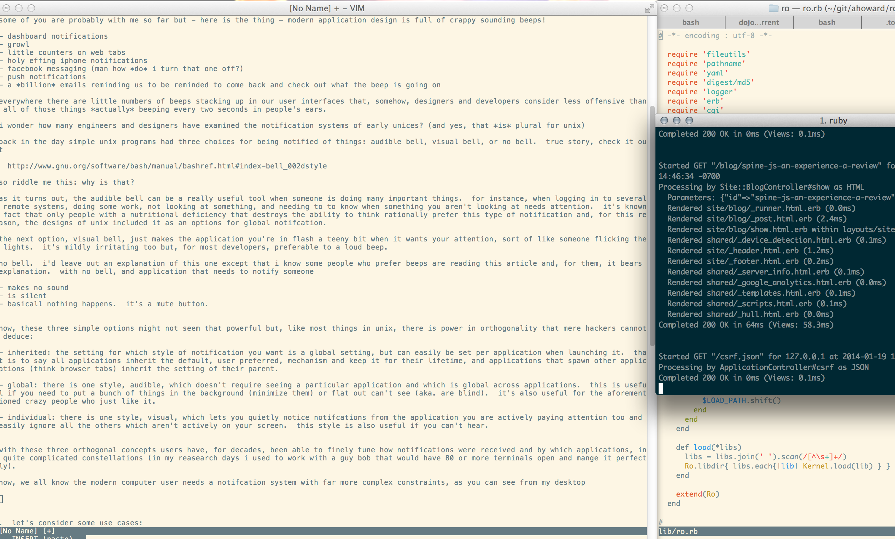
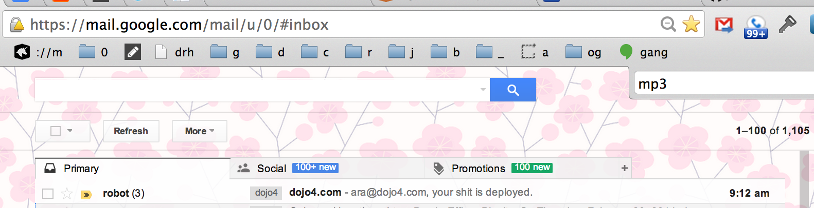

“Anything with a sound should have a volume. They should teach this to mechanical engineers.” -- Gary Snyder

Nothing annoys me more than things which beep or make sounds to get attention. From dishwashers, clocks, watches, smoke detectors, cars, to phones. All of it!

I have none of the following in my house:

- TV
- radio
- alarm clock
- doorbell

Everything electronic on my 90 suburban is busted (I like it that way)
My phone's ring tone is 5 seconds of silence. I do have a 'People Under the Stairs' sample that plays when my wife calls though - a [really pleasant flute clip](http://s3.amazonaws.com/drawohara.com.mp3/18_acid_raindrops.mp3).
- The sounds on my computer are all turned off (except one or two bloody ones I cannot find – grrrr!)
- I could never use the beeper on my watches or heart-rate monitors when I used them
- Our house doesn't even have a fire alarm (I know, I know...)

The wife likes to use the timer on the stove for - timing things on the stove - which probably makes sense to normal people but, for me, the teeny beeeeeeep when the time is up is like a spear through my head every time it goes off.

This is really strange considering that, if I could, I'd listen to music 24x7 - even while sleeping.

I recall my dad tearing out the 'open door dinger' on a new truck we'd just bought *in the dealer's lot* before he'd get in it to drive it home so - perhaps it's a genetic disposition.
In any case I am sure I am not the only one who thinks the 'beep' is the worst human interface design feature *ever*?

Some of you are probably with me so far but - here is the thing - modern application design is full of crappy sounding beeps!

- dashboard notifications
- growl
- little counters on web tabs
- holy effing iphone notifications
- facebook messaging (man how *do* I turn that one off?)
- push notifications
- a *billion* emails reminding us to be reminded to come back and check out what the beep is going on

Everywhere there are little numbers of beeps stacking up in our user interfaces that, somehow, designers and developers consider less offensive than all of those things *actually* beeping every two seconds in people's ears.

I wonder how many engineers and designers have examined the notification systems of early Unices? (And yes, that *is* plural for Unix) 

Back in the day, simple Unix programs had three choices for notifications: audible bell, visual bell, or no bell.  True story, check it out

 http://www.gnu.org/software/bash/manual/bashref.html#index-bell_002dstyle

So riddle me this ux girl: why is that?

As it turns out, the audible bell can be a really useful tool when someone is doing many important things.  For instance, when logging in to several remote systems, doing some work, not looking at something, and needing to know when something you aren't looking at needs attention.  It's a known fact that only people with a nutritional deficiency which destroys the ability to think rationally, prefer this type of notification and, for this reason, the designers of Unix included it as an options for global notification.

Another option, the visual bell, just makes the application you're in flash a teeny bit when it wants your attention, sort of like someone flicking the lights.  It’s mildly irritating too but, for most developers, preferable to a loud beep.

No bell, my favorite.  I'd leave out an explanation of this one except that I know some people who prefer beeps are reading this article and, for them, it bears explanation.  With no bell, an application which needs to notify someone

- makes no sound
- is silent
- basically nothing happens.  it's a mute button!

Now, these three simple options might not seem that powerful but, like most things in Unix, there is power in orthogonality that mere hackers cannot deduce:

- Inheritance: The setting for which style of notification you want is a global setting, but can easily be set per application when launching it.  That is to say all applications inherit the default, user preferred, mechanism and keep it for their lifetime, and applications that spawn other applications (think browser tabs) inherit the setting of their parent.

- Global: There is one style, audible, which doesn't require *seeing* a particular application and which there acts globally across applications - simply letting you know that 'something' needs attention.  This is useful if you need to put a bunch of things in the background (minimize them) or flat out can't see (aka. are blind).  It's also useful for the aforementioned crazy people who just like it.

- Individual: There is one style, visual, which lets you quietly notice notifications from the particular application you are actively paying attention too and yet easily ignore all the others which aren't actively on your screen.  The way this is implemented is via a small 'flash' of brightness in the current application. This style is also useful if you can't hear.

With these three orthogonal concepts users have, for decades, been able to finely tune how notifications were received and by which applications in quite complicated constellations.

Now, we all know the modern computer user needs a notification system with far more complex invariants, as you can see from my desktop:

  

Okay, my desktop is a bad example ;-)

By the way, if the idea of defining orthogonal invariants in order to design a powerful tool is new to you - do not pass GO - proceed immediately to reading about contextual vs composable design.  Trust me though, you practice contextual design and, with notifications, that's the bloody the problem!

Refs:

- http://en.wikipedia.org/wiki/Contextual_design
- http://en.wikipedia.org/wiki/Unix_philosophy

Read those?  Good.  Still think user-centered design is a panacea?  Or that composable is the shiznit?

Pop-quiz then: WHO IS THE MOST POWERFUL WIZZARD - your app or the internet?

...

Of course the answer is neither.  The internet wouldn't be useful to people without *applications* to use it and no user-centered design process would have built the internet.  Translation: some things require a composable and modular design, like the internet and pan-application notifications, while others, like you favorite text editor require an user-centered one.

And here we come to the crux of the issue: a non-want-to-slam-your-wee-wee-in-a-car-door approach to notifications *cannot be solved or implemented at the application layer*, it has to be solved at a global level for any user that ever uses more than one simultaneous application (aka - all of them).

I hear the mac people frothing, but they know everyone isn't on mac.  Besides, the unified notification systems on iOS and desktops are going to go the way of the dodo anyhow because only 1 out of a hundred applications bother to integrate with them and the rest re-invent the wheel.

Windows people - check an iPhone to imagine what unified notifications might look like.

Linux people - ... yes, you understand these things, i'll shut up now.

So - what's the answer?

Email.

(/me waits for laughs from the crowd to die down...)

No really.  Check this out:

- email is ultra reliable
- email is ultra cheap
- email is synced to all a user's devices like freaky magic, even when they are offline!
- email is über easy to integrate with in any language

Now, I'm not talking about ordinary email, I'm talking about simple machine parseable emails with human readable messaging in the body and structured data supplied in attachments.  Emails like this could easily be managed by a centralized program on your device that could collate and distribute them according to a ruleset: think of email filters with some special rules to alert you in various user defined ways.  Your email client already does 95% of this, with the exception of managing any structured data or performing custom user defined actions beeping at you or having Siri read you a message that you just got followed on Twitter.  

With this approach you'd gain:

- unification
- simplicity
- archival
- search
- customization
- and much more

So why not start doing this now?  It's crazy right?

Crazy, except that Google is already doing it.  

Seen this?

There's Google in my inbox, auto-partitioning my email into 'Primary', 'Social', and 'Promotions'.  In one fell swoop they just made more headway into the 'too many notifications too many places' problem than all the developers working on their own unique systems have combined. And I don't have to manage a damn thing that I'm not already doing.

I think now is the time for developers and designs to start realizing their homespun notification systems are a waste of energy, annoying, and broken by design.  Now is the time to start taking about a composable, modular, system that is easy to integrate with, think about, and for users to interact with.

In the mean time we can at least do no harm: do not invent a notification system for your application, start leveraging email for notifications now and embrace the power that ubiquity and constraints combine to produce.

BEEEEEEEP -- this rant is over.
