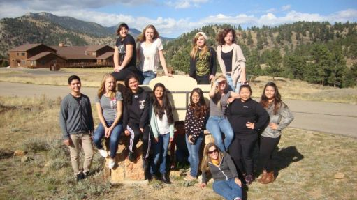
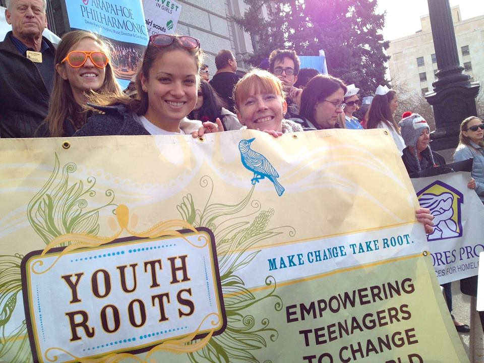

*We were fortunate to be visited recently by Cassie Gardner from [YouthRoots](http://www.youth-roots.org/). We were happy and proud to be able to donate to her organization and asked her to write a blog post about what [YouthRoots](http://www.youth-roots.org/) does and how you, too, can help them do it....*
___________________________________________________________________________________

Hi, my name is Cassie and I am a YouthBoard member of [YouthRoots](http://www.youth-roots.org/). I know what you’re thinking, and no—I am not a member of a religious youth group and I am not about to tell you why you need religion.

Now that that is cleared up (I can’t tell you how many times I’ve had to clarify what YouthRoots is), I can explain what YouthRoots actually is and why you are seeing it on Dojo4’s website is without any misconceptions or distractions.

In short, YouthRoots is youth-led philanthropy which empowers teenagers to change the world, literally. YouthRoots acts as a philanthropic vessel which allows teenagers (sophomores, juniors, and seniors in high school) such as myself to engage in community partnership, personal development, new mediums for humanitarian leadership, and social action.

*So how does it work?*

At the beginning of the school year in June, a bunch of random kids from northern Denver who were accepted into YouthRoots got together, assembled a YouthBoard, and created a needs assessment of the northern Denver area—basically figuring out what at-risk youth in Northern Denver suffer from most. From here we, identified poverty as the main boundary preventing social mobility in young adults from the North Denver-Metro area. 

 

>We asked ourselves: What is the best way to combat youth poverty?

After extensive research, we identified after-school enrichment programs offered by non-profits such as the Maria Droste Counseling Center, [Colorado Youth for a Change](http://youthforachange.org/), and the [I Have a Dream Foundation](http://www.ihaveadreamfoundation.org/) are the best way to encourage social mobility in youth and break fiscal boundaries.

Next came fundraising for these non-profits who apply for grants with YouthRoots. Here is where dojo4 comes in. dojo4 was assigned to me as one of three businesses which I would give a “pitch” to where I explain what YouthRoots is about, why it matters, what is going on with the youth in Denver, which non-profits help combat these regional issues, and ask whether or not they are interested in helping fundraise for these non-profits.

Over some awesome peppermint tea with [Ara Howard](https://www.facebook.com/ara.t.howard), the [CTO of dojo4](http://dojo4.com/team/ara-t-howard), dojo4 agreed to invest in Colorado Youth. Basically, dojo4 agreed to donate to YouthRoots so we could put 100% of their investment toward some of the non-profit grants which YouthRoots received (including the Maria Droste Counseling Center, Colorado Youth for a Change, and the I Have a Dream Foundation).

Why does this matter? On a grand scale, it’s amazing. As a part of a YouthBoard composed of about 13 kids from northern Denver, we raised $10,000 this year to give back to non-profits which solve for issues facing Denver youth. 

>This is huge— the non-profits we are supporting this year (which I have mentioned) change lives, and couldn’t do it without the help of organizations like YouthRoots, and philanthropic businesses such as dojo4.  

Personally, on a smaller scale, this gives me hope and inspiration to create a better future. YouthRoots was not my first volunteering endeavor. I’ve always volunteered in my life, whether that was helping at a community run, taking on a summer volunteering responsibility at a shelter, or helping at a hospital. Volunteering has always been fun and rewarding, but truthfully I never saw the benefits which my volunteering created. As a result, even though I liked volunteering, I wasn’t passionate about it. This was before YouthRoots. Now, post-YouthRoots, I see volunteering as the absolute best way to make a difference in this world and create a future which I want to live in and be a part of.

YouthRoots has empowered me to realize that if I seek change in the world, then I have the ability and even obligation to create that change. YouthRoots has shown be that being “just a 17 year-old girl” doesn’t cut it anymore as an excuse to avoid trying to better my community. YouthRoots has permanently (and for the better) changed my perspective on how the world works and why it is the way it is. 

>By connecting teenagers to businesses such as dojo4, which are interested in fostering a better future, it forces us to recognize that change is possible— it just takes a little time and effort.

**If you are interested in being involved in YouthRoots, learning more about the organization, or would like to contribute to the cause, the YouthRoots website contains all of that information: [http://www.youth-roots.org](http://www.youth-roots.org/).**

 