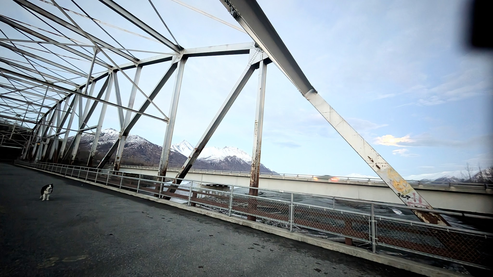
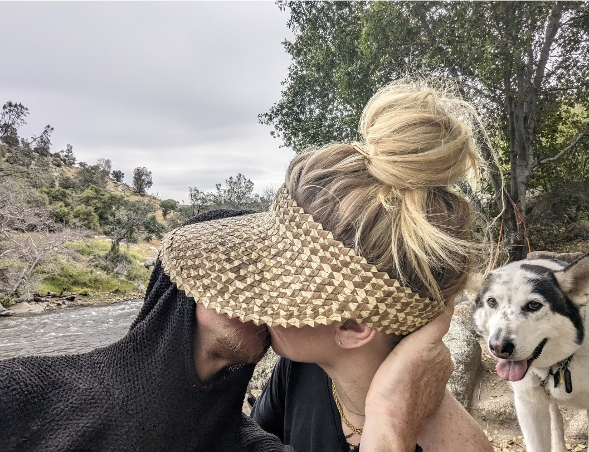
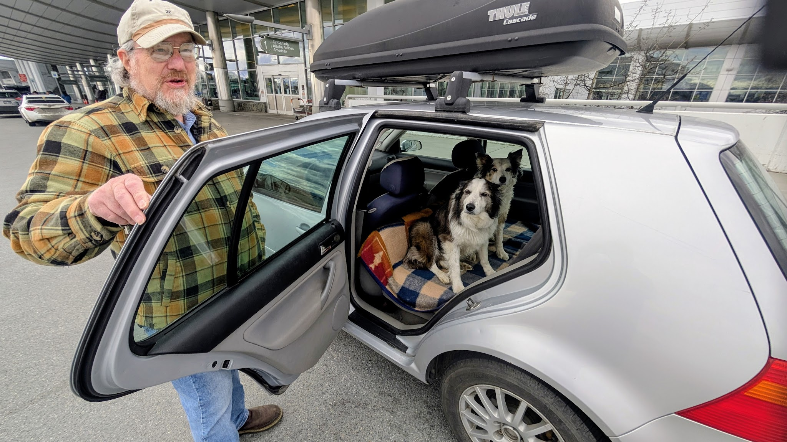

*life after growth...*

at the moment i'm walking underneath the moonlight.

and daylight. it's a weird kind of twilight you get at this latitude. which is the latitude of palmer, alaska, where i grew up.

my wife has just had a stroke.

a tia. what they refer to as a mini or transient stroke. but it's a strong precursor.

i think it's around a 1 in 20 chance over 90 days. and clearly even a temporary blockage to your brain can be fatal.

i've been living out of some sort of vehicle—an old suburban, a clapped-out subaru, a van in alaska—for maybe four years now. i've lost track.

in the past year, i've broken both my legs. one of them twice. i blew both my knees. i got [necrosis in my femur](https://photos.app.goo.gl/ZLLWKpux5jns3JUH9). was rescued from a [mountaineering accident](/io/almost-died-in-an-ice-cave) where we were buried alive for five days, fighting for air.

digging shoulder to shoulder. ultimately got yanked out by a [blackhawk helicopter](https://photos.app.goo.gl/UuNWQhWDQBqagfXp9).

i've had a few friends commit suicide.

i've been homeless. properly. everything but a bike.

and in the middle of all that, [in the desert](/io/lost-in-the-desert), i met a beautiful lady, [jess](/jess). i've been with her for about two years, through the hard part of my life. i suppose i've touched on it a little, but most of what i just mentioned happened before it got hard.

so. that's a little bit of context.

of my state of mind. and that's important for what i'm talking about.

i'm 53 years old.

i've been a professional cyclist. an [entrepreneur](https://dojo4.com). a [research scientist](https://independent.academia.edu/arahoward).

i grew up racing my skis and running chainsaws, shooting guns, smoking weed, racing cars, making bombs. having gun wars and firework wars. back when our parents would let 300 kids vanish into the wilderness with three-wheelers and not come home for two days in close to freezing temperatures.

no one ever checked up on us. not once. well, maybe the cops. i do still wonder where the parents were.

in any case. i grew up in a wild place. literally. i'm a fourth-generation alaskan, so that freedom is very much embedded in me.

when i'm in a large city, the predominant thing on my mind is a map. a map of where all the private property and roads and cars are.

and the squiggly little lines that are nature. the beach, a dirt path, a secret alleyway with beautiful graffiti. that's how i experience society. as a sort of trap. there's almost no way out that isn't nature. and it's oppressive and anxiety-producing. at all times.

the title of this post is *all that's left is conservatism*. yes, that's a pun. all that we have left. and the political left. both.

what i'm trying to get to is my state of mind. because i think it's something we as a culture are simply not having a discussion about.

---

another lifetime i was a research scientist. for almost ten years, when my kids were little, i worked as research faculty for the university of colorado. a computer scientist.

my job was to do cool shit with other research groups. my small group, say five of us, was trying to understand long-term human population growth from space.

we did that using the nighttime lights of the world.

if you've ever seen a picture of the world at night? that image. it comes from a very small group of satellites, and a very small group of people manage that data. it might not seem novel, but it is.

it's the only globally available dataset that measures man on the sphere. continuously, for over 30 years.

sure, other satellites can see the hair on your head, but they don't collect data everywhere, all the time. the volume is too high. the nighttime lights data is different. it gives you a picture of the world over time.

the dmsp satellites that collected this have since been replaced, but the fact remains. there's fundamentally one data set that measures humanity's footprint on the planet, and that is what i studied.

i mainly worked on systems architecture, but also on low-level c and fortran optimizations. we built all the tools everyone takes for granted now from scratch, because they didn't exist.

our group was on soft money. you eat what you kill. we wrote the proposals and got the funding for our own research.

we'd meet once a quarter. our boss, chris elvidge, would lay out how long each of us was employed for. ara five months. kim nine months. ben six months. then he'd throw up some gigantic initiatives—things software teams nowadays would take hundreds of people years to build—and ask, when do you guys think you'll be done?

we'd have to give a wag, a wild ass guess. eight months.

why eight months? well, we build it in three, and then it runs for five. we were working with petabytes of data. if you got one config parameter out of 20,000 wrong, you’d wake up in a sweat knowing you'd wasted the last seven weeks. sometimes, just running the code to completion, after you hit go, could take over a year.

we learned a lot about what works. it comes down to complete and total trust in your partner. you draw a box around your area of responsibility. this algorithm is your box. this one is mine. this workflow system is his.

we agree on a contract so the boxes can talk. then that box is your fucking box.

it's an engineering principle i rarely see in commercial software. i don't see the humility in developers to trust their fellow developer. the amount of software our small team produced still dumbfounds me. [it still does](https://github.com/ahoward).

on top of that, we were running a 24/7 system. it never stopped. if it was down for 24 hours, it would take 96 hours to catch up because of the data volume. this was the live feed from the satellites.

we had a contract with the u.s. air force to be their data archive. a smart move by my boss. in exchange for being the permanent archive for the dmsp satellites, we got to use the data for our research. it was classified for the first 72 hours. a very sensitive system.

it was often used for making tactical decisions. a go or no-go on an f-16 attack run. delivered straight to the white house.

after hurricane katrina, our data could measure the extent of the storm. how? the nighttime lights.

a power outage is a black hole. no data escapes. you can't call. you can't send a message out. you can't send one in. the nighttime lights are one of the only ways to look from space and see where the power's out.

this is challenging because of clouds. power outages usually come with storms. the dmsp satellites, however, had two bands: visual and thermal. with those two signals, you can do an amazing amount of science. you can tell the difference between a cold, bright, moonlit cloud and the warmer signature of a city light.

you can also spot other things. the south atlantic anomaly, which is bioluminescence you can see from space. fishing boats in japan. forest fires. gas flares. each has a different digital pattern.

we used this data for everything. we monitored the armament buildup on the border between pakistan and india. we detected massive forest fires, the size of states, that burned for a decade across the taiga.

we monitored gas flares. the ussr flares a significant amount of fuel, just burns it into space because it's a waste product. the u.n. had a program with the world bank. if a country would capture that gas instead of flaring it, they'd get paid. don't waste it, don't produce the carbon, and we'll pay you for the fuel you preserved.

of course, every country signed up. and of course, governments and corporations are corrupt as fuck.

we ended up being the bullshit sensor.

my boss would get picked up in a bulletproof car to give a talk at the u.n. it was in mexico, where they were handing out these checks. and they're like, hey, we captured all this gas. give us our three billion dollars.

and we were basically saying no, actually, you didn't.

why? because we've been watching you, and you didn't know it.

that is a dangerous job to have. thus, the bulletproof glass.

the reporting we did on hurricane katrina was equally disturbing. we were publishing maps of the storm's extent on the six o'clock news. for days. national media. abc, cbs.

by about day three, the white house contacts us. they say, you know, we've been thinking. we think you might be able to write code to tell us the extent of the power outage over new orleans.

you can imagine how we felt. our jaws just dropped.

you're like, oh my god, the worst is true. the worst is true.

i've come to the conclusion that most of what we're experiencing right now in the world is a symptom of resource limits.

of a population growing up against the boundary of its environment's ability to carry it.

think about an island populated by hairless monkeys. it used to be covered with turtles and potatoes and edible flowers. but the monkeys have eaten everything. they are so depraved that some of the monkeys are eating babies.

some of the monkeys are having sex with babies. they are warring with each other. they are committing genocide. some of them are committing suicide. other monkeys just sit around all day. other monkeys control other monkeys, and they never let them out of a three-by-three-foot cube where they live their entire lives in service of the ideas of the other monkey.

all the flowers and turtles are dead. the water and land is poisoned with feces and urine.

that has a feeling in nature that we don't talk about. the feeling of coming up against resource limits.

and what does nature do when it hits resource limits? it begins to speciate. survival of the fittest. it will compete. there'll be disease. sickness. we know what nature does here.

if we were actually witnessing this happen to an island of monkeys, or dogs for god's sake, our intuition as compassionate people would never be to race in, cure them all, let them go back to doing business as usual, and then give them a machine that speeds it up.

dramatic pause.

we certainly wouldn't develop a vaccine, inoculate them all, and say have at it. carry on.

now, a lot of people will find this a disturbing concept. but i want to point out a logical fallacy that a vast majority of americans are carrying around. which is that things have gotten better.

i'm not gonna say things have gotten worse across the board, or better. but when most scientists and rationalists claim progress, there's an implicated value system they've never considered: that all human life has infinite value.

you say, no, i don't believe that. but think about it. how else could you justify it?

we talk about progress almost exclusively in terms of statistics. it is two percent. it is seven percent.

is your mother a percent? a percentage? an idea?

we say it's progress if 50,000 babies died last year and only 25,000 die this year. yes, that's 25,000 fewer dead babies. but when the population of the planet is 8 billion, a tiny percentage still represents vast sums of actual suffering.

real individuals experiencing it. not an abstract concept on paper.

so anytime you find yourself speaking in terms of progress, i would ask you to do two things. one, reframe it in absolute numbers. how many hours a week do you work to survive? how many did you used to?

the other is to consider *time t*.

we say something is better because of a number. a good example is the efficacy of vaccines. i'm not denying they work. i understand the mechanisms as a scientist. what i am saying is that *to say they work* is yet to be discovered.

if we save ourselves but annihilate every other species on the planet, was that a win? this all depends on the timeframe you're looking at.

i'm a parent. so i do try to think about the next 50 years. which is frankly terrifying, primarily because people aren't thinking like this.

i believe we are at this apex. this crux. the final act.

every single person i know that worked in climate science thinks the same thing. many of them, like me, have ended up in some sort of non-traditional, off-grid situation. they've dropped out of society to some extent.

because we've been screaming into the void. hey, this is happening. and it is.

meanwhile, the corporations want to speed it up.

i know some of you are thinking, but hey, i could find the silver bullet to fix climate change. and i would say, no. you don't know anything about it. you're not a climate scientist. you don't even know what the green revolution was, why it won the nobel prize, and what its dire warning was.

i would encourage you to look that up. because even then, it was already known that we were far beyond the carrying capacity of the planet unless we fed ourselves with oil.

people forget that oil isn't just energy. it's how we eat. it literally makes the fertilizer we use to grow our food. without it, we die. that was the existential crisis in the 60s.

and now i can hear some of you saying, well, that is why we need more technology to fix things. but i would say, brother, give me one example of us fixing something in nature and it going well.

if you consider even a modest timeframe, you simply cannot make that argument. we don't got this. we don't understand it. we are fucking everything up.

that sounds like a hopeless message. but i'll tell you something. it's not.

because the remedy, in my opinion, is just not to do.

not to do. you don't have to do anything.

we can't solve our way out of this by adding things. we can't add more laws to a system so complex a supercomputer couldn't decipher it. you can't control complexity by adding to it.

we have to take things away. we have to stop doing things.

or at least, far fewer things. we need to slow down.

and at that point, everything people talk about starts to become possible. if only we had time. that is the core issue. i'm saying this to you as a lifelong scientist that has studied this and cares about it deeply.

which brings me back to the title of the post.

the meaning of the word *conservative* has been co-opted by the right wing in this country. we have collectively forgotten that *left/right* and *progressive/conservative* are two completely independent axes.

left and right is an axis about power. who has it. who doesn't. who gets it.

progressive and conservative is an axis about *pace*. how fast to move. how much to change.

they are not the same axis. they have never been the same axis.

you can be left and conservative. you can be right and progressive. in fact, silicon valley libertarianism is right-progressive—they want maximum power for capital and maximum velocity of change. that's a coherent position.

and what we need right now, in my opinion, is its mirror: left-conservative. equitable, and slow.

to be conservative or progressive represents a polarity between two extremes.

one is: fuck it, throw the monkey wrenches in the machine, we'll figure it out afterwards. carelessness. i understand being progressive. i tend to be risk-tolerant. but at this point, if you're rational, it does not make sense.

what does make sense is to slow down. the political movement of having fewer laws. acknowledging that, wow, that's imperfect. but more is worse.

going slow carries some risks. but the risks of going too fast are worse. there is a reason to be cautious. to be metered in our thinking.

and just slow down.

i don't think anybody on the entire planet wouldn't like six more hours a day. i think some of us even long for the period during covid when we had that quiet time. when the world, and i don't just mean the natural world, healed to some extent. shifted.

hopefully everyone can remember that. that was a period where we recognized the only valuable things in life are the things immediately around us. our environment, our friends, our partners, the food we eat, the place we live. the walks we take, our dogs, our children, art, music.

everything that's important in life.

and i think many of us felt how desperate we were without the fabric of an artificial society that is driving the world towards ruin at a rapid clip. a society we don't really want to participate in, but feel powerless to do anything about.

and that brings me back around. at this point, it's not about doing something. it's about not doing things.

that is what i am trying to bring back as a political movement.

take the word back. it doesn't belong to them.

all that's left is conservatism.

slow the fuck down.

[more photos →](https://photos.app.goo.gl/jBDsiqef2dWNDchu7)