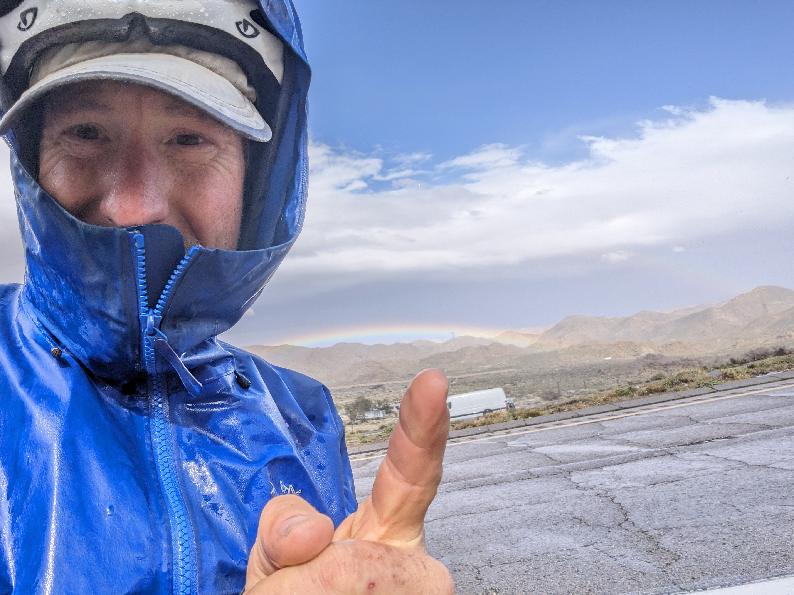
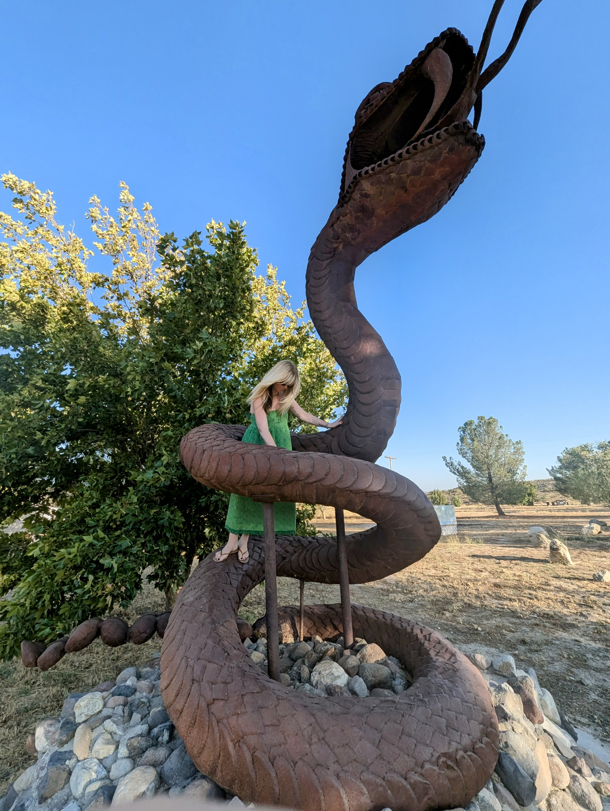
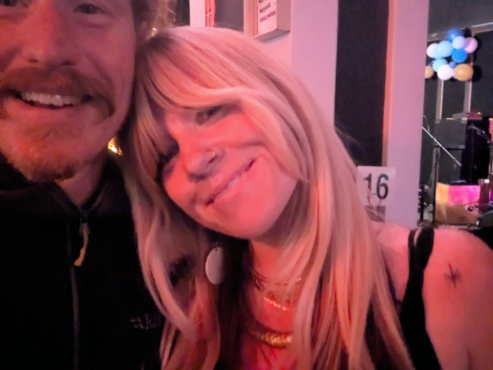

i met jess at [jacumba hot springs](https://maps.app.goo.gl/Q8hzaHeMJqwXhTmi8).

i'd been [lost in the desert](/io/lost-in-the-desert) for some time.

a few weeks later, she gave me a [purple rock](/io/almost-died-in-ice-cave) and sent on an adventure.

but, let's rewind.

the day i met her, was a brutal, brutal day. i'd been riding my bike from
arizona to alaska, and had spent the night sleeping in a creepy old mission
on the res. a storm had hit and, somehow, i ended up sleeping in the only
shelter i could find. an old power pole shack, full of snakes, that seemed
better than the [raging lightning storm above and all around me](https://photos.app.goo.gl/SuSxrKVj6ZA5V4xm7).

the next morning, out of food and water, i'd ridden my 70 pound bike about 30 miles
to a gas station where, undoubtedly, i ate 3000 calories of something horrible for breakfast.

i was sitting by myself when some other cyclists came up and gave me the nod.
when you know, you know. [@yogibuur](https://www.instagram.com/yogibuur) and
[@nycfixed](https://www.instagram.com/nycfixed) looked me up and down - i was
looking pretty haggard - and told me ['you can make it'](https://photos.app.goo.gl/EfKZnf2cSQLRKzUg7).

the pass was almost unridable. i had to push my bike in the
[wind](https://photos.app.goo.gl/9iEW4Spxo3ryuo9K6) for miles and
[miles](https://photos.app.goo.gl/1MKUuyh1peyiAyN49).

the pass, drenched in sleet, had no shelter for as far as the eye could see and
no cars on except some burned out meth dens, i wondered if i was going to be
very, very cold that night.  or worse.

i dropped into jacumba, noting the bridge (slightly snakey) on the edge of town
and thinking 'i will probably sleep there...'.

there seemed to be very little in town except a closed gas station.

at the front desk of the hot springs, an airstream trailer, the girls asked what
i was doing. when i told them, they looked at me [like i was crazy](k) said that i could have a room - it was
a posh place and sold out, too - even though i barely had enough cash for the
soak. i was relieved, and immediately nervous about being around people in a
confined space. at that point, i'd been sleeping outside for at least 4
months. often with coyotes but, otherwise, very alone.

i kept to myself. hood on. another hood on. and one more for good measure. it
helped with the sound too. the band, ['noel and the deserters'](https://www.instagram.com/noelleandthedeserters)
was really on a roll.  i'd had a few drinks with the musicians and was really digging it.

no one else seemed to be quite as into as i was.

and then she was right there.

i couldn't help myself. i blurted out: 'can you feel it?'.

because she was moving too.  we were the only two dancing.

it's always like that. the people that move. you just see them. next thing,
your lost up some god damned mountain or riding bikes in europe somewhere,
it's just how it works... magnetic.

she *definitely* had it.

some people need to move to think. i am one of these. and, now i know, she is too.

we talked. i was trying to not talk. to anyone really, but she was so easy to talk to. and she made me laugh.

accidentally, our hands touched.

electric.

fuck.

this is how is always starts.  first a girl.  next, indoor plumbing.

what was i doing?

but, as you might have guess, i'm only joking.  there was, in fact, zero
hesitation or restraint of any kind.  both feet.  jump.

that night, from the first second, it was as if we'd been married for a decade. and still loved each other madly.

i couldn't describe it any other way.

it was simply, very natural.

the most comfortable i'd been around another human for quite a while. 

_well, except the 65 year old hobo, the married flamenco dancer couple that
studied in the caves of spain, the old guy that walked the camino and a
wilderness survival guide that skateboarded before working on hides in our camp
every morning.  but that is another tale..._

but, i'd said goodbye to all that, and everything i owned, in bisbee, arizona
and had been, very solitary, following the border wall, and trying not to get
hit by snakes.  they are everywhere, in the desert.

all that is to say. it was a big, big, big surprise.

then again, i had been looking at that little spot, a no-name town, on the map
for 3 months, or more. it drew me in, and altered my route, as only another
long distance cyclist could understand. it was days off my route, with
dangerous camps on the way but... i had to go. places do that to me. this
one, had a very nice shape. you can tell from afar if you look long and hard
enough.

jess was there for her birthday. also, for different reasons, avoiding human contact.

so, the next morning, i was a little surprised when she told me i could visit her in los angeles.

i said 'yes' of course. that would be 10-15 days away, and i would need a
shower for pretty sure by then. also, there was that other spot. the one
derren and i had looked at on the map and the one i had been terrified of for some time.

somehow, i know that i would not be able to pass that spot.

it's the place where the pacific coast highway squeezes between the hollywood hills, and the ocean. a choke point.

i rode there the night of the la fires, and watched the lighthouse there [burn](https://photos.app.goo.gl/Kjipk8eKT88CtSRSA).

i have always been fascinated by fire. i used to write software for field
computers forest fire fighters used to make life-depending decisions. they are
terrible, and beautiful to see.

i still have not ridden north of that spot. even though i ride here every day
now, it has been unavailable to me.

that was almost a year ago, and in two days we leave to alaska. seeing
friends, mom and dad, the dogs, and leaving the wolf in good hands for a week or
two. i will miss him. he is a very, very good boy.

in between, there have been many more stories, some of which i plan to write
about here. this is a work in progress, like everyting else...  but, for
reasons known only to the two of us, i felt it was important to begin.

and that's because i love her.

my favorite.

and we have new stories to start writing.

**[[ y'all check back soon now ya hear! ]]**

